## LeetCode每日一题高频面试算法题目

### day01 

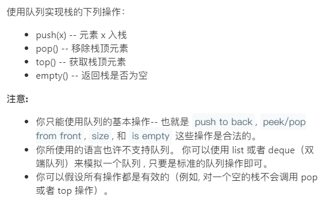

```java
class MyStack {
    private Queue<Integer> q1; //输入
    private Queue<Integer> q2; //输出
    private int top;
    /** Initialize your data structure here. */
    public MyStack() {
        q1 = new LinkedList<Integer>();
        q2 = new LinkedList<Integer>();
    }
    
    /** Push element x onto stack. */
    public void push(int x) {
        q1.offer(x); //q1接收数据，将q2中所有数据复制到q1，保证先来的数据在后面，新来的数据在前面
        while(!q2.isEmpty()){
            q1.offer(q2.poll());
        }
        Queue temp = q1;
        q1 = q2;
        q2 = temp;
    }
    
    /** Removes the element on top of the stack and returns that element. */
    public int pop() {
        return q2.poll();
    }
    
    /** Get the top element. */
    public int top() {
        return q2.peek();
    }
    
    /** Returns whether the stack is empty. */
    public boolean empty() {
        return q2.isEmpty();
    }
}

/**
 * Your MyStack object will be instantiated and called as such:
 * MyStack obj = new MyStack();
 * obj.push(x);
 * int param_2 = obj.pop();
 * int param_3 = obj.top();
 * boolean param_4 = obj.empty();
 */
```


### day02

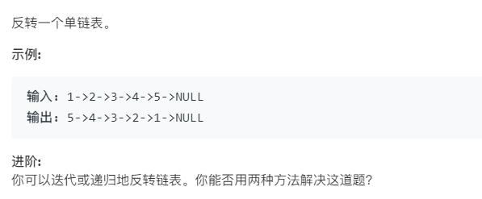

```java
非递归
/**
 * Definition for singly-linked list.
 * public class ListNode {
 *     int val;
 *     ListNode next;
 *     ListNode(int x) { val = x; }
 * }
 */
class Solution {
    public ListNode reverseList(ListNode head) {
        if(head == null || head.next==null)
            return head;
        ListNode curNode = head.next;
        ListNode preNode = head;
        preNode.next = null;
        ListNode curNext;
        while(curNode!=null){
            curNext = curNode.next;
            curNode.next = preNode;
            preNode = curNode;
            curNode = curNext;
        }
        return preNode;
    }
}
时间复杂度：O(n)，假设 nn 是列表的长度，时间复杂度是 O(n)。
空间复杂度：O(1)。
```

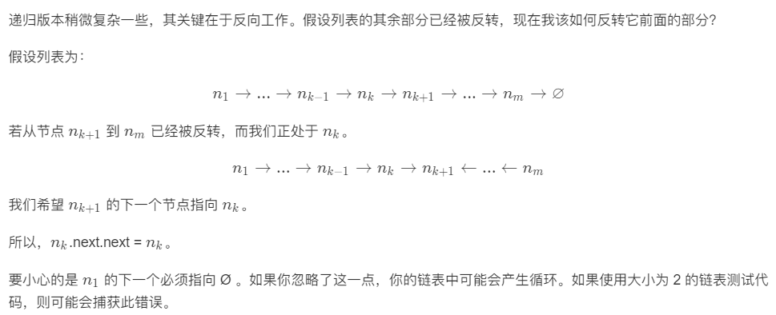

```java
//1->2->3->4->5:递归执行完向下走的时候，第一次的p指向5，head指向4,head.next是5，当执行head.next.next=head时，p.next指向4，当执行head.next=null时，断开head的4到5的节点完成一次反转，以此类推
public ListNode reverseList(ListNode head){
    if(head==null || head.next==null){
        return head;
    }
    ListNode p = reverseList(head.next);
    head.next.next = head;
    head.next = null;
    return p;
}
时间复杂度：O(n)，假设 nn 是列表的长度，那么时间复杂度为 O(n)。
空间复杂度：O(n)，由于使用递归，将会使用隐式栈空间。递归深度可能会达到 n层。
```

### day03

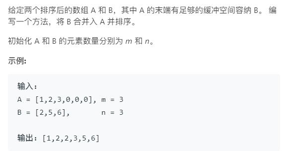

解析：

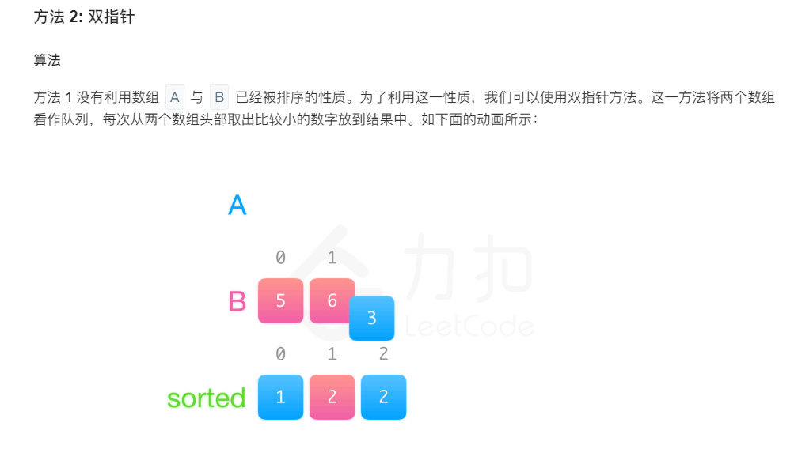

```java
class Solution {
    public void merge(int[] A, int m, int[] B, int n) {
        int pa = 0;
        int pb = 0;
        int[] sorted = new int[m+n];
        int curVal = 0;
        while(pa<m || pb<n){
            if(pa==m){            //注意判断其中一个是否到达尾部
                curVal = B[pb++];
            }else if(pb==n){
                curVal = A[pa++];
            }else if(A[pa]<B[pb]){
                curVal = A[pa++];
            }else{
                curVal = B[pb++];
            }
           sorted[pa+pb-1] = curVal;
        }
        for(int i=0;i<m+n;i++){
            A[i] = sorted[i];
        }
    }
}
```

### day04

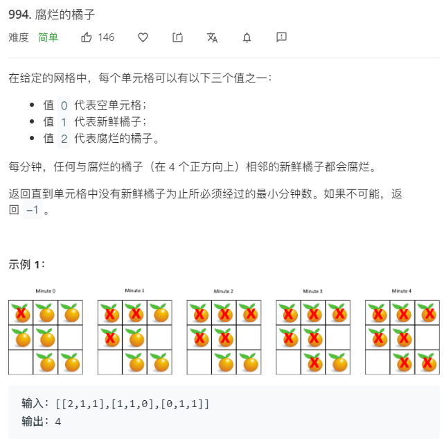

1、先将所有腐烂橘子放入Queue（LinkedList）中，建立Map  key=r*C+c  value=此时此刻腐烂橘子所经历的时间

2、当queue不为空 循环遍历，queue  remove得到腐烂橘子队列中的位置，分析该腐烂橘子上下左右使其腐烂，并把腐烂橘子（key=r*C+c, value=上层腐烂橘子对应时间+1）

3、遍历网格，如果有位置为1，说明有橘子未腐烂，return -1，否则返回map中的最大value

```java
class Solution {
    //对行和列进行移动，上，左，下，右
    int[] dr = new int[]{-1,0,1,0};
    int[] dc = new int[]{0,-1,0,1};
    public int orangesRotting(int[][] grid) {
        int R = grid.length;
        int C = grid[0].length;
        
        Queue<Integer> queue = new LinkedList();
        Map<Integer,Integer> depth = new HashMap<>();
        //先遍历寻找该开始就腐烂的橘子
        for(int r=0;r<R;r++){
            for(int c=0;c<C;c++){
                if(grid[r][c]==2){
                    int code = r*C+c; //将表格中腐烂橘子的二维坐标转化为一个数字编码
                    queue.add(code);
                    depth.put(code,0); //key为二维坐标对应的数字编码，value为该编码对应的橘子腐烂用时
                }
            }
        }
        
        int ans = 0;
        while(!queue.isEmpty()){
            int code = queue.remove();
            int r = code/C;
            int c = code%C;
            for(int k=0;k<4;k++){  //将该腐烂橘子的上下左右依次腐烂
                int nr = r + dr[k];
                int nc = c + dc[k];
                if(nr>=0 && nr<R && nc>=0 && nc<C && grid[nr][nc]==1){
                    grid[nr][nc] = 2;
                    int ncode = nr*C+nc;
                    queue.add(ncode);
                    depth.put(ncode,depth.get(code)+1); //对腐烂橘子的时刻进行重新设定  注意depth.get(code)不是ncode 
                    ans = depth.get(ncode);
                }
            }
        }
        
        for(int[] r:grid){
            for(int c :r){
                if(c==1){
                    return -1;
                }
            }
        }
        return ans;
        
    }
}

时间复杂度：O(nm)
即进行一次广度优先搜索的时间，其中 n=grid.lengthn=grid.length, m=grid[0].lengthm=grid[0].length 

空间复杂度：O(nm)
需要额外的 disdis 数组记录每个新鲜橘子被腐烂的最短时间，大小为 O(nm)，且广度优先搜索中队列里存放的状态最多不会超过 nmnm 个，最多需要 O(nm) 的空间，所以最后的空间复杂度为 O(nm)。

```

### day05

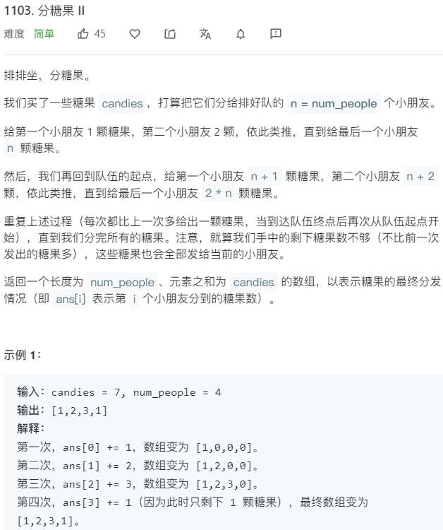

```java
class Solution {
    public int[] distributeCandies(int candies, int num_people) {
        int[] ans = new int[num_people];
        int i = 0;
        while(candies!=0){
            ans[i%num_people] += Math.min(candies,i+1);  //这里i%num_people用来多次循环数组
            candies -= Math.min(candies,i+1);
            i +=1;
        }
        return ans;
    }
}
```

### day06

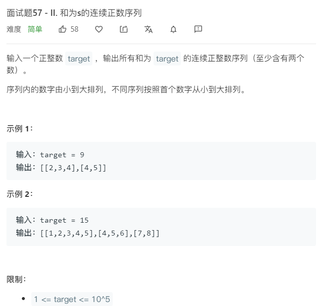

Idea:（滑动数组）

1、因为target>=1 所以滑动数组左右边界初始化为1

2、规定滑动数组尺寸[i,j)  左开右闭

3、循环次数为 i<=target/2  因为数组连续，当滑动数组最左边>=target/2时，数组无论如何也不会出现和为target组合

```java
class Solution {
    public int[][] findContinuousSequence(int target) {
        //滑动窗口解决问题
        int i = 1;  //窗口最左端
        int j = 1;  //窗口最右端  [i,j)
        List<int[]> ans = new ArrayList<>();
        int sum = 0;
        while(i<=target/2){
            if(sum<target){
                sum += j;
                j++;
            }else if(sum>target){
                sum -= i;
                i++;
            }else{
                int[] temp = new int[j-i];
                for(int k=i;k<j;k++){
                    temp[k-i] = k; 
                }
                ans.add(temp);
                sum -= i;
                i++;
            }
        }
        return ans.toArray(new int[ans.size()][]);
    }
}
```

### day07

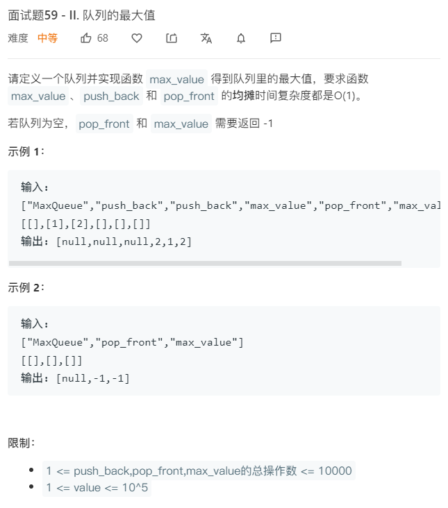

idea:

1、初始化一个队列存放每次push_back的数据

2、初始化一个双端队列，要求该队列front-->back为递减，保证front始终为最大值

```java
class MaxQueue {
    private Queue<Integer> queue = new LinkedList<>();
    private Deque<Integer> deque = new ArrayDeque<>();
    public MaxQueue() {
       
    }
    
    public int max_value() {
       return deque.isEmpty() ? -1:deque.peekFirst();
    }
    
    public void push_back(int value) {
        queue.offer(value);
        //deque成为递减队列
        while(!deque.isEmpty()&&deque.peekLast()<value){
            deque.pollLast();
        }
        deque.offerLast(value);
    }
    
    public int pop_front() {
        Integer result = queue.poll();  //queue存放入队列的各个数据
        if(!deque.isEmpty()&&deque.peekFirst().equals(result)){
            deque.pollFirst();
        }
        return result==null ? -1:result;
    }
}

/**
 * Your MaxQueue object will be instantiated and called as such:
 * MaxQueue obj = new MaxQueue();
 * int param_1 = obj.max_value();
 * obj.push_back(value);
 * int param_3 = obj.pop_front();
 */
```

### day08

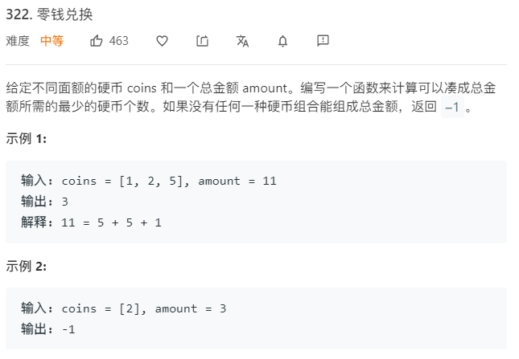

Idea:

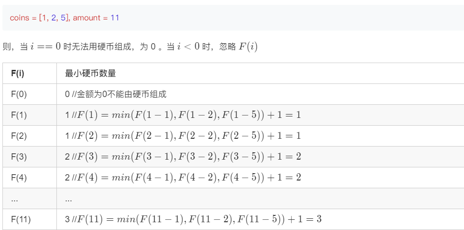

```java
class Solution {
    public int coinChange(int[] coins, int amount) {
        int max = amount+1;
        int[] dp = new int[amount+1];
        
        Arrays.fill(dp,max);
        dp[0] = 0;
        for(int i=1;i<=amount;i++){
            for(int j=0;j<coins.length;j++){
                if(coins[j]<=i){
                    dp[i] = Math.min(dp[i],dp[i-coins[j]]+1);
                }
            }
        }
        
        return dp[amount]>amount ? -1:dp[amount];
    }
}
```

### day09（买卖股票系列）

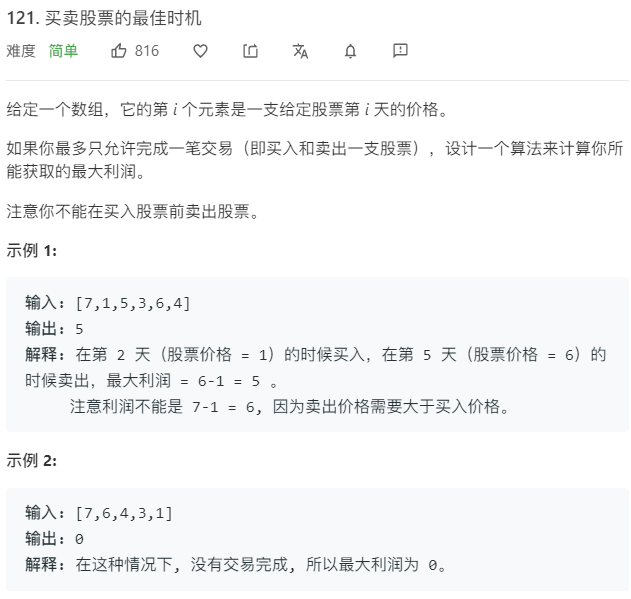

```java
class Solution {
    public int maxProfit(int[] prices) {
        //用minPriceBefore记录截止当前天的最低历史价格
        int minPriceBefore = Integer.MAX_VALUE;
        int maxProfit = 0;
        for(int i=0;i<prices.length;i++){
            if(prices[i]<minPriceBefore){
                minPriceBefore = prices[i];
            }else if(prices[i]-minPriceBefore>maxProfit){
                maxProfit = prices[i]-minPriceBefore;
            }
        }
        return maxProfit;
    }
}
```

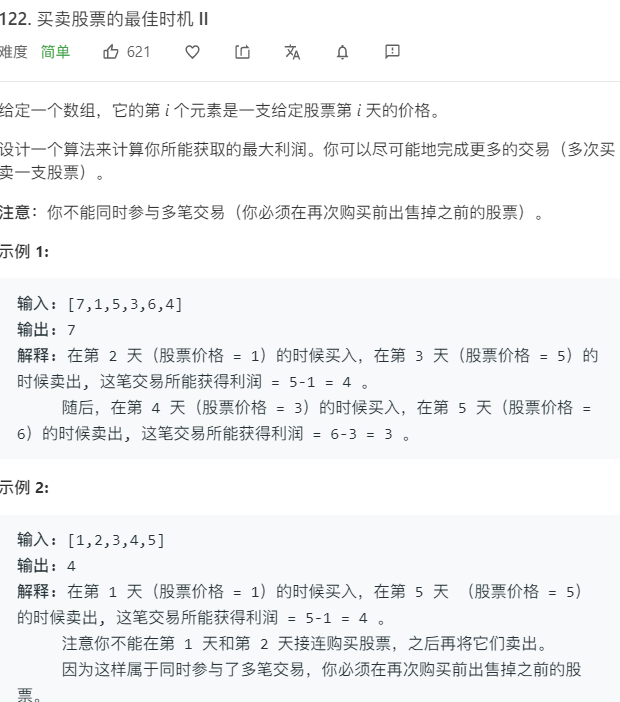

我们可以直接继续增加加数组的连续数字之间的差值，如果第二个数字大于第一个数字，我们获得的总和将是最大利润。这种方法将简化解决方案。

[1,7,2,3,6,7,6,7]


```java
class Solution {
    public int maxProfit(int[] prices) {
        int maxprofit = 0;
        for (int i = 1; i < prices.length; i++) {
            if (prices[i] > prices[i - 1])
                maxprofit += prices[i] - prices[i - 1];
        }
        return maxprofit;
    }
}
```

