## LeetCode每日一题高频面试算法题目

### day01 （队列实现栈）


```java
class MyStack {
    private Queue<Integer> q1; //输入
    private Queue<Integer> q2; //输出
    private int top;
    /** Initialize your data structure here. */
    public MyStack() {
        q1 = new LinkedList<Integer>();
        q2 = new LinkedList<Integer>();
    }
    
    /** Push element x onto stack. */
    public void push(int x) {
        q1.offer(x); //q1接收数据，将q2中所有数据复制到q1，保证先来的数据在后面，新来的数据在前面
        while(!q2.isEmpty()){
            q1.offer(q2.poll()); //poll返回链表头并删除   offer插入链表尾部
        }
        Queue temp = q1;
        q1 = q2;
        q2 = temp;
    }
    
    /** Removes the element on top of the stack and returns that element. */
    public int pop() {
        return q2.poll();
    }
    
    /** Get the top element. */
    public int top() {
        return q2.peek();
    }
    
    /** Returns whether the stack is empty. */
    public boolean empty() {
        return q2.isEmpty();
    }
}

/**
 * Your MyStack object will be instantiated and called as such:
 * MyStack obj = new MyStack();
 * obj.push(x);
 * int param_2 = obj.pop();
 * int param_3 = obj.top();
 * boolean param_4 = obj.empty();
 */
```


### day02（反转一个单链表）


```java
非递归
/**
 * Definition for singly-linked list.
 * public class ListNode {
 *     int val;
 *     ListNode next;
 *     ListNode(int x) { val = x; }
 * }
 */
class Solution {
    public ListNode reverseList(ListNode head) {
        if(head == null || head.next==null)
            return head;
        ListNode curNode = head.next;
        ListNode preNode = head;
        preNode.next = null;
        ListNode curNext;
        while(curNode!=null){
            curNext = curNode.next;
            curNode.next = preNode;
            preNode = curNode;
            curNode = curNext;
        }
        return preNode;
    }
}
时间复杂度：O(n)，假设 nn 是列表的长度，时间复杂度是 O(n)。
空间复杂度：O(1)。
```


```java
//1->2->3->4->5:递归执行完向下走的时候，第一次的p指向5，head指向4,head.next是5，当执行head.next.next=head时，p.next指向4，当执行head.next=null时，断开head的4到5的节点完成一次反转，以此类推
public ListNode reverseList(ListNode head){
    if(head==null || head.next==null){
        return head;
    }
    ListNode p = reverseList(head.next);
    head.next.next = head;
    head.next = null;
    return p;
}
时间复杂度：O(n)，假设 nn 是列表的长度，那么时间复杂度为 O(n)。
空间复杂度：O(n)，由于使用递归，将会使用隐式栈空间。递归深度可能会达到 n层。
```

### day03（合并两个排序数组保证有序）


解析：


```java
class Solution {
    public void merge(int[] A, int m, int[] B, int n) {
        int pa = 0;
        int pb = 0;
        int[] sorted = new int[m+n];
        int curVal = 0;
        while(pa<m || pb<n){
            if(pa==m){            //注意判断其中一个是否到达尾部
                curVal = B[pb++];
            }else if(pb==n){
                curVal = A[pa++];
            }else if(A[pa]<B[pb]){
                curVal = A[pa++];
            }else{
                curVal = B[pb++];
            }
           sorted[pa+pb-1] = curVal;
        }
        for(int i=0;i<m+n;i++){
            A[i] = sorted[i];
        }
    }
}
```

### day04（腐烂的橘子）


1、先将所有腐烂橘子放入Queue（LinkedList）中，建立Map  key=r*C+c  value=此时此刻腐烂橘子所经历的时间

2、当queue不为空 循环遍历，queue  remove得到腐烂橘子队列中的位置，分析该腐烂橘子上下左右使其腐烂，并把腐烂橘子（key=r*C+c, value=上层腐烂橘子对应时间+1）

3、遍历网格，如果有位置为1，说明有橘子未腐烂，return -1，否则返回map中的最大value

```java
class Solution {
    //对行和列进行移动，上，左，下，右
    int[] dr = new int[]{-1,0,1,0};
    int[] dc = new int[]{0,-1,0,1};
    public int orangesRotting(int[][] grid) {
        int R = grid.length;
        int C = grid[0].length;
        
        Queue<Integer> queue = new LinkedList();
        Map<Integer,Integer> depth = new HashMap<>();
        //先遍历寻找该开始就腐烂的橘子
        for(int r=0;r<R;r++){
            for(int c=0;c<C;c++){
                if(grid[r][c]==2){
                    int code = r*C+c; //将表格中腐烂橘子的二维坐标转化为一个数字编码
                    queue.add(code);
                    depth.put(code,0); //key为二维坐标对应的数字编码，value为该编码对应的橘子腐烂用时
                }
            }
        }
        
        int ans = 0;
        while(!queue.isEmpty()){
            int code = queue.remove();
            int r = code/C;
            int c = code%C;
            for(int k=0;k<4;k++){  //将该腐烂橘子的上下左右依次腐烂
                int nr = r + dr[k];
                int nc = c + dc[k];
                if(nr>=0 && nr<R && nc>=0 && nc<C && grid[nr][nc]==1){
                    grid[nr][nc] = 2;
                    int ncode = nr*C+nc;
                    queue.add(ncode);
                    depth.put(ncode,depth.get(code)+1); //对腐烂橘子的时刻进行重新设定  注意depth.get(code)不是ncode 
                    ans = depth.get(ncode);
                }
            }
        }
        
        for(int[] r:grid){
            for(int c :r){
                if(c==1){
                    return -1;
                }
            }
        }
        return ans;
        
    }
}

时间复杂度：O(nm)
即进行一次广度优先搜索的时间，其中 n=grid.lengthn=grid.length, m=grid[0].lengthm=grid[0].length 

空间复杂度：O(nm)
需要额外的 disdis 数组记录每个新鲜橘子被腐烂的最短时间，大小为 O(nm)，且广度优先搜索中队列里存放的状态最多不会超过 nmnm 个，最多需要 O(nm) 的空间，所以最后的空间复杂度为 O(nm)。

```

### day05（分糖果II）


```java
class Solution {
    public int[] distributeCandies(int candies, int num_people) {
        int[] ans = new int[num_people];
        int i = 0;
        while(candies!=0){
            ans[i%num_people] += Math.min(candies,i+1);  //这里i%num_people用来多次循环数组
            candies -= Math.min(candies,i+1);
            i +=1;
        }
        return ans;
    }
}
```

### day06（和为s的连续正数序列）


Idea:（滑动数组）

1、因为target>=1 所以滑动数组左右边界初始化为1

2、规定滑动数组尺寸[i,j)  左开右闭

3、循环次数为 i<=target/2  因为数组连续，当滑动数组最左边>=target/2时，数组无论如何也不会出现和为target组合

```java
class Solution {
    public int[][] findContinuousSequence(int target) {
        //滑动窗口解决问题
        int i = 1;  //窗口最左端
        int j = 1;  //窗口最右端  [i,j)
        List<int[]> ans = new ArrayList<>();
        int sum = 0;
        while(i<=target/2){
            if(sum<target){
                sum += j;
                j++;
            }else if(sum>target){
                sum -= i;
                i++;
            }else{
                int[] temp = new int[j-i];
                for(int k=i;k<j;k++){
                    temp[k-i] = k; 
                }
                ans.add(temp);
                sum -= i;
                i++;
            }
        }
        return ans.toArray(new int[ans.size()][]);
    }
}
```

### day07（队列的最大值）


idea:

1、初始化一个队列存放每次push_back的数据

2、初始化一个双端队列，要求该队列front-->back为递减，保证front始终为最大值

```java
class MaxQueue {
    private Queue<Integer> queue = new LinkedList<>();
    private Deque<Integer> deque = new ArrayDeque<>();
    public MaxQueue() {
       
    }
    
    public int max_value() {
       return deque.isEmpty() ? -1:deque.peekFirst();
    }
    
    public void push_back(int value) {
        queue.offer(value);
        //deque成为递减队列
        while(!deque.isEmpty()&&deque.peekLast()<value){
            deque.pollLast();
        }
        deque.offerLast(value);
    }
    
    public int pop_front() {
        Integer result = queue.poll();  //queue存放入队列的各个数据
        if(!deque.isEmpty()&&deque.peekFirst().equals(result)){
            deque.pollFirst();
        }
        return result==null ? -1:result;
    }
}

/**
 * Your MaxQueue object will be instantiated and called as such:
 * MaxQueue obj = new MaxQueue();
 * int param_1 = obj.max_value();
 * obj.push_back(value);
 * int param_3 = obj.pop_front();
 */
```

### day08（零钱兑换）


Idea:


```java
class Solution {
    public int coinChange(int[] coins, int amount) {
        int max = amount+1;
        int[] dp = new int[amount+1];
        
        Arrays.fill(dp,max);
        dp[0] = 0;
        for(int i=1;i<=amount;i++){
            for(int j=0;j<coins.length;j++){
                if(coins[j]<=i){
                    dp[i] = Math.min(dp[i],dp[i-coins[j]]+1);
                }
            }
        }
        
        return dp[amount]>amount ? -1:dp[amount];
    }
}
```

### day09（买卖股票系列）


```java
class Solution {
    public int maxProfit(int[] prices) {
        //用minPriceBefore记录截止当前天的最低历史价格
        int minPriceBefore = Integer.MAX_VALUE;
        int maxProfit = 0;
        for(int i=0;i<prices.length;i++){
            if(prices[i]<minPriceBefore){
                minPriceBefore = prices[i];
            }else if(prices[i]-minPriceBefore>maxProfit){
                maxProfit = prices[i]-minPriceBefore;
            }
        }
        return maxProfit;
    }
}
```


我们可以直接继续增加加数组的连续数字之间的差值，如果第二个数字大于第一个数字，我们获得的总和将是最大利润。这种方法将简化解决方案。

[1,7,2,3,6,7,6,7]


```java
class Solution {
    public int maxProfit(int[] prices) {
        int maxprofit = 0;
        for (int i = 1; i < prices.length; i++) {
            if (prices[i] > prices[i - 1])
                maxprofit += prices[i] - prices[i - 1];
        }
        return maxprofit;
    }
}
```

### day10（树的遍历系列）


```java
递归：
/*
// Definition for a Node.
class Node {
    public int val;
    public List<Node> children;

    public Node() {}

    public Node(int _val) {
        val = _val;
    }

    public Node(int _val, List<Node> _children) {
        val = _val;
        children = _children;
    }
};
*/
//前序遍历
class Solution {
    List<Integer> NodeList = new LinkedList<>();
    public List<Integer> preorder(Node root) {
        if(root==null){
            return NodeList;
        }

        NodeList.add(root.val);
        for(Node child:root.children){
            preorder(child);
        }
        return NodeList;
    }
}

//后序遍历
class Solution {
    List<Integer> ans = new LinkedList<Integer>();
    public List<Integer> postorder(Node root) {
        if(root == null){
            return ans;
        }
        for(Node child:root.children){
            postorder(child);
        }
        ans.add(root.val);
        return ans;
    }
}

//非递归--前序遍历
class Solution {
    public List<Integer> preorder(Node root) {
 		List<Integer> stack = new LinkedList<>();
        List<Integer> output = new LinkedList<>();
        if(root == null){
            return output;
        }
        
        stack.add(root.val);
        while(!stack.isEmpty()){
            Node node = stack.pollLast();
            output.add(node.val);
            Collections.reverse(noed.children);
           	for(Node temp:node.children){
                stack.add(temp);
            }
        }
        return output;
    }
}
```


```java
class Solution {
    int ans;
    public int diameterOfBinaryTree(TreeNode root) {
        ans = 1;
        depth(root);
        return ans - 1;
    }
    public int depth(TreeNode node) {
        if (node == null) return 0; // 访问到空节点了，返回0
        int L = depth(node.left); // 左儿子为根的子树的深度
        int R = depth(node.right); // 右儿子为根的子树的深度
        ans = Math.max(ans, L+R+1); // 计算d_node即L+R+1 并更新ans
        return Math.max(L, R) + 1; // 返回该节点为根的子树的深度
    }
}
```

### day11（将数组分成和相等的三部分）


```java
class Solution {
    public boolean canThreePartsEqualSum(int[] A) {
        int sum = 0;
        for(int i:A){
            sum+=i;
        }
        if(sum%3!=0){
            return false;
        }
        
        int s = 0;
        int flag = 0;
        for(int i=0;i<A.length;i++){
            s+=A[i];
            if(sum/3==s){
                flag++;
                s = 0;
            }
        }
        return flag>=3;  //防止[10,-10,10,-10,10,-10,10,-10]sum=0 可能导致flag>3
        
    }
}
```

### day12（字符串的最大公因子）


```java
class Solution {
    
    public int gcd(int len1,int len2){
        int big = len1>len2 ? len1:len2;
        int small = len1<len2 ? len1:len2;
        if(big%small==0){
            return small;
        }
        return gcd(big%small,small);
    }
    public String gcdOfStrings(String str1, String str2) {
        if(!(str1+str2).equals(str2+str1)){
            return "";
        }
        int gcdStr = gcd(str1.length(),str2.length());
        return str1.substring(0,gcdStr);
    }
}
```

### day13（多数元素）


```java
class Solution {
    public int majorityElement(int[] nums) {
        Map<Integer,Integer> record = new HashMap<>();
        int n  = nums.length;
        for(int i=0;i<n;i++){
            if(!record.containsKey(nums[i])){
                record.put(nums[i],1);
            }else{
                record.put(nums[i],record.get(nums[i])+1);
            }
        }
        int maxValue = 0;
        int ans = 0;
        for(Map.Entry<Integer,Integer> entry:record.entrySet()){
            if(entry.getValue()>maxValue){
                maxValue = entry.getValue();
                ans = entry.getKey();
            }
        }
        return ans;
}
}
```

遍历Map的四种方式

```java
public static void main(String[] args) {
        // 循环遍历Map的4中方法
        Map<Integer, Integer> map = new HashMap<Integer, Integer>();
        map.put(1, 2);
        // 1. entrySet遍历，在键和值都需要时使用（最常用）
        for (Map.Entry<Integer, Integer> entry : map.entrySet()) {
            System.out.println("key = " + entry.getKey() + ", value = " + entry.getValue());
        }
        // 2. 通过keySet或values来实现遍历,性能略低于第一种方式
        // 遍历map中的键
        for (Integer key : map.keySet()) {
            System.out.println("key = " + key);
        }
        // 遍历map中的值
        for (Integer value : map.values()) {
            System.out.println("key = " + value);
        }
        // 3. 使用Iterator遍历
        Iterator<Map.Entry<Integer, Integer>> it = map.entrySet().iterator();
        while (it.hasNext()) {
            Map.Entry<Integer, Integer> entry = it.next();
            System.out.println("key = " + entry.getKey() + ", value = " + entry.getValue());
        }

        // 4. java8 Lambda
        // java8提供了Lambda表达式支持，语法看起来更简洁，可以同时拿到key和value，
        // 不过，经测试，性能低于entrySet,所以更推荐用entrySet的方式
        map.forEach((key, value) -> {
            System.out.println(key + ":" + value);
        });
        
    }
```

### day14（最长上升子序列--动态规划）


思路：


```java
class Solution {
    public int lengthOfLIS(int[] nums) {
        //动态规划
        if(nums.length==0){
            return 0;
        }
        //dp[i]代表数组中第<=i的子数组中最长上升子序列长度
        int[] dp = new int[nums.length];
        int maxAns = 1;
        for(int i=0;i<nums.length;i++){
            int maxBeforeI = 0; //定义dp[<i]中最大的值，即子数组最长上升子序列长度
            dp[i] = 1;
            for(int j=0;j<i;j++){
                //找到nums[i]>nums[j]时候  dp[1..j]中的最大值
                //只有nums[i]>nums[i]的时候，才会出现最长生长子序列递增，才去更新dp
                if(nums[i]>nums[j]){
                    maxBeforeI = Math.max(maxBeforeI,dp[j]);
                }
            }
            dp[i] = maxBeforeI+1;
            maxAns = Math.max(maxAns,dp[i]);
        }
        return maxAns;
    }
}
```

#### 动态规划类似题目：


```java
class Solution {
    public boolean increasingTriplet(int[] nums) {
        if(nums.length<3){
            return false;
        }
        int[] dp = new int[nums.length];
        for(int i=0;i<nums.length;i++){
            int maxBeforeI = 0;
            for(int j=0;j<i;j++){
                if(nums[i]>nums[j]){
                    maxBeforeI = Math.max(maxBeforeI,dp[j]);
                }
            }
            dp[i] = maxBeforeI + 1;
        }
        for(int i:dp){
            if(i>=3){
                return true;
            }
        }
        return false;
    }
}
```


```java
class Solution {
    public int maxSubArray(int[] nums) {
        int maxSum = nums[0];
        int[] dp = new int[nums.length];
        dp[0] = nums[0];
        for(int i=1;i<nums.length;i++){
            if(dp[i-1]>0){
                dp[i] = dp[i-1]+nums[i];
            }else{
                dp[i] = nums[i];
            }
            maxSum = Math.max(maxSum,dp[i]);
        }
        return maxSum;
    }
    
}
```


### day15（岛屿的最大面积DFS）


```java
class Solution {
    public int maxAreaOfIsland(int[][] grid) {
        int maxArea = 0;
        for(int i=0;i<grid.length;i++){
            for(int j=0;j<grid[i].length;j++){
                if(grid[i][j]==1){
                    maxArea = Math.max(maxArea,dfs(i,j,grid));   
                }
            }
        }
        return maxArea;
    }
    //递归遍历寻找最大连续1的个数（岛屿面积）
    public int dfs(int i,int j,int[][] grid){
        if(i<0 || j<0 || i>=grid.length || j>=grid[i].length || grid[i][j]==0){
            return 0;
        }
        grid[i][j]=0;//把当前[i][j]置为0  防止回溯遍历出现栈溢出
        int num = 1;
        num += dfs(i-1,j,grid);
        num += dfs(i+1,j,grid);
        num += dfs(i,j-1,grid);
        num += dfs(i,j+1,grid);
        return num;
    }
}
```

```java
//采用栈的方式   
class Solution {

    public int maxAreaOfIsland(int[][] grid) {
        Deque<int[]> stack = new LinkedList<>();

        int[][] moveIndexArray = {{-1, 0}, {1, 0}, {0, -1}, {0, 1}};
        int maxArea = 0;
        for (int i = 0; i < grid.length; i++) {
            for (int j = 0; j < grid[i].length; j++) {
                stack.add(new int[]{i, j});
                //计算最大面积
                int currMaxArea = 0;
                while (!stack.isEmpty()) {
                    int[] pop = stack.pop();
                    int currI = pop[0];
                    int currJ = pop[1];
                    if (currI < 0 || currI >= grid.length || currJ < 0 || currJ >= grid[0].length || grid[currI][currJ] == 0) {
                        continue;
                    }
                    currMaxArea++;
                    grid[currI][currJ] = 0;
                    for (int[] moveIndex : moveIndexArray) {
                        stack.add(new int[]{currI + moveIndex[0], currJ + moveIndex[1]});
                    }
                }
                maxArea = Math.max(currMaxArea, maxArea);
            }
        }

        return maxArea;
    }

}
```

### day16（字符串压缩--双指针）


```java
class Solution {
    public String compressString(String S) {
        int N = S.length();
        int i=0;
        StringBuilder sb = new StringBuilder();
        while(i<N){
            int j=i;
            while(j<N && S.charAt(j)==S.charAt(i)){
                j++;
            }
            sb.append(S.charAt(i)).append(j-i);
            i = j;
        }
        
        String ans = sb.toString();
        return ans.length()>=N ? S:ans;
    }
}
```

### day17（拼写单词）

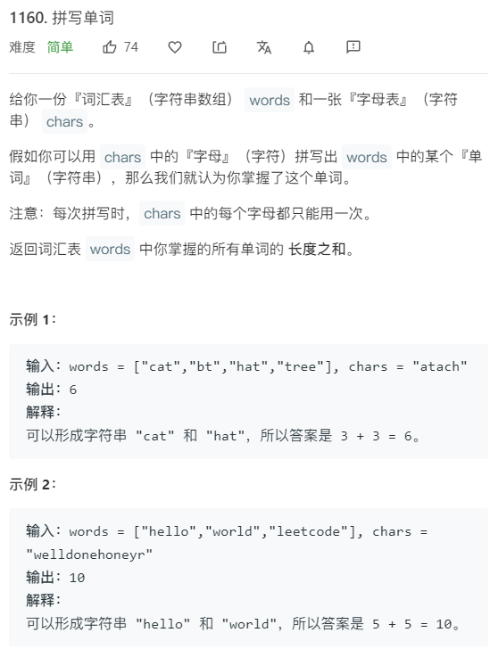

```java
class Solution {
    public int countCharacters(String[] words, String chars) {
        int[] hash = new int[26];
        for(char c:chars.toCharArray()){
            hash[c-'a'] += 1;
        }
        
        int[] map = new int[26];
        int len = 0;
        for(int i=0;i<words.length;i++){
            String word = words[i];
            Arrays.fill(map,0);
            boolean flag = true;
            for(char c:words[i].toCharArray()){
                map[c-'a'] ++;
                if(map[c-'a']>hash[c-'a']){
                    flag = false;
                }
            }
            if(flag){
                len+=word.length();
            }else{
                len+=0;
            }
        }
        return len;
    }
}
```


### day18（矩形重叠）


```java
//想象一下，如果我们在平面中放置一个固定的矩形 rec2，那么矩形 rec1 必须要出现在 rec2 的「四周」，也就是说，矩形 rec1 需要满足以下四种情况中的至少一种：

//矩形 rec1 在矩形 rec2 的左侧；

//矩形 rec1 在矩形 rec2 的右侧；

//矩形 rec1 在矩形 rec2 的上方；

//矩形 rec1 在矩形 rec2 的下方。
class Solution {
    public boolean isRectangleOverlap(int[] rec1, int[] rec2) {
        //先判断不重叠的情况  再取反
        return (!(rec1[1]>=rec2[3]||rec1[3]<=rec2[1]||rec1[2]<=rec2[0]||rec1[0]>=rec2[2]));
    }
}
```

### day19（最长回文串）


对于每个字符 `ch`，假设它出现了 `v` 次，我们可以使用该字符 `v / 2 * 2` 次，在回文串的左侧和右侧分别放置 `v / 2` 个字符 `ch`，其中 `/` 为整数除法。例如若 `"a"` 出现了 `5` 次，那么我们可以使用 `"a"` 的次数为 `4`，回文串的左右两侧分别放置 `2` 个 `"a"`。

如果有任何一个字符 `ch` 的出现次数 `v` 为奇数（即 `v % 2 == 1`），那么可以将这个字符作为回文中心，注意只能最多有一个字符作为回文中心。在代码中，我们用 `ans` 存储回文串的长度，由于在遍历字符时，`ans` 每次会增加 `v / 2 * 2`，因此 `ans` 一直为偶数。但在发现了第一个出现次数为奇数的字符后，我们将 `ans` 增加 `1`，这样 `ans` 变为奇数，在后面发现其它出现奇数次的字符时，我们就不改变 `ans` 的值了。

```

```

```java
class Solution {
    public int longestPalindrome(String s) {
        int[] arr = new int[128];
        for(char c:s.toCharArray()){
            arr[c]++;
        }
        
        int ans = 0;
        for(int n:arr){
            ans+=n/2*2;
            //第一次遇到奇数字符时，ans+1,以后遇到奇数不再增加ans直接跳过，只有偶数增加在ans左右两端         
           //ans%2==0  防止以后遍历再次进入if语句
            if(n%2==1 && ans%2==0 ){
                ans ++;
            }
        }
        return ans;
    }
}
```

### day20（最小的k个数）


相等于练习冒泡排序吧 哈哈哈

```java
class Solution {
    public int[] getLeastNumbers(int[] arr, int k) {
        sortArray(arr);
        int[] ans = new int[k];
        for(int i=0;i<k;i++){
            ans[i] = arr[i];
        }
        return ans;
    }
    
    public void sortArray(int[] arr){
        for(int i=0;i<arr.length;i++){
            boolean flag = true;
            for(int j=0;j<arr.length-i-1;j++){
                if(arr[j]>arr[j+1]){
                    flag = false;
                    int temp = arr[j];
                    arr[j] = arr[j+1];
                    arr[j+1] = temp;
                }
            }
            if(flag){
                break;
            }
        }
    }
}
```

### day21（水壶问题--最大公约数）


idea:

```
若a,b是整数,且gcd(a,b)=d，那么对于任意的整数x,y,ax+by都一定是d的倍数，特别地，一定存在整数x,y，使ax+by=d成立。
     * 裴蜀定理：
     * 如果所需要的水量是两个水壶容量的最大公约数的倍数，且水量不大于两个水壶的容量之和，那么必然可以用这两个水壶操作得到所需要的水量。
```

```java
class Solution {
    public boolean canMeasureWater(int x, int y, int z) {
        //解决x或者y中一个为0的情况
        if(x==0||y==0){
            if(z==x||z==y){
                return true;
            }
            return false;
        }
        if(x+y<z){
            return false;
        }
        int temp = gcd(x,y);
        return z%temp==0;
    }
    
    private int gcd(int x,int y){
        int big = x>y? x:y;
        int small = x<y? x:y;
        if(big%small==0){
            return small;
        }
        return gcd(big%small,small);
    }
}
```

### day22（使数组唯一的最小增量）


```java
class Solution {
    public int minIncrementForUnique(int[] A) {
        //先排序
        Arrays.sort(A);
        int ans = 0;
        for(int i=1;i<A.length;i++){
            if(A[i]<=A[i-1]){
                int temp = A[i];
                A[i] = A[i-1]+1;
                ans+=A[i-1]+1-temp;
            }
        }
        return ans;
    }
}
```

### day23（链表中间节点--快慢指针）


```java
/**
 * Definition for singly-linked list.
 * public class ListNode {
 *     int val;
 *     ListNode next;
 *     ListNode(int x) { val = x; }
 * }
 */
class Solution {
    public ListNode middleNode(ListNode head) {
        if(head==null){
            return null;
        }
        ListNode fast = head;
        ListNode slow = head;
        while(fast!=null && fast.next!=null){
            fast = fast.next.next;
            slow = slow.next;
        }
        return slow;
    }
}
```

### day24（按摩师问题--动态规划）


**idea:**

```
dp[i][0] 第i个预约不接受的最佳总时长，则i-1可以接收也可以不接受
dp[i][1] 第i个预约接收的最佳总时长，则i-1一定为不接受
```

```java
class Solution {
    public int massage(int[] nums) {
        int n = nums.length;
        if(n==0) return 0;
        if(n==1) return nums[0];
        
        int[][] dp = new int[n][2];
        dp[0][1] = nums[0];
        dp[0][0] = 0;
        for(int i=1;i<n;i++){
            dp[i][1] = dp[i-1][0] + nums[i];
            dp[i][0] = Math.max(dp[i-1][1],dp[i-1][0]);
        }
        return Math.max(dp[n-1][0],dp[n-1][1]);
    }
}
```

### day25（三维形体表面积）


Idea:

1、输入二维数组，数字代表数组i,j位置放置的立方体个数

2、要点是要把i,j方向上立方体重叠面积进行删除

```java
class Solution {
    public int surfaceArea(int[][] grid) {
        int n = grid.length;
        int area = 0;
        for(int i = 0;i<n;i++){
            for(int j=0;j<grid[i].length;j++){
                int level = grid[i][j];
                if(level>0){
                    area += (level<<2)+2;
                }
                //删除i,j方向上的重叠面积
                if(i>0) area -= Math.min(grid[i-1][j],grid[i][j])*2;
                if(j>0) area -= Math.min(grid[i][j-1],grid[i][j])*2;
            }
        }
        return area;
    }
}
```

### day26（车的可用捕获量）


idea：

题目太长迷惑人心，要点如下：

1、先找到白色车的位置 i, j

2、在四个方向上移动车，车停止条件为 a: 超出8x8棋盘界限  b: 遇到白色的象 c: 遇到要找的黑色卒

```java
class Solution {
    public int numRookCaptures(char[][] board) {
        //上下左右
        int[] dx = {-1,1,0,0};
        int[] dy = {0,0,-1,1};
        
        int ans = 0;
        for(int i=0;i<8;i++){
            for(int j=0;j<8;j++){
                //找到白色车的位置
                if(board[i][j]=='R'){
                    //四个方向进行前进
                    for(int k=0;k<4;k++){
                        //把白色车的位置赋值给移动变量
                        int moveX = i;
                        int moveY = j;
                        while(true){
                            moveX += dx[k];
                            moveY += dy[k];
                            //判断是否越界  车不能与其他友方（白色）象进入同一个方  
                            if(moveX<0 || moveX>=8 || moveY<0 || moveY>=8 || board[moveX][moveY]=='B'){
                                break;
                            }
                            
                            if(board[moveX][moveY]=='p'){
                                ans++;
                                break; //在另一个方向查找
                            }
                        }
                    }
                }
            }
        }
        return ans;
    }
}
```

### day27（卡牌分组）

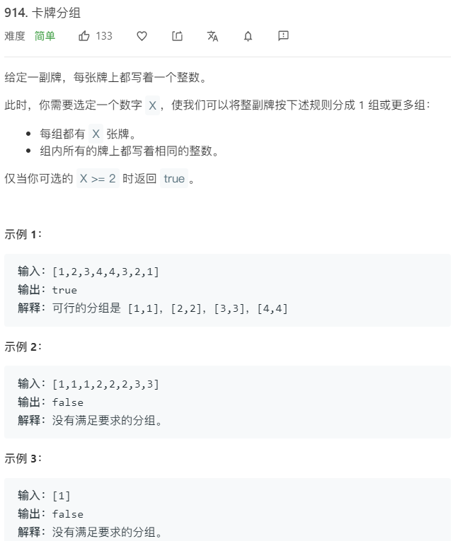

idea:

求数组中各个相同元素个数的最大公约数，如果最大公约数>=2则返回true  否则返回false

```java
class Solution {
    public boolean hasGroupsSizeX(int[] deck) {
        int[] counter = new int[10000];
        for(int i=0;i<deck.length;i++){
            counter[deck[i]] ++;
        }
        int x =0;
        for(int count:counter){
            if(count>0){
                //计算最大公约数
                x = gcd(x,count);
                if(x==1){
                    return false;
                }
            }
        }
        return x>=2;
    }
    
    private int gcd(int a,int b){
        if(a==0) return b;
        if(b==0) return a;
        int max = a>b? a:b;
        int min = a<b? a:b;
        if(max%min==0){
            return min;
        }
        return gcd(max%min,min);
    }
    
}
```

### BFS/DFS问题

#### 快速幂算法

```java
 
    public static long pow(int n) {
        if (n == 0)
            return 1;
        long half = pow(n / 2);
        if (n % 2 == 0)
            return (half * half);
        else
            return (half * half * 2);
    }
```

#### BFS地图问题（阿里巴巴面试题）

 一个地图n*m，包含1个起点，1个终点，其他点包括可达点和不可达点。 每一次可以：上下左右移动，或使用1点能量从（i,j)瞬间移动到（n-1-i, m-1-j)，最多可以使用5点能量。

```java
package cn.nuaa.alibaba;

import java.util.LinkedList;
import java.util.Queue;
import java.util.Scanner;

public class test02 {
    static int[] dx = {1,-1,0,0};
    static int[] dy = {0,0,1,-1};
    static int m;
    static int n;
    static int endX;
    static int endY;
    public static void main(String[] args) {
        Scanner scanner = new Scanner(System.in);
        n = scanner.nextInt();
        m = scanner.nextInt();
        char[][] map = new char[n][m];
        Queue<Pair> queue = new LinkedList<>();
        for(int i=0;i<n;i++){
            map[i] = scanner.next().toCharArray();
            for(int j=0;j<map[i].length;j++){
                if(map[i][j]=='S'){
                    Pair pair = new Pair(i,j);
                    queue.add(pair);
                }else if(map[i][j]=='E'){
                    endX = i;
                    endY = j;
                }
            }
        }
        //BFS
        System.out.println(BFS(map,queue));
    }
    public static boolean check(int x,int y){
        if(x<0 || y<0 || x>=n || y>=m){
            return false;
        }
        return true;
    }
    public static int BFS(char[][] map,Queue<Pair>queue){
        while (!queue.isEmpty()){
            int size = queue.size();
            while (size-- >0){
                Pair top = queue.poll();
                if(top.x==endX && top.y==endY){
                    return top.step;
                }
                for(int k=0;k<4;k++){
                    int curX = top.x+dx[k];
                    int curY = top.y+dy[k];
                    Pair nextPair = new Pair(curX,curY);
                    nextPair.step = top.step + 1;
                    nextPair.fly = top.fly;
                    if(check(curX,curY) && (map[curX][curY]=='.' || map[curX][curY]=='E')){
                        queue.add(nextPair);
                        map[curX][curY] = 'X';
                    }
                }
                int flyX = n-1-top.x;
                int flyY = m-1-top.y;
                if(check(flyX,flyY) && top.fly<5 && (map[flyX][flyY]=='.' || map[flyX][flyY]=='E')){
                    Pair pair = new Pair(flyX,flyY);
                    pair.step = top.step+1;
                    pair.fly = top.fly+1;
                    queue.add(pair);
                    map[flyX][flyY] = 'X';
                }
            }
        }
        return -1;
    }
}

class Pair{
    int x;
    int y;
    int step;
    int fly;

    public Pair(int x, int y) {
        this.x = x;
        this.y = y;
    }
}

```

#### LeetCode BFS问题

##### 被围绕的区域

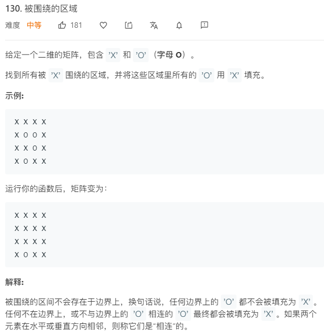

**总结：**

**1、一般需要定义一个内部类，代表地图每个点，将题目中给的属性加进去，基础属性为坐标x,y**

**2、BFS问题需要queue，DFS问题需要stack**

**3、一般需要定义上下左右坐标转移数组**  

**4、需要定义坐标范围检查函数**

```java
class Solution {
    private class Node{
        int x;
        int y;
        public Node(int x,int y){
            this.x = x;
            this.y = y;
        }
    }
    
    int m = 0;
    int n = 0;
    public void solve(char[][] board) {
        if(board.length==0 || board==null){
            return;
        }
        m = board.length;
        n = board[0].length;
        for(int i=0;i<m;i++){
            for(int j=0;j<n;j++){
                boolean isEdge = (i==0 || i==m-1 ||j==0 ||j==n-1) ? true:false;
                if(isEdge && board[i][j]=='O'){
                    bfs(board,i,j);
                }
            }
        }
        
        //与边界相连的O用#代替  
        for(int i=0;i<m;i++){
            for(int j=0;j<n;j++){
                if(board[i][j] == 'O'){
                    board[i][j] = 'X';
                }
                if(board[i][j] == '#'){
                    board[i][j] = 'O';
                }
            }
        }
    }
    
    public boolean check(int x,int y){
        if(x<0 || x>=m || y<0 || y>=n){
            return false;
        }
        return true;
    }
    
    public void bfs(char[][] board,int i,int j){
        Queue<Node> queue = new LinkedList<>();
        queue.add(new Node(i,j));
        board[i][j] = '#';
        //上下左右
        int[] dx = {-1,1,0,0};
        int[] dy = {0,0,-1,1};
        while(!queue.isEmpty()){
            Node curNode = queue.poll();
            
            for(int k=0;k<4;k++){
                int nextX = curNode.x + dx[k];
                int nextY = curNode.y + dy[k];
                if(check(nextX,nextY) && board[nextX][nextY]=='O'){
                    queue.add(new Node(nextX,nextY));
                    board[nextX][nextY] = '#';
                }
            }
        }
    }
}
```

##### 最远海洋问题

参考day29 ☟

### 动态规划问题


### day28（单词的压缩编码---set存储不重复后缀）

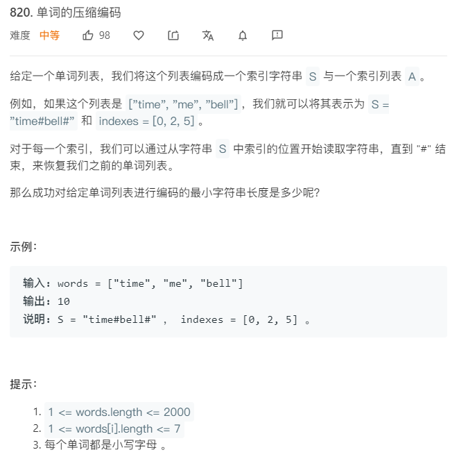

idea:

如果单词 X 是 Y 的后缀，那么单词 X 就不需要考虑了，因为编码 Y 的时候就同时将 X 编码了。例如，如果 words 中同时有 "me" 和 "time"，我们就可以在不改变答案的情况下不考虑 "me"。

如果单词 Y 不在任何别的单词 X 的后缀中出现，那么 Y 一定是编码字符串的一部分。

因此，目标就是保留所有不是其他单词后缀的单词，最后的结果就是这些单词长度加一的总和，因为每个单词编码后后面还需要跟一个 # 符号。

```java
class Solution {
    public int minimumLengthEncoding(String[] words) {
        Set<String> set = new HashSet<String>(Arrays.asList(words));
        for(String word:words){
            for(int i=1;i<word.length();i++){ //i一定从1开始，否则会把该单词从set中移除
                set.remove(word.substring(i));
            }
        }
        
        int ans = 0;
        // for(String word:set){
        //     ans += word.length()+1；
        // }
        Iterator<String> iter = set.iterator();
        while(iter.hasNext()){
            String temp = iter.next();
            ans += temp.length()+1;
        }
        return ans;
    }
}
```

### day29（BFS最远海洋问题）

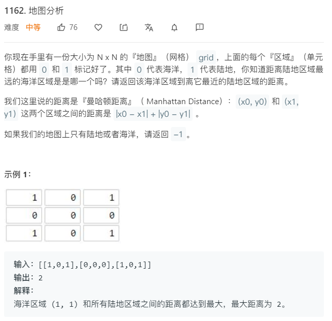

Idea:

我们只要先把所有的陆地都入队，然后从各个陆地**同时开始**一层一层的向海洋扩散，那么最后扩散到的海洋就是最远的海洋！并且这个海洋肯定是被离他最近的陆地给扩散到的！


```java
class Solution {
    
    int m;
    int n;
    
    //定义内部类标记一些题目要求的属性
    private class Node{
        int x;
        int y;
        int far;  //定义该点距离出发点大陆的距离
        public Node(int x,int y){
            this.x = x;
            this.y = y;
        }
    }
    
    public boolean check(int x,int y){
        if(x<0 || x>=m || y<0 || y>=n){
            return false;
        }
        return true;
    }
    
    public int maxDistance(int[][] grid) {
        //首先遍历grid找出所有为1的元素
        
        m = grid.length;
        n = grid[0].length;
        
        Queue<Node> queue = new LinkedList<>();
        
        for(int i=0;i<m;i++){
            for(int j = 0;j<n;j++){
                if(grid[i][j]==1){
                    queue.add(new Node(i,j));
                }
            }
        }
        return BFS(queue,grid);
    }
    
    public int BFS(Queue<Node> queue,int[][] grid){
        int[] dx = {-1,1,0,0};
        int[]dy = {0,0,-1,1};
        boolean hasOcean = false;
        Node newNode = null;
        while(!queue.isEmpty()){
            Node curNode = queue.poll();
            for(int k=0;k<4;k++){
                int newX = curNode.x+dx[k];
                int newY = curNode.y+dy[k];
                if(check(newX,newY) && grid[newX][newY]==0){
                    newNode = new Node(newX,newY);
                    newNode.far = curNode.far+1;  //一定是curNode.step
                    grid[newX][newY] = 1;
                    hasOcean = true;
                    queue.add(newNode);
                }
            }   
        }
        if(!hasOcean){
            return -1;
        }
        return newNode.far;
    }
}
```

### day30（圆圈中最后剩下的数字）

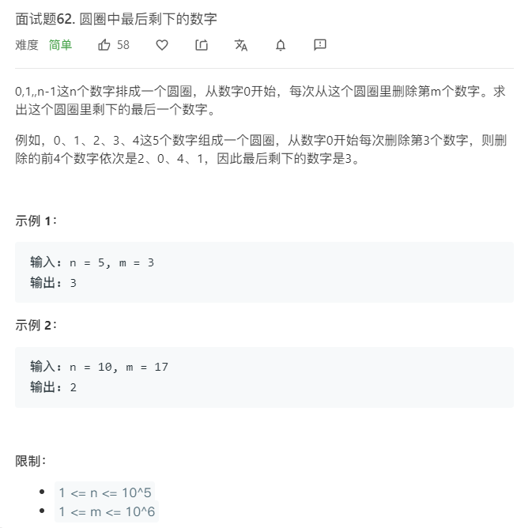

```java
class Solution {
    public int lastRemaining(int n, int m) {
        List<Integer> list = new ArrayList<>();
        for(int i=0;i<n;i++){
            list.add(i);
        }
        int start = 0;
        while(list.size()>1){
            int size = list.size();
            int delIndex = (start+m-1)%size;
            list.remove(delIndex);
            start = delIndex;
        }
        return list.get(0);
    }
}
```

### day31（数组升序--冒泡、选择、插入、快速排序算法）

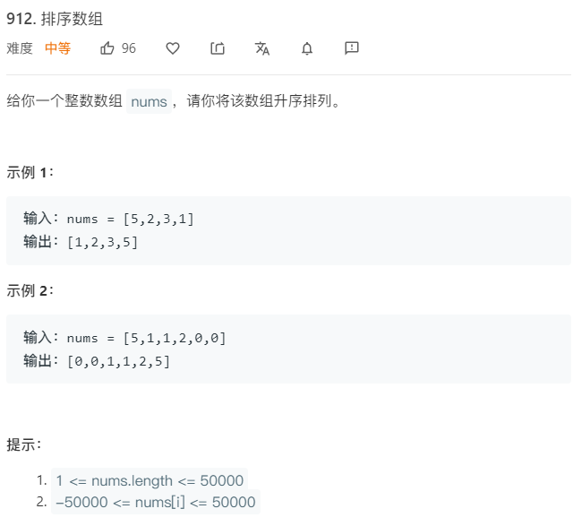

```java
class Solution {
    public int[] sortArray(int[] nums) {
        // BubbleSort(nums);
        // selectSort(nums);
        insertSort(nums);
        return nums;
    }
    
    //冒泡排序
    public void BubbleSort(int[] nums){
        int n = nums.length;
        for(int i=0;i<n-1;i++){
            boolean isSort = true;
            for(int j=0;j<n-i-1;j++){
                if(nums[j+1]<nums[j]){
                    isSort = false;
                    int temp = nums[j+1];
                    nums[j+1] = nums[j];
                    nums[j] = temp;
                }
            }
            if(isSort){
                break;
            }
        }
    }
    
    //选择排序
    public void selectSort(int[] nums){
        int n = nums.length;
        //遍历n-1次 前n-1选择好了之后 最后一个元素必然满足要求
        for(int i=0;i<n-1;i++){
            int minIndex = i;
            for(int j=i+1;j<n;j++){
                if(nums[j]<nums[minIndex]){
                    minIndex = j;
                }
            }
            //交换数据把最小的元素给i
            int temp = nums[minIndex];
            nums[minIndex] = nums[i];
            nums[i] = temp;
        }
    }
    
    //插入排序
    public void insertSort(int[] nums){
        int n = nums.length;
        //循环数组 将nums[i]插入到 nums[0,i)有序区间中
        for(int i=1;i<n;i++){
            int temp = nums[i];
            int j = i;
            while(j>0 && (nums[j-1]>temp)){
                nums[j] = nums[j-1];
                j--;
            }
            nums[j] = temp;
        }
    }
    
    //快速排序 ---重点掌握
    public void quickSort(int[] nums,int low,int high){
        int i,j,base;
        if(low>high){
            return;
        }
        i = low;
        j = high;
        base = nums[low];
        while(i<j){
            //从右边找一个比base小的
            while(base<=nums[j] && (i<j)){
                j--;
            }
            //从左边找一个比base大的
            while (base>=nums[i] && (i<j)){
                i++;
            }
            //交换i，j数据
            if(i<j){
                int temp = nums[i];
                nums[i] = nums[j];
                nums[j] = temp;
            }
        }
        //交换base和ij相遇数字
        int temp = nums[i];
        nums[i] = base;
        nums[low] = temp;  //不能写成base=temp  i,j,base都只是 low high nums[low]的代表
        //递归执行base左边和右边
        quickSort(nums,low,j-1);
        quickSort(nums,j+1,high);
    }
}
```

### day32（有效括号问题）

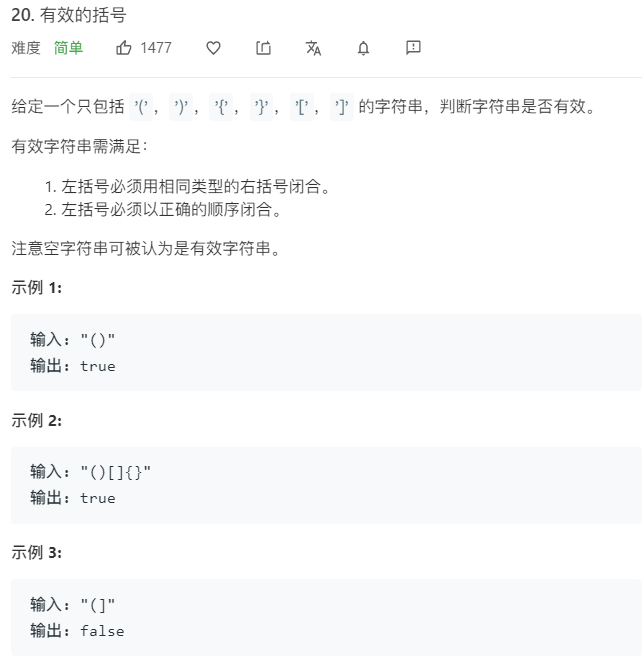

```java
class Solution {
    public boolean isValid(String s) {
        Stack<Character> stack = new Stack<>();
        char[] chars = s.toCharArray();
        for(char c:chars){
            if(stack.size()==0){
                stack.push(c);
            }else if(isPair(stack.peek(),c)){
                stack.pop();
            }else{
                stack.push(c);
            }
        }
        return stack.size()==0;
    }
    
    public boolean isPair(char a,char b){
        if(a=='(' && b==')' || a=='{' && b=='}' || a=='[' && b==']'){
            return true;
        }
        return false;
    }
}
```

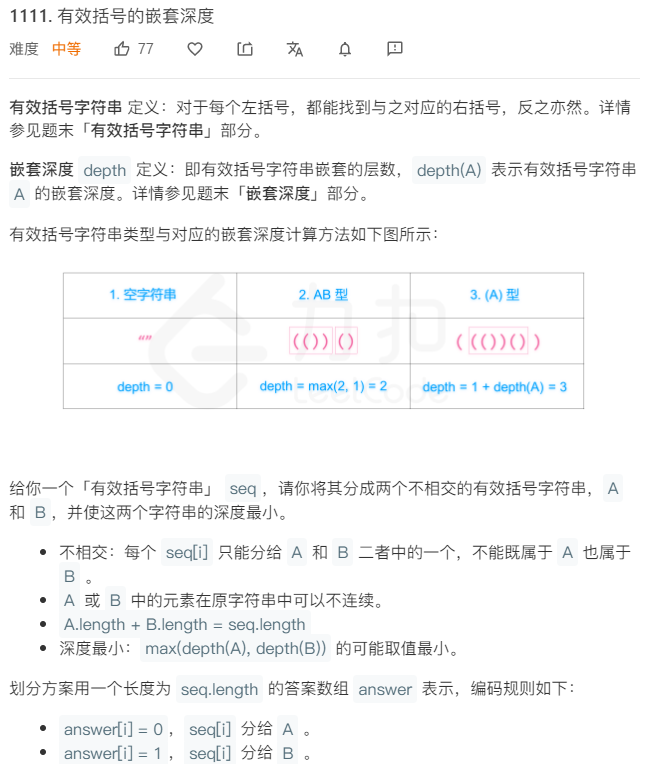

今天题目太难理解了，没意思

使 max(depth(A), depth(B)) 的可能取值最小”。这句话其实相当于让A字符串和B字符串的depth尽可能的接近。为什么呢？因为seq对应的栈上，每个左括号都对应一个深度，而这个左括号，要么是A的，要么是B的。所以，栈上的左括号只要按奇偶分配给A和B就可以啦！时间复杂度很明显是 O(n)O(n)的，空间复杂度也是O(n)O(n)（如果算返回的变量的话）。

```java
class Solution {
    public int[] maxDepthAfterSplit(String seq) {
        int[] ans = new int[seq.length()];
        
        for(int i=0;i<seq.length();i++){
            //奇数下标的( 分给A 偶数下标（ 分给B 
            //奇数下标的) 分给B 偶数下标) 分给A 
            // if(seq.charAt(i)=='('){
            //     if(i%2==0){
            //         ans[i] = 1;
            //     }else{
            //         ans[i] = 0;
            //     }
            // }else{
            //     if(i%2==0){
            //         ans[i] = 0;
            //     }else{
            //         ans[i] = 1;
            //     }
            // }
            ans[i] = seq.charAt(i)=='('? i&1:(i+1)&1;
        }
        return ans;
    }
}
```

### day33（生命游戏）

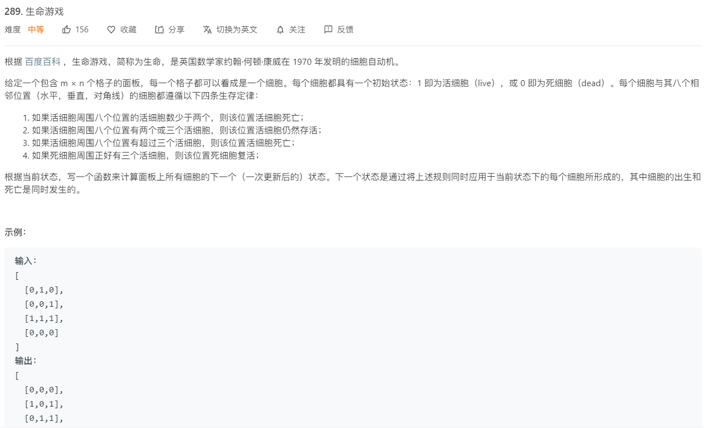

idea：

不能每个点周围判断完之后立即更新周围点的状态，因为当前点的周围状态会是下一次研究的中心点对象，采取标志位方式  2代表：alive-->dead   -1: dead-->alive

```java
class Solution {
    public int m;
    public int n;
    public void gameOfLife(int[][] board) {
        int[] dx = {0, 0, 1, -1, 1, 1, -1, -1};
        int[] dy = {1, -1, 0, 0, 1, -1, 1, -1};
        
        m = board.length;
        n = board[0].length;
        
        for(int i=0;i<m;i++){
            for(int j=0;j<n;j++){
                int cnt = 0; //统计当前细胞周围活细胞数量
                for(int k=0;k<8;k++){
                    int next_X = i+dx[k];
                    int next_Y = j+dy[k];
                    if(check(next_X,next_Y) && board[next_X][next_Y]>0){//标记为2或者-1只是一个标识位 在没有遍历完之前2，-1还代表他底层的1,0
                        cnt ++;
                    }
                }
                
                if(board[i][j]==1){
                    if(cnt<2 || cnt>3){
                        board[i][j] = 2; //活细胞-->死亡
                    }
                }else if(cnt==3){
                    board[i][j] = -1;  //死细胞-->复活
                }
                
            }
        }
        for(int i=0;i<m;i++){
            for(int j=0;j<n;j++){
                if(board[i][j]==2){
                    board[i][j] = 0;
                }else if(board[i][j]==-1){
                    board[i][j] = 1;
                }
            }
        }
    }
    
    public boolean check(int x,int y){
        if(x<0 || x>=m || y<0 || y>=n){
            return false;
        }
        return true;
    }
}
```

### day34（字符串到整数）

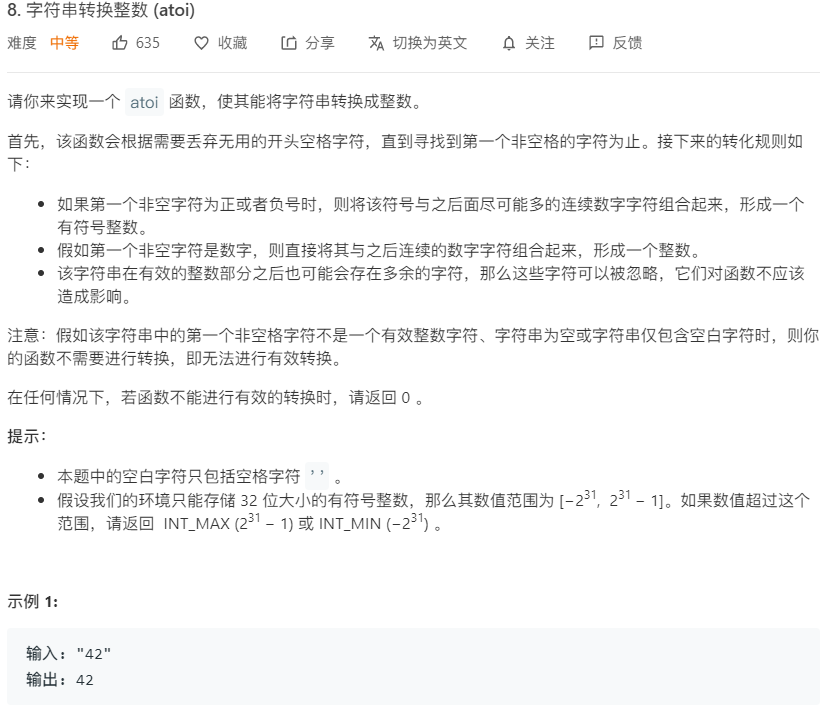

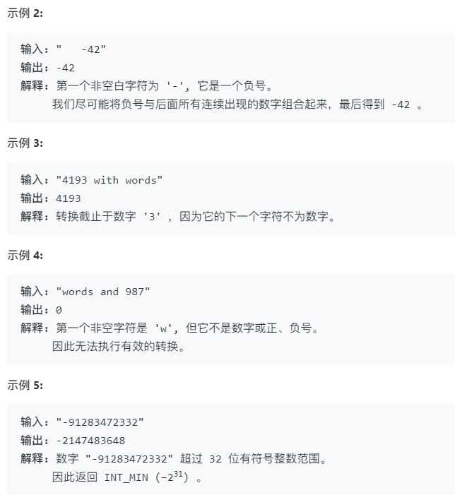

```java
class Solution {
    public int myAtoi(String str) {
        char[] chars = str.toCharArray();
        int n = chars.length;
        int cur = 0;
        //去掉前导空格
        while(cur<n && chars[cur]==' '){
            cur++;
        }
        if(cur==n){
            return 0;
        }

        boolean negative = false;
        if(chars[cur]=='-'){
            negative = true;
            cur++;
        }else if(chars[cur]=='+'){
            cur++;
        }else if(!Character.isDigit(chars[cur])){
            return 0;
        }
        
        int ans = 0;
        int digit = 0;
        while(cur<n && Character.isDigit(chars[cur])){
            digit = chars[cur]-'0';
            if(ans>(Integer.MAX_VALUE-digit)/10){ //保证不溢出
                return ans = negative? Integer.MIN_VALUE:Integer.MAX_VALUE;
            }
            ans = ans*10+digit;
            cur++;
        }
        return negative?-ans:ans;
    }
}
```

### day35（接雨水）

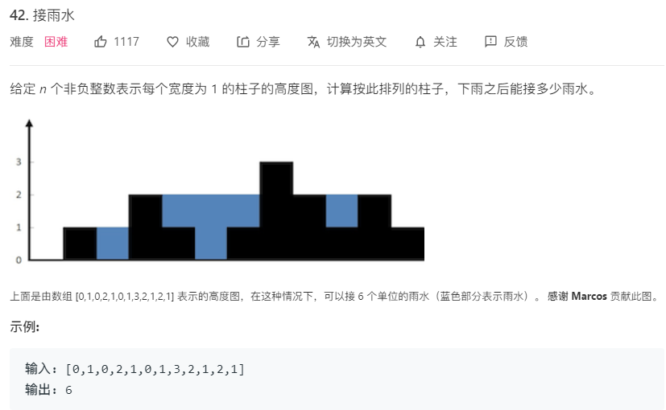

```java
class Solution {
    public int trap(int[] height) {
        //***************暴力解法******************
        int ans = 0;
        //从第二个柱体遍历到倒数第二个柱体
        for(int i=1;i<height.length-1;i++){
            int leftMax = 0;
            int rightMax = 0;
            for(int j=0;j<=i;j++){
                leftMax = Math.max(leftMax,height[j]);
            }
            for(int k=i;k<height.length;k++){
                rightMax = Math.max(rightMax,height[k]);
            }
            ans += Math.min(leftMax,rightMax)-height[i];
        }
        return ans;
        
        //*****************dp解法********************
        int n = height.length;
        int ans = 0;
        if(n==0){
            return 0;
        }
        int[][] dp = new int[n][2];
        //dp[i][0] dp[i][1] 表示第i柱子左右两边的最大高度(包括当前柱子高度)
        dp[0][0] = height[0];
        dp[n-1][1] = height[n-1];
        //填充柱子左边高度所有情况
        for(int i=1;i<n;i++){
            dp[i][0] = Math.max(dp[i-1][0],height[i]);
        }
        for(int j=n-2;j>=0;j--){
            dp[j][1] = Math.max(dp[j+1][1],height[j]);
        }
        for(int k=0;k<n;k++){
            ans += Math.min(dp[k][0],dp[k][1])-height[k];
        }
        return ans;
    }
}
```

### day37（编辑距离）


```java
class Solution {
    public int minDistance(String word1, String word2) {
        int len1 = word1.length();
        int len2 = word2.length();
        //dp[i][j] word1的前i个字符转化为word2前j个字符所使用的最小操作次数
        int[][] dp = new int[len1+1][len2+1];
        for(int i = 0;i<=len1;i++){
            dp[i][0] = i;
        }
        for(int j = 0;j<=len2;j++){
            dp[0][j] = j;
        }
        
        for(int i=1;i<=len1;i++){
            for(int j=1;j<=len2;j++){
                if(word1.charAt(i-1) == word2.charAt(j-1)){
                    dp[i][j] = dp[i-1][j-1];
                }else{
                    dp[i][j] = Math.min(Math.min(dp[i][j-1],dp[i-1][j]),dp[i-1][j-1])+1;
                }
            }
        }
        return dp[len1][len2];
    }
}
```

