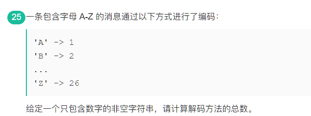
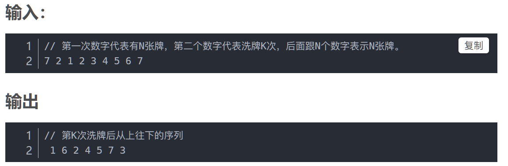

### Vivo---20200607

#### Question 1（种花）:


```java
Young版
class Solution {
    public boolean canPlaceFlowers(int[] flowerbed, int n) {
        int count = 0;
        int[] ans;
        int len = flowerbed.length;
        if(len==1){
            if(flowerbed[0]==0){
                count ++;
                return count>=n;
            }else{
                return count>=n;
            }
        }
        for(int i=0;i<flowerbed.length;i++){
            if(i==0){
                if(flowerbed[i]==0 && (i+1)<len && flowerbed[i+1]==0 ){
                    flowerbed[i] = 1;
                    count ++;
                }
            }else if(i==flowerbed.length-1){
                if(flowerbed[i]==0 && (i-1)>0 && flowerbed[i-1]==0){
                    flowerbed[i] = 1;
                    count ++;
                }
            }else if(flowerbed[i]==0 && flowerbed[i-1]==0 && flowerbed[i+1]==0){
                flowerbed[i] = 1;
                count ++;
            }
        }
        return count>=n;
    }
}

参考代码：
public class Solution {
    public boolean canPlaceFlowers(int[] flowerbed, int n) {
        int i = 0, count = 0;
        while (i < flowerbed.length) {
            if (flowerbed[i] == 0 && (i == 0 || flowerbed[i - 1] == 0) && (i == flowerbed.length - 1 || flowerbed[i + 1] == 0)) {    //巧妙
                flowerbed[i] = 1;
                count++;
            }
            i++;
        }
        return count >= n;
    }
}

```

#### Question 2（鸡蛋掉落）


#### Question 3 （合并k个有序链表）


```java
package Vivo;

import java.util.*;

public class Ques2_0608 {
    public static void main(String[] args) {
    List<Integer> list1 = Arrays.asList(new Integer[] {1,4,5});
    List<Integer> list2 = Arrays.asList(new Integer[] {1,3,4});
    List<Integer>[] lists = new List[]{list1,list2};
        System.out.println(mergeKList(lists).toString());
    }

    public static List<Integer> mergeKList(List<Integer>[] lists){
        if(lists.length==0 || lists==null){
            return null;
        }
        int k = lists.length;
        //注意优先队列的使用，需要自定义比较器
        PriorityQueue<Integer> queue = new PriorityQueue<>(new Comparator<Integer>() {
            @Override
            public int compare(Integer o1, Integer o2) {
                return o1-o2;
            }
        });
        for(int i =0;i<k;i++){
            List<Integer> temp = lists[i];
            Iterator<Integer> iterator = temp.iterator();
            while (iterator.hasNext()){
                queue.add(iterator.next());
            }
        }

        List<Integer> ans = new LinkedList<>();
        while (!queue.isEmpty()){
            ans.add(queue.poll());
        }
        return ans;
    }
}
```

#### Question 4 （生产线）


```java
//思路
//[1,2,2,3,3,3,4,4,4,4,5,5,5,5,5]-->[1,2,3,4,5]对应每段的个数
//GroupCount用来计算小于n的前几段和 count用来计算属于12345哪一段中

package Vivo;

import java.util.Scanner;

public class Ques3 {
    public static void main(String[] args) {
        Scanner scanner = new Scanner(System.in);
        while (scanner.hasNext()){
            int numOfDay = scanner.nextInt();
            System.out.println(NumPhones(numOfDay));
        }
    }

    /**
     *
     * @param n 第n天
     * @return 生产的手机总数
     */
    public static int NumPhones(int n){
        int GroupCount = 0;
        int count = 0;
        int sum = 0;
        for(int i=0;i<n+1;i++){
            if(GroupCount<n){
                GroupCount += i+1;
                count ++;
            }else{
                GroupCount -= i;
                break;
            }
        }
        for(int i=1;i<count;i++){
            sum += Math.pow(i,2);
        }
        sum = sum+(n-GroupCount)*(count);
        return sum;
    }
}
```

#### Question 5 （数位之积）

现给定任意正整数n,请寻找并输出最小的正整数m(m>9),使得m的各位（个位、十位…）之乘积等于n,若不存在则输出-1.
输入样例： 36
输出样例： 49

```java
package Vivo;

import java.util.Scanner;

public class Ques4 {
    public static void main(String[] args) {
        Scanner scanner =  new Scanner(System.in);
        while (scanner.hasNext()){
            int test = scanner.nextInt();
            System.out.println(solution(test));
        }
    }

    public static int solution(int n){
        int ans = resolve(n);
        if(ans>0){
            return ans;
        }
        return -1;
    }

    //递归进行整除运算
    public static int resolve(int n){
        if(n<10){
            return n;
        }
        for(int i=9;i>1;i--){
            if(n%i==0){
                return resolve(n/i)*10+i;
            }
        }
        return -1;
    }
}

```

### ICBC

#### Question 1（考勤记录）


```java
package ICBC;

import java.util.Scanner;

public class Test01 {
    public static void main(String[] args) {
        Scanner scanner = new Scanner(System.in);
        while (scanner.hasNext()){
            int N = scanner.nextInt();
            if(N==1){
                System.out.println(1);
            }else if(N==2){
                System.out.println(4);
            }else{
                System.out.println(N*(N-1)/2+1+N);
            }
        }
    }
}

```

#### Question 2（解码方式--动态规划）



```java
package ICBC;

import java.util.Scanner;

public class Test02 {
    public static void main(String[] args) {
        Scanner scanner = new Scanner(System.in);
        while (scanner.hasNext()){
            String s = scanner.nextLine();
            System.out.println(numDecoding(s));
        }
    }

    //动态规划的思想：
    //当前位置的编码方式需要根据前面的步骤来计算；
    //举例：
    //1226
    //当前位置：1   -->编码方式: 1
    //当前位置：2   -->编码方式：1  2 ； 12
    //当前位置：2   -->编码方式：1 2 2 ；12 2 ；1 22
    //当前位置：6   -->编码方式：1 2 2 6 ; 12 2 6 ; 1 22 6 ; 1 2 26 ; 12 26
    //规律总结:
    //如果当前数字不是0，则判断 它和前一位数字组合是否大于26，如果不大于26，则可以通过组合形式形成新的编码方法，如果和前一位组合后大于26，则只能单独出道；可以看出，如果可以组合，则是在dp[i-2] 的基础上进行组合，如果不能组合即单独出道，即在dp[i-1] 的基础上单独出道，如果又能单独出道又能组合，则dp[i] = dp[i-1] + dp[i-2]

    public static int numDecoding(String s){
        if(s.charAt(0)==0){
            return 0;  //不合法
        }
        int[] dp = new int[s.length()+1];
        dp[0] = dp[1] = 1;
        for (int i=2;i<=s.length();i++){   //dp长度为s.length()+1 所以i可以取到s.length()
            if(s.charAt(i-1)!='0'){ //合法字符
                dp[i] += dp[i-1];
            }
            String twoChar = s.substring(i-2,i);
            if(Integer.valueOf(twoChar)<=26){
                dp[i] += dp[i-2];
            }
        }
        return dp[s.length()];
    }
}

```

#### Question 3（最小船只数--双指针）


```java
package ICBC;

import java.util.Arrays;

public class Test03 {
    public static void main(String[] args) {
        int[] test = new int[]{1,2,3,4,5,6,7,8};
        System.out.println(leastShapeNum(test,5));
    }

    public static int leastShapeNum(int[] people,int limit){
        if(people.length==0 || people==null){
            return 0;
        }
        Arrays.sort(people);
        //双指针 将最大体重和最小体重的放在一起 就可以用最小的船的数量
        int i = 0;
        int j = people.length-1;
        int result = 0;
        while (i<j){
            if(people[j]+people[i]<=limit){
                result ++;
                i++;
                j--;
            }else{
                j--;  //体重最大的独自做一条船
                result ++;
            }
        }

        if(i==j){
            result ++;  //最后剩余的一个人需要一条船
        }
        return result;
    }
}

```

#### Question 4 （字符串是否由子串拼成）


```java
public class Main{
    public static void main(String args[]){
        Scanner sc = new Scanner(System.in);
        String s = sc.nextLine();
        String result = "";
        String[] allResult = new String[s.length()];
        int count = 0;
        for(int i=0;i<s.length()/2;i++){
            if(isSubString(s,s.substring(0,i+1))){
                 allResult[count] = s.substring(0,i+1);
                 count ++;
            }
        }
        if(allResult[0]!=null){
             System.out.print(allResult[0]);
        }else{
            System.out.print(false);
        }
      
    }
    
    public static boolean isSubString(String s,String subStr){
        if((subStr+s).equals(s+subStr)){
            return true;
        }
        return false;
    }
}
```

#### Question 5 (洗牌算法--左右手交替)




```java
package ICBC;

import java.util.Scanner;

public class Test09 {
    public static void main(String[] args) {
        Scanner scanner = new Scanner(System.in);
        int num = scanner.nextInt();
        int k = scanner.nextInt();
        int[] cards = new int[num];
        for(int i=0;i<num;i++){
            cards[i] = scanner.nextInt();
        }

        for (int j=1;j<=k;j++){
            cards = shuffle(cards,j);
        }
        for(int m=0;m<cards.length-1;m++){
            System.out.print(cards[m]+" ");
        }
        System.out.print(cards[cards.length-1]);
    }

    public static int[] shuffle(int[] cards,int curTimes){
        int len = cards.length;
        int left = 0;
        int right = len-1;
        int mid = 0;
        if(len%2==0){
            mid = len/2-1;
        }else{
            mid = len/2;
        }
        left = mid;
        int[] result = new int[len];
        int index = len-1;
        while (index>=0){
            if((curTimes & 1) == 0){ //偶数次洗牌
                if(left>=0) result[index--] = cards[left--];
                if(right>mid) result[index--] = cards[right--];
            }else { //奇数次洗牌
                if(right>mid) result[index--] = cards[right--];
                if(left>=0) result[index--] = cards[left--];
            }
        }
        return result;
    }

}

```

