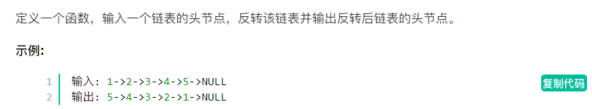
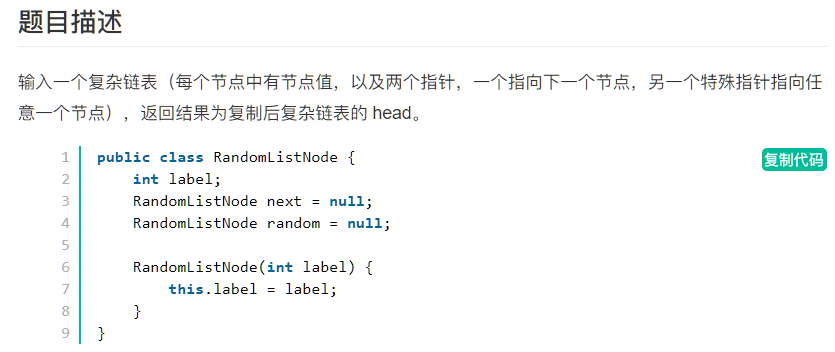
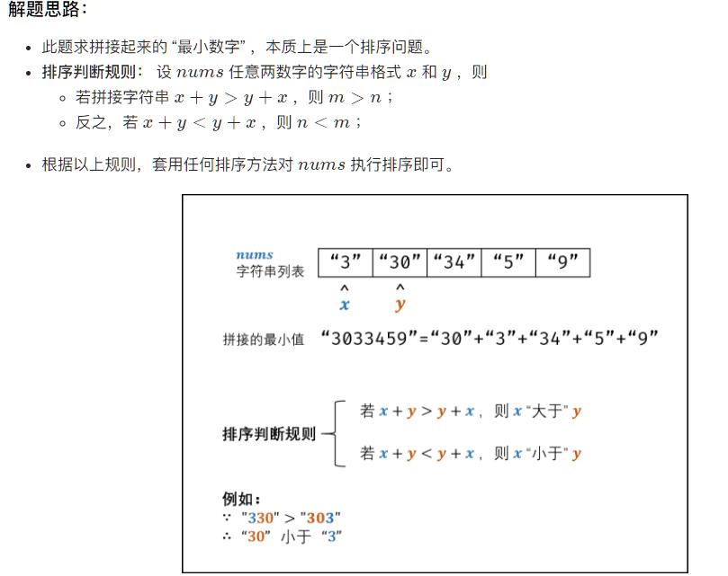
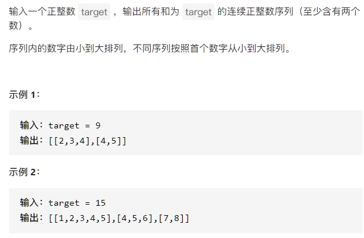
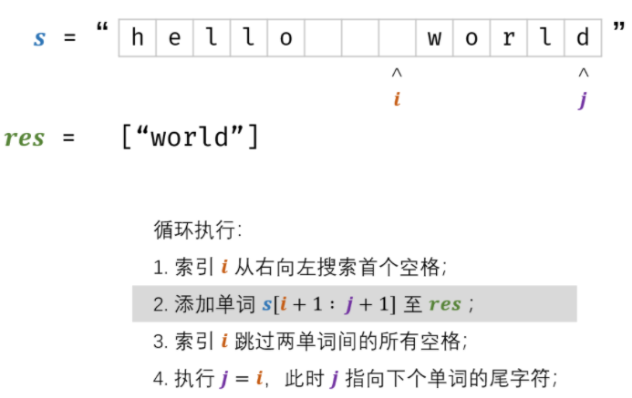
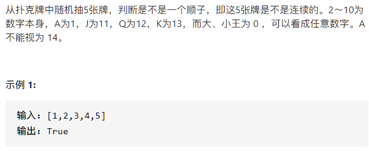
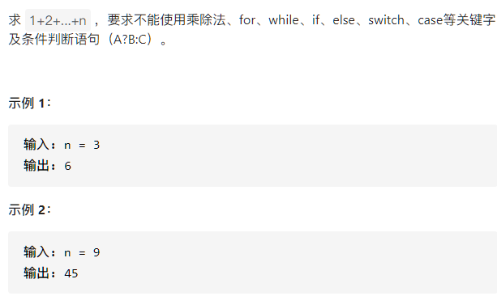
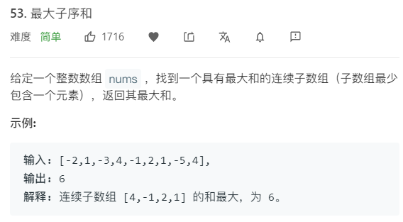

# 剑指Offer

## 001:三个线程循环打印数字

```java
public class Test05 {
    public static void main(String[] args) throws InterruptedException{
        Thread t1 = new Thread(new MyThread1(0));
        Thread t2 = new Thread(new MyThread1(1));
        Thread t3 = new Thread(new MyThread1(2));
        t1.start();
        t2.start();
        t3.start();
        t1.join();
        t2.join();
        t3.join();

    }
}

class MyThread1 implements Runnable{
    private static Object lock = new Object();
    private static int count = 0;
    int no;

    MyThread1(int no){
        this.no = no;
    }

    @Override
    public void run() {
        while (true){
            synchronized (lock){
                if(count>100){
                    break;
                }
                if(count%3==this.no){
                    System.out.println(this.no+"----->"+count);
                    count++;
                }else{
                    try{
                        lock.wait();
                    }catch (InterruptedException e){
                        e.printStackTrace();
                    }
                }
                lock.notifyAll();
            }
        }
    }
}
```

## 002: 死锁Demo

```java
package ByteDance;

/**
 * 线程死锁
 */
public class Lock {
    private static Object resource1 = new Object();
    private static Object resource2 = new Object();

    public static void main(String[] args) {
        new Thread(()->{
            synchronized(resource1){
                System.out.println(Thread.currentThread()+"get resource1");
                try{
                    Thread.sleep(1000);

                }catch (InterruptedException e){
                    e.printStackTrace();
                }
                System.out.println(Thread.currentThread()+"waitting get resource2");
                synchronized (resource2){
                    System.out.println(Thread.currentThread()+"get resource2");
                }
            }
        },"线程1").start();

        new Thread(()->{
            synchronized (resource2){
                System.out.println(Thread.currentThread()+"get resource2");
                try{
                    Thread.sleep(1000);

                }catch (InterruptedException e){
                    e.printStackTrace();
                }
                System.out.println(Thread.currentThread()+"waitting get resource1");
                synchronized(resource1){
                    System.out.println(Thread.currentThread()+"get resource1");
                }
            }
        },"线程2").start();
    }
    
    //解决死锁方法---------TODO--------
            new Thread(() -> {
            synchronized (resource1) {   //和线程1获取资源顺序同步
                System.out.println(Thread.currentThread() + "get resource1");
                try {
                    Thread.sleep(1000);
                } catch (InterruptedException e) {
                    e.printStackTrace();
                }
                System.out.println(Thread.currentThread() + "waiting get resource2");
                synchronized (resource2) {  //和线程1获取资源顺序同步
                    System.out.println(Thread.currentThread() + "get resource2");
                }
            }
        }, "线程 2").start();
}
```

## 003：双重检查单例

```java
public class Singleton {
    private static volatile Singleton singleton;
    private Singleton(){

    }

    public static Singleton getSingleton(){
        if(singleton == null){
            synchronized(Singleton.class){
                if(singleton == null){
                    singleton = new Singleton();
                }
            }
        }
        return singleton;
    }
}
```

## 01：数组全排列(:star:)


```java
class Solution {
    public List<List<Integer>> permute(int[] nums) {
        List<List<Integer>> ans = new LinkedList<>();
        Queue<List<Integer>> queue = new LinkedList<>();
        queue.add(new LinkedList<Integer>());
        
        while(!queue.isEmpty()){
            List<Integer> list = queue.poll();
            int size = list.size();
            if(size == nums.length){
                ans.add(list);
                continue;
            }
            for(int i = 0; i<=nums.length-1;i++){
                if(!list.contains(nums[i])){
                    List<Integer> temp = new LinkedList<>(list);
                    temp.add(nums[i]);
                    queue.add(temp);
                }

            }
        }
        return ans;
    }
}
```

## 02：数组中重复的数字


```java
class Solution {
    public int findRepeatNumber(int[] nums) {
        for(int i=0;i<nums.length;i++){
            if(nums[i]!=i){
                if(nums[i]==nums[nums[i]]){
                    return nums[i];
                }
                int temp = nums[i];
                nums[i] = nums[temp];  //数组下标一定要用temp
                nums[temp] = temp;
            }
        }
        return -1;
    }
}
```

## 03：二维数组中的查找(:star:)


```java
public boolean Find(int target, int[][] matrix) {
    if (matrix == null || matrix.length == 0 || matrix[0].length == 0)
        return false;
    int rows = matrix.length, cols = matrix[0].length;
    int r = 0, c = cols - 1; // 从右上角开始
    while (r <= rows - 1 && c >= 0) {
        if (target == matrix[r][c])
            return true;
        else if (target > matrix[r][c])
            r++;
        else
            c--;
    }
    return false;
}
```

## 04：替换空格


```java
class Solution {
    public String replaceSpace(String s) {
        StringBuilder sb=new StringBuilder();
        for(int i=0;i<s.length();i++){
            if(s.charAt(i)==' ')
                sb.append("%20");
            else   
                sb.append(s.charAt(i));
        }
        return sb.toString();
    }
}
```

## 05：逆序打印链表（栈）


```java
class Solution {
    public int[] reversePrint(ListNode head) {
        List<Integer> list=new ArrayList<>();
        while(head!=null){
            list.add(head.val);
            head=head.next;
        }
        int[] res=new int[list.size()];
        for(int i=0;i<res.length;i++)
            res[i]=list.get(list.size()-i-1);
        return res;
    }

}
```

## 06：重建二叉树（***TODO***:tired_face:）


```java
class Solution {

    //key是中序遍历的值，value是中序遍历的结果
    HashMap<Integer,Integer> indexMap=new HashMap<>();

    public TreeNode buildTree(int[] preorder, int[] inorder) {
        //保存中序遍历的信息
        for(int i=0;i<inorder.length;i++){
            indexMap.put(inorder[i],i);
        }
        return createTree(preorder,0,inorder,0,inorder.length-1);
    }

    //preIndex是前序遍历的索引，inStart和inEnd是中序遍历的索引范围
    private TreeNode createTree(int[] preorder,int preIndex,int[] inorder,int inStart,int inEnd){
        if(inStart>inEnd)
            return null;
        //获取前序遍历的值
        int val=preorder[preIndex];
        //获取前序遍历值在中序遍历的位置
        int inIndex=indexMap.get(val);
        //以该值作为根节点的值创建根节点
        TreeNode root=new TreeNode(val);
        //根节点的左子树节点数目
        int leftNum=inIndex-inStart;
        //根节点以左创建左子树，根节点以右创建右子树
        root.left=createTree(preorder,preIndex+1,inorder,inStart,inIndex-1);
        root.right=createTree(preorder,preIndex+1+leftNum,inorder,inIndex+1,inEnd);
        return root;
    }
}
```

## 07：二叉树的下一个节点


1：如果一个节点的右子树不为空，那么下一个节点为右子树的最左节点


2：否则，向上找第一个祖先节点


```java
public TreeLinkNode GetNext(TreeLinkNode pNode) {
    if (pNode.right != null) {
        TreeLinkNode node = pNode.right;
        while (node.left != null)
            node = node.left;
        return node;
    } else {
        while (pNode.next != null) {
            TreeLinkNode parent = pNode.next;
            if (parent.left == pNode)
                return parent;
            pNode = pNode.next;
        }
    }
    return null;
}
```

## 08：两个栈实现队列(:star:)


```java
class CQueue {
    Stack<Integer> stack1;
    Stack<Integer> stack2;
    public CQueue() {
        stack1 = new Stack<Integer>();
        stack2 = new Stack<Integer>();
        
    }
    
    public void appendTail(int value) {
        stack1.add(value);

    }
    
    public int deleteHead() {
        if(stack2.isEmpty()){
            while(!stack1.isEmpty()){
                stack2.push(stack1.pop());
            }
        }
        
        if(stack2.isEmpty()){
            return -1;
        }
        
        int item = stack2.pop();
        return item;
    }
}

/**
 * Your CQueue object will be instantiated and called as such:
 * CQueue obj = new CQueue();
 * obj.appendTail(value);
 * int param_2 = obj.deleteHead();
 */
```

## 09：旋转数组的最小数字


```java
    public int minNumberInRotateArray(int [] array) {
        for(int i=0;i<array.length-1;i++){
            if(array[i]>array[i+1]){
                return array[i+1];
            }
        }
        return 0;
    }
```

## 10：青蛙跳台阶


```java
    public int JumpFloor(int target) {
        int[] dp = new int[target+1];
        dp[0] = dp[1] = 1;
        for(int i=2;i<=target;i++){
            dp[i] = dp[i-1] + dp[i-2];
        }
        return dp[target];
    }


//一只青蛙一次可以跳上1级台阶，也可以跳上2级……它也可以跳上n级。求该青蛙跳上一个n级的台阶总共有多少种跳法。
    public int JumpFloorII(int target) {
        int[] dp = new int[target];
        Arrays.fill(dp,1);
        for(int i=0;i<target;i++){
            for(int j=0;j<i;j++){
                dp[i] += dp[j];
            }
        }
        
        return dp[target-1];
    }
```

## 11：矩形覆盖


```java
    public int RectCover(int target) {
        if(target<=2){
            return target;
        }
        return RectCover(target-1)+RectCover(target-2);
    }
```

## 12：二进制中1的个数


```java
public int NumberOf1(int n) {
    int count = 0;
    while(n!=0){
        count ++;
        n = n&(n-1);
    }
    return count;
}
```

## 13：数值的整数次方(:star:)


```java
    public double Power(double base, int exponent) {
        if(exponent == 0){
            return 1;
        }
        if(exponent == 1){
            return base;
        }
        
        boolean isNeg = false;
        
        if(exponent<0){
            isNeg = true;
            exponent = -exponent;
        }
        
        double ans = Power(base,exponent/2);
        if(exponent %2 == 0){
            ans = ans*ans;
        }else{
            ans = ans*ans*base;
        }
        
        return isNeg ? 1/ans:ans;
  }
```

## 14：调整数组顺序使奇数在前偶数在后


```java
public void reOrderArray(int [] array) {
        if(array == null || array.length == 0){
            return;
        }
        int count = 0;  //奇数个数-------->谁在前统计谁的个数 否则会处理不了【1】数组长度为1的情况
        for(int num:array){
            if(num %2 == 1){
                count ++;
            }
        }
        
        int[] ans = array.clone();
        int i = 0;
        int j = count;
        for(int num:ans){
            if(num %2 == 1){
                array[i++] = num;
            }else{
                array[j++] = num;
            }
        }
    }
```

## 15：链表倒数第K个节点(:star:)


```java
 public ListNode FindKthToTail(ListNode head,int k) {
        if(head == null){
            return null;
        }
        
        ListNode p1 = head;
        while(p1!=null && k>0){
            k--;
            p1 = p1.next;
        }
        //k>列表长度
        if(k>0){
            return null;
        }
        
        ListNode p2 = head;
        while(p1!=null){
            p1 = p1.next;
            p2 = p2.next;
        }
        return p2;
    }
```

## 16：反转单链表(:star:)



```java
public ListNode ReverseList(ListNode head) {
    if(head == null || head.next==null){
        return head;
    }

    ListNode pre = head;
    ListNode cur = pre.next;
    pre.next = null;
    ListNode next = null;

    while(cur!=null){
        next = cur.next;
        cur.next = pre;
        pre = cur;
        cur = next;
    }

    return pre;
}
```

## 17：合并两个排序链表(:star:)


```java
//方法1---->优先队列
public ListNode Merge(ListNode list1,ListNode list2) {
        PriorityQueue<ListNode> queue = new PriorityQueue<>(new Comparator<ListNode>(){
            public int compare(ListNode o1,ListNode o2){
                return o1.val-o2.val;
            }
        });
        
        while(list1!=null){
            queue.add(list1);
            list1 = list1.next;
        }
        
        while(list2!=null){
            queue.add(list2);
            list2 = list2.next;
        }
        ListNode pre = new ListNode(-1);
        ListNode temp = pre;
        while(!queue.isEmpty()){
            temp.next = queue.poll();
            temp = temp.next;
        }
        return pre.next;
    }

//方法2----->双指针
public ListNode mergeTwoLists(ListNode l1, ListNode l2) {
    ListNode pre=new ListNode(-1);
    ListNode cur=pre;
    while(l1!=null&&l2!=null){
        if(l1.val<l2.val){
            cur.next=l1;
            l1=l1.next;
        }else{
            cur.next=l2;
            l2=l2.next;
        }
        cur=cur.next;
    }
    cur.next = l1 == null?l2:l1;
    return pre.next;
}
```

## 18：合并K个有序链表

```java
public ListNode mergeKLists(ListNode[] lists) {
    if(lists==null || lists.length==0){
        return null;
    }
    int k = lists.length;
    PriorityQueue<ListNode> queue = new PriorityQueue<>(new Comparator<ListNode>(){
        public int compare(ListNode o1,ListNode o2){
            //升序排序
            return (o1.val-o2.val);
        } 
    });

    //把每个链表的数据放入queue
    for(int i=0;i<k;i++){
        ListNode head  = lists[i];
        while(head!=null){
            queue.add(head);
            head = head.next;
        }
    }

    ListNode temp = new ListNode(-1);
    ListNode head = temp;
    while(!queue.isEmpty()){
        temp.next = queue.poll();
        temp = temp.next;
    }
    temp.next = null;
    return head.next;
}
```

## 19：镜像二叉树(:star:)


```java
public void Mirror(TreeNode root) {
    if(root == null){
        return;
    }

    Queue<TreeNode> queue = new LinkedList<TreeNode>();
    queue.add(root);

    while(!queue.isEmpty()){
        TreeNode curNode = queue.poll();
        TreeNode temp = curNode.left;
        curNode.left = curNode.right;
        curNode.right = temp;

        if(curNode.left != null){
            queue.add(curNode.left);
        }
        if(curNode.right != null){
            queue.add(curNode.right);
        }
    }
}
```

## 20：顺时针打印矩阵

```java
public ArrayList<Integer> printMatrix(int [][] matrix) {
    ArrayList<Integer> ans = new ArrayList<>();
    int RL = 0;
    int RH = matrix.length-1;

    int CL = 0;
    int CH = matrix[0].length-1;

    while(RL<=RH && CL<=CH){
        for(int i=CL;i<=CH;i++){
            ans.add(matrix[RL][i]);
        }
        for(int i=RL+1;i<=RH;i++){
            ans.add(matrix[i][CH]);
        }

        if(RL!=RH){
            for(int i=CH-1;i>=CL;i--){
                ans.add(matrix[RH][i]);
            }
        }

        if(CL!=CH){
            for(int i=RH-1;i>RL;i--){
                ans.add(matrix[i][CL]);
            }
        }
        RL++;
        RH--;

        CL++;
        CH--;

    }
    return ans;
}
```

## 21：最小栈(:star:)


```java
public class Solution {
    Stack<Integer> dataStack = new Stack<>();
    Stack<Integer> minStack = new Stack<>();
    
    public void push(int node) {
        dataStack.push(node);
        if(minStack.isEmpty()){
            minStack.push(node);
        }else{
            minStack.push(Math.min(node,minStack.peek()));
        }
    }
    
    public void pop() {
        dataStack.pop();
        minStack.pop();
    }
    
    public int top() {
        return dataStack.peek();
    }
    
    public int min() {
        return minStack.peek();
    }
}
```

## 22：栈的压入、弹出(:star:)


利用一个辅助栈来模拟，停止条件是压栈序列全部入栈，然后入栈时如果栈顶和出栈序列的当前元素相同就出栈一个，直到栈空或栈顶不等于出栈序列当前元素。

最后判断栈是否空，如果空代表入栈出栈有效。

```java
public boolean IsPopOrder(int [] pushA,int [] popA) {
    Stack<Integer> stack = new Stack<>();
    int pushIndex = 0;
    int popIndex = 0;

    while(pushIndex!=pushA.length){
        stack.push(pushA[pushIndex]);
        while(!stack.isEmpty() && stack.peek()==popA[popIndex]){
            stack.pop();
            popIndex ++;
        }
        pushIndex ++;
    }

    return stack.isEmpty();
}
```

## 23：层次遍历二叉树(:star:)


```java
public ArrayList<Integer> PrintFromTopToBottom(TreeNode root) {
    ArrayList<Integer> ans = new ArrayList<>();
    Queue<TreeNode> queue = new LinkedList<>();

    if(root!=null){
        queue.add(root);
    }
    while(!queue.isEmpty()){
        TreeNode node = queue.poll();
        ans.add(node.val);
        if(node.left!=null){
            queue.add(node.left);
        }
        if(node.right!=null){
            queue.add(node.right);
        }
    }
    return ans;
}
```

## 24：树的子结构(:tired_face:)


```java
public class Solution {
    public boolean HasSubtree(TreeNode root1,TreeNode root2) {
        if(root1==null || root2==null){
            return false;
        }
        return isSubTree(root1,root2) || HasSubtree(root1.left,root2) || HasSubtree(root1.right,root2);
    }

    public boolean isSubTree(TreeNode root1,TreeNode root2){
        if(root1==null){
            return false;
        }

        if(root2==null){
            return true;  
        }

        if(root1.val != root2.val){
            return false;
        }

        return isSubTree(root1.left,root2.left) && isSubTree(root1.right,root2.right);
    }
}
```

## 25：二叉树的后续遍历序列（:tired_face:）


```java
public boolean VerifySquenceOfBST(int [] sequence) {
    if(sequence==null || sequence.length==0){
        return false;
    }
    Stack<Integer> stack = new Stack<>();
    int root = Integer.MAX_VALUE;
    int length = sequence.length;

    for(int i=length-1;i>=0;i--){
        if(sequence[i]>root){
            return false;
        }
        while(!stack.isEmpty() && stack.peek()>sequence[i]){
            root = stack.pop();
        }
        stack.push(sequence[i]);
    }
    return true;
}
```

## 26：二叉树中和为某一值的路径(:tired_face:)


```java
public class Solution {
    ArrayList<ArrayList<Integer>> ans = new ArrayList<>();
    LinkedList<Integer> temp = new LinkedList<>();
    public ArrayList<ArrayList<Integer>> FindPath(TreeNode root,int target) {
        help(root,target);
        return ans;
    }
    
    public void help(TreeNode root,int sum){
        if(root==null){
            return;
        }
        temp.add(root.val);
        if(sum-root.val == 0 && root.left == null && root.right == null){
            ans.add(new ArrayList(temp));
        }
        help(root.left,sum-root.val);
        help(root.right,sum-root.val);
        temp.removeLast();  //不符合条件的当前节点回退
    }
}
```

## 27：复杂链表的复制(:tired_face:)




```java
/*
public class RandomListNode {
    int label;
    RandomListNode next = null;
    RandomListNode random = null;

    RandomListNode(int label) {
        this.label = label;
    }
}
*/
public class Solution {
    public RandomListNode Clone(RandomListNode pHead)
    {
        if(pHead == null){
            return null;
        }
        
        //插入新节点
        RandomListNode cur = pHead;
        while(cur!=null){
            RandomListNode clone = new RandomListNode(cur.label);
            clone.next = cur.next;
            cur.next = clone;
            cur = clone.next;
        }
        //建立random连接
        cur = pHead;
        while(cur != null){
            RandomListNode clone = cur.next;
            if(cur.random !=null){
                clone.random = cur.random.next;  //这里的next是被random指向的clone的相同节点
            }
            cur = clone.next;
        }
        
        //拆分
        cur = pHead;
        RandomListNode pCloneHead = cur.next;
        while(cur.next!=null){
            RandomListNode next = cur.next;
            cur.next = next.next;
            cur = next;
        }
        return pCloneHead;
    }
}
```

## 28：二叉搜索树与双向链表(:tired_face:)


```java
class Solution {
    Node head,pre;
    public Node treeToDoublyList(Node root) {
        if(root == null){
            return null;
        }
        dfs(root);
        pre.right = head;
        head.left = pre;
        return head;
    }
    public void dfs(Node cur){
        if(cur == null){
            return;
        }
        dfs(cur.left);
        if(pre == null){
            head = cur;
        }else{
            pre.right = cur;
        }
        cur.left = pre;
        pre = cur;
        dfs(cur.right);
    }
}
```

## 29：字符串排列(:tired_face:)


```java
public class Solution {
    ArrayList<String> ans = new ArrayList<>();
    char[] c;
    public ArrayList<String> Permutation(String str) {
       c = str.toCharArray();
       dfs(0);
       Collections.sort(ans); 
       return ans;
    }
    
    public void dfs(int x){
        if(x == c.length-1){
            ans.add(String.valueOf(c));
            return;
        }
        
        HashSet<Character> set = new HashSet<>();
        for(int i=x;i<c.length;i++){
            if(set.contains(c[i])){
                continue;
            }
            set.add(c[i]);
            swap(i,x);
            dfs(x+1);
            swap(i,x);
        }
    }
    
    public void swap(int a,int b){
        char temp = c[a];
        c[a] = c[b];
        c[b] = temp;
    }
}
```

## 30：数组中超过一半的元素（:smile:）


```java
public int MoreThanHalfNum_Solution(int [] array) {
    //HashMap放方法
    HashMap<Integer,Integer> map = new HashMap<>();
    for(int i=0;i<array.length;i++){
        if(map.containsKey(array[i])){
            map.put(array[i],map.get(array[i])+1);
            continue;
        }
        map.put(array[i],1);
    }
    for(Map.Entry<Integer,Integer> entry:map.entrySet()){
        if(entry.getValue()>array.length/2){
            return entry.getKey();
        }
    }
    return 0;

    //投票法  选择数组中的众数
    int x = 0,votes =0,count =0;
    for(int num:array){
        if(votes==0){
            x = num;  //新的众数待选
        }
        votes += num==x ? 1:-1;
    }
    for(int num : array){
        if(num == x){
            count ++;
        }
    }
    return count>array.length/2? x:0;
}
```

## 31：最小的K个数(:star:)


大根堆解决前最小K个数

小根堆解决前最大K个数

```java
//// 保持堆的大小为K，然后遍历数组中的数字，遍历的时候做如下判断：
// 1. 若目前堆的大小小于K，将当前数字放入堆中。
// 2. 否则判断当前数字与大根堆堆顶元素的大小关系，如果当前数字比大根堆堆顶还大，这个数就直接跳过；
//    反之如果当前数字比大根堆堆顶小，先poll掉堆顶，再将该数字放入堆中。

public ArrayList<Integer> GetLeastNumbers_Solution(int[] input, int k) {
    if(input.length == 0 || k==0 || k>input.length){
        return new ArrayList<Integer>();
    }

    ArrayList<Integer> ans = new ArrayList<>();
    PriorityQueue<Integer> queue = new PriorityQueue<>(new Comparator<Integer>(){
        public int compare(Integer o1,Integer o2){
            return o2 - o1;
        }
    });

    for(int num:input){
        if(queue.size()<k){
            queue.add(num);
        }else if(num<queue.peek()){
            queue.poll();
            queue.add(num);
        }
    }

    while(queue.size()>0){
        ans.add(queue.poll());
    }
    return ans;
}
```

## 32：连续子数组的最大和(dp---​>:smile:)


```java
public int FindGreatestSumOfSubArray(int[] array) {
    int[] dp = new int[array.length];
    dp[0] = array[0];  //截止当前索引的最大和
    int max = Integer.MIN_VALUE;
    for(int i=1;i<array.length;i++){
        if(dp[i-1]<=0){
            dp[i] = array[i];
            max = Math.max(max,dp[i]);
        }else{
            dp[i] = dp[i-1]+array[i];
            max = Math.max(max,dp[i]);
        }
    }
    return max;
}
```

## 33：把数组排成最小的数(:star:)




```java
public String PrintMinNumber(int [] numbers) {
    if(numbers == null || numbers.length == 0){
        return "";
    }

    String[] ans = new String[numbers.length];
    for(int i=0;i<numbers.length;i++){
        ans[i] = String.valueOf(numbers[i]);
    }
    Arrays.sort(ans,new Comparator<String>(){
        public int compare(String s1,String s2){
            return (s1+s2).compareTo(s2+s1);
        }
    });
    StringBuilder sb = new StringBuilder();
    for(String s:ans){
        sb.append(s);
    }
    return sb.toString();
}
```

## 34：丑数(:star:)


**思路**：

     一个十分巧妙的动态规划问题
    1.我们将前面求得的丑数记录下来，后面的丑数就是前面的丑数*2，*3，*5
    2.但是问题来了，我怎么确定已知前面k-1个丑数，我怎么确定第k个丑数呢
    3.采取用三个指针的方法，p2,p3,p5
    4.p2指向的数字下一次永远*2，p3指向的数字下一次永远*3，p5指向的数字永远*5
    5.我们从2*p2 3*p3 5*p5选取最小的一个数字，作为第k个丑数
    6.如果第K个丑数==2*p2，也就是说前面0-p2个丑数*2不可能产生比第K个丑数更大的丑数了，所以p2++
    7.p3,p5同理
    8.返回第n个丑数

```java
public int GetUglyNumber_Solution(int index) {
    if(index == 0){
        return 0;
    }
    int p2=0,p3=0,p5=0;
    int[] dp = new int[index];
    dp[0] = 1;
    for(int i=1;i<index;i++){
        dp[i] = Math.min(dp[p2]*2,Math.min(dp[p3]*3,dp[p5]*5));
        if(dp[p2]*2 == dp[i]) p2++;
        if(dp[p3]*3 == dp[i]) p3++;
        if(dp[p5]*5 == dp[i]) p5++;
    }

    return dp[index-1];
}
```

## 35：第一个只出现一次的字符


```java
public int FirstNotRepeatingChar(String str) {
    char[] chars = str.toCharArray();
    HashMap<Character,Integer> map = new LinkedHashMap<>();
    for(int i=0;i<chars.length;i++){
        if(!map.containsKey(chars[i])){
            map.put(chars[i],1);
            continue;
        }
        map.put(chars[i],map.get(chars[i])+1);
    }
    for(int i=0;i<chars.length;i++){
        if(map.get(chars[i])==1){
            return i;
        }
    }
    return -1;
}
```

## 36：逆序对(:tired_face:  归并排序并计数)


```java
public class Solution {
    public int InversePairs(int [] array) {
        int len = array.length;
        if(len<2){
            return 0;
        }
        int[] copy = new int[len];
        for(int i=0;i<len;i++){
            copy[i] = array[i];
        }
            
        int[] temp = new int[len];
        return (int)sort(copy,0,len-1,temp)%1000000007;
    }
    
    public int sort(int[] array,int left,int right,int[] temp){
        if(left == right){
            return 0;
        }
        
        int mid = left + (right-left)/2;
        int leftPairs = sort(array,left,mid,temp);
        int rightPairs = sort(array,mid+1,right,temp);
        if(array[mid]<=array[mid+1]){
            return leftPairs+rightPairs;
        }
        int crossPairs = mergeCount(array,left,mid,right,temp);
        
        return leftPairs+rightPairs+crossPairs;
    }
    
    public int mergeCount(int[] array,int left,int mid,int right,int[] temp){
        for(int i=left;i<=right;i++){
            temp[i] = array[i];
        }
        
        int i = left;
        int j = mid + 1;
        
        int count = 0;
        for(int k=left;k<=right;k++){
            if(i==mid+1){  //左边遍历完  将所有右边数组加入temp
                array[k] = temp[j];
                j++;
            }else if(j==right+1){
                array[k] = temp[i];
                i++;
            }else if(temp[i]<=temp[j]){
                array[k] = temp[i];
                i++;
            }else{
                array[k] = temp[j];
                j++;
                count += (mid-i+1);
            }
        }
        return count;
    }
}
```

## 37：链表第一个公共节点(:star:)


```java
public ListNode FindFirstCommonNode(ListNode pHead1, ListNode pHead2) {
    ListNode p1 = pHead1;
    ListNode p2 = pHead2;
    while(p1!=p2){
        if(p1!=null){
            p1 = p1.next;
        }else{
            p1 = pHead2;
        }

        if(p2!=null){
            p2 = p2.next;
        }else{
            p2 = pHead1;
        }
    }
    return p1;
}
```

## 38：排序数组中数字出现的次数(:star:)


```java
public int GetNumberOfK(int [] array , int k) {
    //搜索右边界
    int i=0;
    int j=array.length-1;
    while(i<=j){
        int m = i+(j-i)/2;
        if(array[m]<=k){  //*************等于号********
            i = m+1;
        }else{
            j = m-1;
        }
    }
    int right = i;
    //搜索左边界
    i = 0;
    j = array.length-1;
    while(i<=j){
        int m = i + (j-i)/2;
        if(array[m]<k){ //**************无等于号*************
            i = m+1;
        }else{
            j = m-1;
        }
    }
    int left = j;

    return right-left-1;

}
```

## 39：二叉树的深度(:star:---->层次遍历+计数)


```java
public int TreeDepth(TreeNode root) {
    if(root == null){
        return 0;
    }
    //层次遍历统计树的深度
    Queue<TreeNode> queue = new LinkedList<>();
    queue.add(root);
    int ans = 0;
    while(!queue.isEmpty()){
        LinkedList<TreeNode> temp = new LinkedList<>();
        for(TreeNode node:queue){
            if(node.left!=null) temp.add(node.left);
            if(node.right!=null) temp.add(node.right);
        }
        queue = temp;
        ans ++;
    }
    return ans;
}
```

## 40：平衡二叉树(:star:)


```java
public class Solution {
    private boolean isBanlanced = true;
    public boolean IsBalanced_Solution(TreeNode root) {
        height(root);
        return isBanlanced;
    }

    public int height(TreeNode root){
        if(root == null){
            return 0;
        }

        int left = height(root.left);
        int right = height(root.right);

        if(Math.abs(left-right)>1){
            isBanlanced = false;
        }

        return 1+Math.max(left,right);
    }
}
```

## 41：数组中数字出现的次数(:star:)


1：全员异或，得到两个不同数字的异或值（相同数值异或为0）

2：找到异或结果中第一个为1的bit位即mask

3：遍历数组，根据数字的该位是否为1划分为两个子数组，且每个子数组只包含一个出现一次的数字

```java
class Solution {
    public int[] singleNumbers(int[] nums) {
        //*******************Step1********************
        int sum = 0;
        for(int n:nums){
            sum ^= n;
        }
        //*******************Step2********************
        int mask = 1;
        while((mask & sum) == 0){
            mask <<=1;
        }
        //S*******************Step3********************
        int a = 0;
        int b = 0;
        for(int n:nums){
            if((mask & n) == 0){
                a ^= n;
            }else{
                b ^= n;
            }
        }
        return new int[]{a,b};
    }
}
```

## 42：和为s的连续正数序列(:star:---->双指针)



```java
public class Solution {
    public ArrayList<ArrayList<Integer> > FindContinuousSequence(int target) {
       ArrayList<ArrayList<Integer>> ans = new ArrayList<>();
        int i = 1;
        int j = 1;
        int sum = 0;
        while(i<=target/2){
            if(sum<target){
                target += j;
                j++;
            }else if(sum >target){
                target -= i;
                i++;
            }else{
                ArrayList<Integer> temp = new ArrayList<>();
                for(int k = i;k<j;k++){
                    temp.add(k);
                }
                ans.add(temp);
                sum -= i;
                i++;
            }
        }
        
        return ans;
    }
}
```

## 43：和为S的两个数字(:smile:)


```java
public ArrayList<Integer> FindNumbersWithSum(int [] array,int sum) {
    //因为排序  所以双指针即可
    ArrayList<Integer> ans = new ArrayList<>();
    int i = 0;
    int j = array.length-1;

    while(i<j){
        if((array[i]+array[j])>sum){
            j--;
        }else if((array[i]+array[j])<sum){
            i++;
        }else{
            ans.add(array[i]);
            ans.add(array[j]);
            break;
        }
    }
    return ans;
}
```

## 44：左旋转字符串(:smile:)


```java
public String LeftRotateString(String str,int n) {
    if(n>str.length()){
        return "";
    }
    StringBuilder ans = new StringBuilder();
    for(int i=n;i<str.length();i++){
        ans.append(str.charAt(i));
    }
    for(int i=0;i<n;i++){
        ans.append(str.charAt(i));
    }

    return ans.toString();
}
```

## 45：翻转单词顺序列(:star:)




```java
public class Solution {
    public String ReverseSentence(String str) {
        if(str==null || str.trim().length()==0){
            return str;
        }
        str.trim();
        int i = str.length()-1;
        int j = str.length()-1;
        StringBuilder ans = new StringBuilder();
        while(i>=0){
            //**************遍历单词加入ans************
            while(i>=0 && str.charAt(i)!=' '){
                i--;
            }
            ans.append(str.substring(i+1,j+1)+" ");
            //**************遍历单词间的空格************
            while(i>=0 && str.charAt(i)==' '){
                i--;
            }
            j = i;
        }
        return ans.toString().trim();
    }
}
```

## 46：扑克牌中的顺子



```java
public class Solution {
    public boolean isContinuous(int [] numbers) {
        if(numbers == null || numbers.length == 0){
            return false;
        }
        int joker = 0;
        Arrays.sort(numbers);
        for(int i=0;i<4;i++){
            if(numbers[i]==0){
                joker ++;
            }else{
                if(numbers[i]==numbers[i+1]){
                    return false;
                }
            }
        }
        return numbers[4]-numbers[joker]<5;
    }
}
```

## 47：圆圈中剩下的数字(:smile:)


```java
public class Solution {
    public int LastRemaining_Solution(int n, int m) {
        if(n == 0 || m == 0){
            return -1;
        }
        List<Integer> list = new ArrayList<>();
        for(int i=0;i<n;i++){
            list.add(i);
        }
        int startIndex = 0;
        while(list.size()>1){
            int deleteIndex = (startIndex+m-1)%list.size();
            list.remove(deleteIndex);
            startIndex = deleteIndex;
        }
        return list.get(0);
    }
}
```

## 48：不用加减乘数求1+2+....n(:star:)




```java
public class Solution {
    int ans = 0;
    public int Sum_Solution(int n) {
        boolean x = n>1 && Sum_Solution(n-1)>0;
        ans += n;
        return ans;
    }
}
```

## 49：位运算做加法(:star:)


```java
class Solution {
    public int add(int a, int b) {
        while(b != 0) { // 当进位为 0 时跳出
            int c = (a & b) << 1;  // c = 进位
            a ^= b; // a = 非进位和
            b = c; // b = 进位
        }
        return a;
    }
}

```

## 50：字符串转数字(:star:)


```java
public class Solution {
    public int StrToInt(String str) {
        int cur = 0;
        int length = str.length();
        char[] chars = str.toCharArray();
 
        while(cur<length && chars[cur] == ' '){
            cur++;
        }
        if(cur==length){
            return 0;
        }
        boolean isNeg = false;
        if(chars[cur]=='-'){
            isNeg = true;
            cur++;
        }else if(chars[cur]=='+'){
            cur++;
        }else if(!Character.isDigit(chars[cur])){
            return 0;
        }
        
        //与leetcode不同的一点  字符串不符合数字规范 即返回0
        for(int i = cur;i<length;i++){
            if(!Character.isDigit(chars[i])){
                return 0;
            }
        }
        
        int ans = 0;
        while(cur<length && Character.isDigit(chars[cur])){
            int digit = chars[cur]-'0';
            if(ans>(Integer.MAX_VALUE-digit)/10){
                return ans = isNeg? Integer.MIN_VALUE : Integer.MAX_VALUE;
            }
            ans = ans*10+digit;
            cur ++;
        }
        return isNeg? -ans:ans;
    }
}
```

## 51: 构建乘积数组(:star:)


```java
class Solution {
    public int[] constructArr(int[] a) {
        if(a.length == 0) return new int[0];
        int[] b = new int[a.length];
        b[0] = 1;
        int tmp = 1;
        for(int i = 1; i < a.length; i++) {
            b[i] = b[i - 1] * a[i - 1];
        }
        for(int i = a.length - 2; i >= 0; i--) {
            tmp *= a[i + 1];
            b[i] *= tmp;
        }
        return b;
    }
}
```

## 52: 第一个只出现一次的字符


```java
class Solution {
    public char firstUniqChar(String s) {
        char[] chars = s.toCharArray();
        Map<Character,Boolean> map = new LinkedHashMap<>();
        for(int i=0;i<chars.length;i++){
            if(!map.containsKey(chars[i])){
                map.put(chars[i],true);
            }else{
                map.put(chars[i],false);
            } 
        }
        
        for(char c:chars){
            if(map.get(c))
                return c;
        }
        
        return ' ';
    }
}
```

## 53:链表中环的入口节点

**题目描述**

给一个链表，若其中包含环，请找出该链表的环的入口结点，否则，输出null。

**思路：**

**1：先找到相遇节点**

**2：找到相遇节点后，将慢指针放到链表头，然后头指针和相遇节点指针同时移动，相遇 即环的入口节点。**

```java
public class Solution {
    public ListNode EntryNodeOfLoop(ListNode pHead)
    {
        ListNode slow = pHead;
        ListNode fast = pHead;
        while(fast!=null && fast.next!=null){
            slow = slow.next;
            fast = fast.next.next;
            if(slow == fast){
                break;
            }
        }
        if(fast == null || fast.next==null){
            return null;
        }
        
        slow = pHead;
        while(slow!=fast){
            slow = slow.next;
            fast = fast.next;
        }
        return slow;
    }
}
```

## 54：删除链表中重复的节点(:star:)


```java
public class Solution {
    public ListNode deleteDuplication(ListNode pHead)
    {
        if(pHead == null || pHead.next == null){
            return pHead;
        }
        
        ListNode head = new ListNode(-1);
        head.next = pHead;
        ListNode pre = head;
        ListNode cur = head.next;
        
        while(cur!=null){
            if(cur.next!=null && cur.next.val == cur.val){
                while(cur.next!=null  && cur.next.val == cur.val){
                    cur = cur.next;
                }
                cur = cur.next;
                pre.next = cur;
            }else{
                pre = cur;
                cur = cur.next;
            }
        }
        return head.next;
    }
}
```

## 55: 对称二叉树(:star:)


```java
//递归方法
public class Solution {
    boolean isSymmetrical(TreeNode pRoot)
    {
        if(pRoot == null){
            return true;
        }
        return helper(pRoot.left,pRoot.right);
    }
    
    public boolean helper(TreeNode left,TreeNode right){
        if(left == null && right == null){
            return true;
        }
        if(left==null || right==null || left.val!=right.val){
            return false;
        }
        return helper(left.left,right.right) && helper(left.right,right.left);
    }
}
```

```java
//非递归方法
public static boolean isSymmetric(TreeNode root){
        if(root == null){
            return true;
        }
        Queue<TreeNode> queue = new LinkedList<>();
        queue.add(root.left);
        queue.add(root.right);
        while (!queue.isEmpty()){
            TreeNode left = queue.poll();
            TreeNode right = queue.poll();
            if(left == null && right == null){
                continue;
            }
            if(left == null || right==null){
                return false;
            }
            if(left.val != right.val){
                return false;
            }
            
            queue.add(left.left);
            queue.add(right.right);
            queue.add(left.right);
            queue.add(right.left);
        }
        return true;
    }
```

## 华为Leetcode题目备考

### H01:版本号匹配


```java
class Solution {
    public int compareVersion(String version1, String version2) {
        String[] nums1 = version1.split("\\.");
        String[] nums2 = version2.split("\\.");
        int n1 = nums1.length;
        int n2 = nums2.length;
        int i1 = 0;
        int i2 = 0;
        for(int i=0;i<Math.max(n1,n2);i++){
            i1 = i<n1? Integer.parseInt(nums1[i]):0;
            i2 = i<n2? Integer.parseInt(nums2[i]):0;
            if(i1!=i2){
                return i1>i2? 1:-1;
            }
        }
        return 0;
    }
}
```

### H02:有效括号


```java
class Solution {
    public boolean isValid(String s) {
        Stack<Character> stack = new Stack<>();
        char[] chars = s.toCharArray();
        for(char c:chars){
            if(stack.size()==0){
                stack.push(c);
            }else if(isPair(stack.peek(),c)){
                stack.pop();
            }else{
                stack.push(c);
            }
        }
        return stack.size()==0;
    }
    
    public boolean isPair(char a,char b){
        if(a=='(' && b==')' || a=='{' && b=='}' || a=='[' && b==']'){
            return true;
        }
        return false;
    }
}
```

### H03：出现频率前K高的元素


```java
import java.util.*;

public class Main03 {
    public static void main(String[] args) {
        List<Integer> list;
        list = topKNums(new int[]{1,1,1,2,2,3},2);
        System.out.println(list.toString());
    }

    public static List<Integer> topKNums(int[] nums,int k){
        Map<Integer,Integer> map = new HashMap<Integer, Integer>();
        for(int i=0;i<nums.length;i++){
            if(map.containsKey(nums[i])){
                int curCount = map.get(nums[i])+1;
                map.put(nums[i],curCount);
            }else {
                map.put(nums[i],1);
            }
        }

        List<Map.Entry<Integer,Integer>> list = new ArrayList<>(map.entrySet()); //初始化
        Collections.sort(list, new Comparator<Map.Entry<Integer, Integer>>() {
            @Override
            public int compare(Map.Entry<Integer, Integer> o1, Map.Entry<Integer, Integer> o2) {
                return o2.getValue()-o1.getValue(); //逆序
            }
        });

        List<Integer> ans = new ArrayList<>();
        for(int i=0;i<k;i++){
            ans.add(list.get(i).getKey());
        }
        return ans;
    }
}
```

### H04：网格中的最短路径


```java
public int shortestPath(int[][] grid, int k) {
        int m = grid.length;
        int n = grid[0].length;
        // 非法参数处理
        if (validateInputParams(k, m, n)) {
            return -1;
        }
        // 特殊场景处理
        if (m == 1 && n == 1) {
            return 0;
        }
        // BFS搜索节点访问标识, 此题要求有k个消除障碍的机会，所以每个节点除了标记是否被访问过
        // 还要记录搜索到此节点时消除了几个障碍。消除相同障碍的下一层节点 可以剪枝（因为有相同代价更早的节点了）
        // 例子：k=1, BFS是按层级来的，绕道的层级扩展越多
        // 坐标(0,2)可以为消除(0,1)障碍过来的 visited[0][2][1] = 1，搜索层级为2
        // 也可能为不消除任何障碍过来的 visited[0][2][0] = 1，层级为6，为扩展搜索不通障碍消除数提供区分
        // 0 1 0 0 0 1 0 0
        // 0 1 0 1 0 1 0 1
        // 0 0 0 1 0 0 1 0

        // 二维标记位置，第三维度标记 到此节点的路径处理障碍总个数
        int[][][] visited = new int[m][n][k+1];
        // 初始步数为0，m=n=1的特殊场景已处理
        int minSteps = 0;
        // 初始位置标记已访问
        visited[0][0][0] = 1;
        Queue<Point> queue = new LinkedList<>();
        Point startPoint = new Point(0, 0, 0);
        queue.offer(startPoint);

        // 定义四个方向移动坐标
        int[] dx = {1, -1, 0, 0};
        int[] dy = {0, 0, 1, -1};
        // BFS搜索-队列遍历
        while (!queue.isEmpty()) {
            minSteps++;
            // BFS搜索-遍历相同层级下所有节点
            // 当前队列长度一定要在循环外部定义，循环内部有插入对列操作
            int size = queue.size();
            for (int i = 0; i < size; i++) {
                Point current = queue.poll();
                int x = current.x;
                int y = current.y;
                int oneCount = current.oneCount;

                // 对当前节点四个方向进行识别处理
                for (int j = 0; j < 4; j++) {
                    int xNew = x + dx[j];
                    int yNew = y + dy[j];
                    // 越界
                    if (xNew < 0 || xNew >= m || yNew < 0 || yNew >= n) {
                        continue;
                    }
                    // 搜索到目标节点则直接返回结果
                    if (xNew == m - 1 && yNew == n - 1) {
                        return minSteps;
                    }
                    // 穿越障碍次数已满
                    if (grid[xNew][yNew] == 1 && oneCount >= k) {
                        continue;
                    }
                    int oneCountNew = grid[xNew][yNew] == 1 ? oneCount + 1 : oneCount;
                    // 四个方向节点是否被访问过（第三维度）
                    if (visited[xNew][yNew][oneCountNew] == 1) {
                        continue;
                    } else {
                        // 未被访问过且可以走的节点标记为访问过，对下一步节点确认状态非常重要
                        // 将下一层级节点入队列标记为已访问，可以剪枝更多节点，节省计算耗时
                        visited[xNew][yNew][oneCountNew] = 1;
                    }
                    queue.offer(new Point(xNew, yNew, oneCountNew));
                }
            }
        }
        // BFS没搜索到目标，返回-1
        return -1;
    }

    private boolean validateInputParams(int k, int m, int n) {
        return m > 40 || m < 1 || n > 40 || n < 1 || k < 1 || k > m * n;
    }

    class Point {
        int x;
        int y;
        int oneCount;

        public Point(int x, int y, int oneCount) {
            this.x = x;
            this.y = y;
            this.oneCount = oneCount;
        }
    }

```

### H05:合并两个排序数组


```java
class Solution {
    public void merge(int[] A, int m, int[] B, int n) {
        int pa = 0;
        int pb = 0;
        int[] sorted = new int[m+n];
        int curVal = 0;
        while(pa<m || pb<n){
            if(pa==m){            //注意判断其中一个是否到达尾部
                curVal = B[pb++];
            }else if(pb==n){
                curVal = A[pa++];
            }else if(A[pa]<B[pb]){
                curVal = A[pa++];
            }else{
                curVal = B[pb++];
            }
           sorted[pa+pb-1] = curVal;
        }
        for(int i=0;i<m+n;i++){
            A[i] = sorted[i];
        }
    }
}
```

### H06: 和为s的连续正数序列

```java
class Solution {
    public int[][] findContinuousSequence(int target) {
        //滑动窗口解决问题
        int i = 1;  //窗口最左端
        int j = 1;  //窗口最右端  [i,j)
        List<int[]> ans = new ArrayList<>();
        int sum = 0;
        while(i<=target/2){
            if(sum<target){
                sum += j;
                j++;
            }else if(sum>target){
                sum -= i;
                i++;
            }else{
                int[] temp = new int[j-i];
                for(int k=i;k<j;k++){
                    temp[k-i] = k; 
                }
                ans.add(temp);
                sum -= i;
                i++;
            }
        }
        return ans.toArray(new int[ans.size()][]);
    }
}
```

### H07:最大子序和



```java
class Solution {
    public int maxSubArray(int[] nums) {
        int maxSum = nums[0];
        int[] dp = new int[nums.length];
        dp[0] = nums[0];
        for(int i=1;i<nums.length;i++){
            if(dp[i-1]>0){
                dp[i] = dp[i-1]+nums[i];
            }else{
                dp[i] = nums[i];
            }
            maxSum = Math.max(maxSum,dp[i]);
        }
        return maxSum;
    }
    
}
```

### H08:无重复字符的最长子串

```java
public static int maxSubString(String s){
    int n = s.length();
    int ans = 0;
    int start = 0;
    Map<Character,Integer> map = new HashMap<>();
    for(int end = 0;end<n;end++){
        if(map.containsKey(s.charAt(end))){
            start = Math.max(map.get(s.charAt(end)),start);
        }
        ans = Math.max(ans,end-start+1);
        map.put(s.charAt(end),end+1);
    }
    return ans;
}
```

