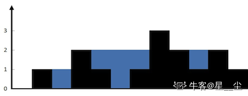
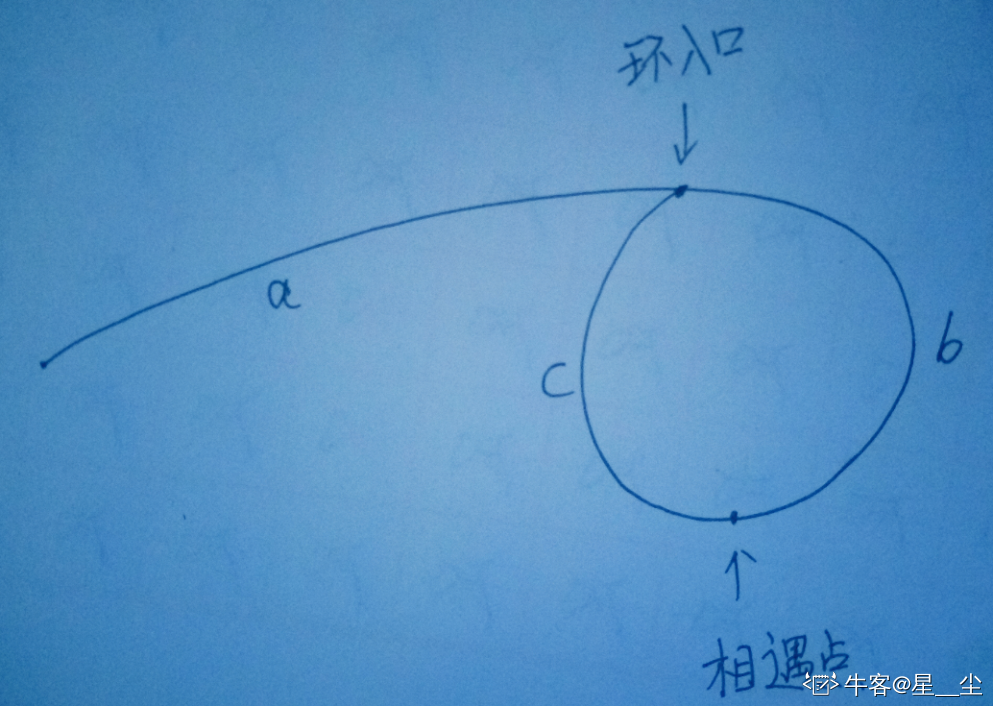
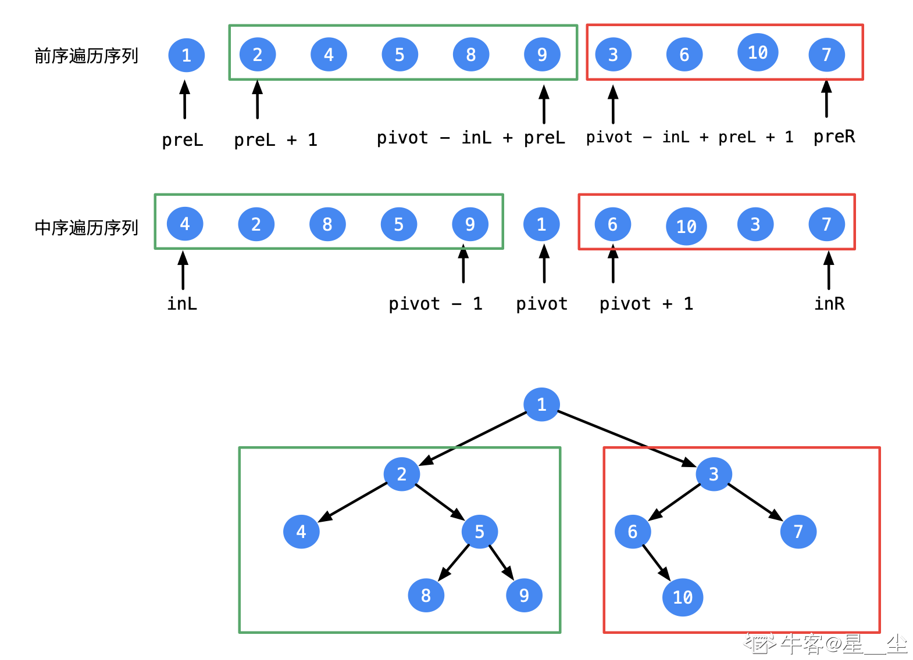
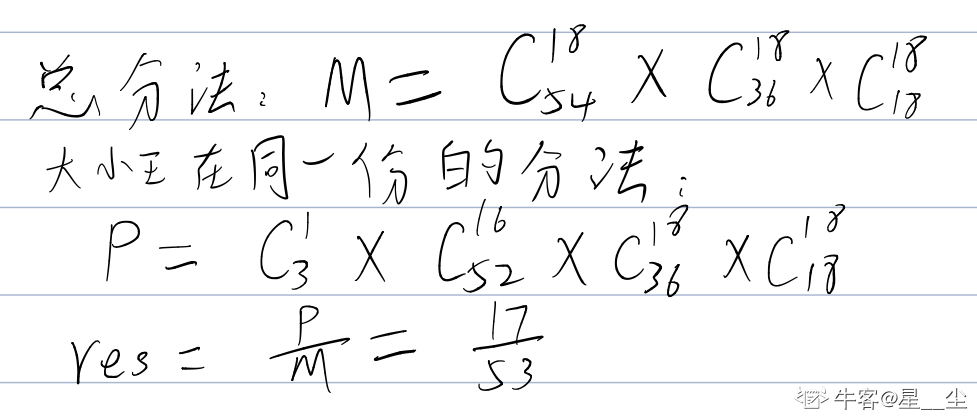

## 算法题

#### 动态规划和贪心

##### **买卖股票的最佳时机**

股票问题通用解法详解参考：https://leetcode-cn.com/problems/best-time-to-buy-and-sell-stock/solution/yi-ge-fang-fa-tuan-mie-6-dao-gu-piao-wen-ti-by-l-3/  

 最复杂的情况是限制交易k次，状态转移方程无法化简，其他情况均可化简为二维或一维动态规划。

```java
//一次买卖
public class Solution {
    public int buy(int[] price) {
        int n = price.length;
        int ans = 0;
        int[][] dp = new int[n][2];
        dp[0][0] = 0;
        dp[0][1] = Integer.MIN_VALUE;
        for(int i = 1;i < n; i++){
            dp[i][0] = Math.max(dp[i - 1][0],dp[i - 1][1] + price[i]);
            dp[i][1] = Math.max(dp[i - 1][1],- price[i]);
        }
        return dp[i][0];
    }
}
优化：只与相邻的一个状态有关，那么可以只记录前一个状态，不使用数组，空间降到O(1)
public class Solution {
    public int buy(int[] price) {
        int n = price.length;
        int ans = 0;
        int dp_i_0 = 0;
        int dp_i_1 = Integer.MIN_VALUE;
        for(int i = 1;i < n; i++){
            dp_i_0 = Math.max(dp_i_0,dp_i_1 + price[i]);
            dp_i_1 = Math.max(dp_i_1,- price[i]);
        }
        return dp_i_0;
    }
}
//不限制次数：
dp[i][0] = max(dp[i-1][0], dp[i-1][1] + prices[i])
dp[i][1] = max(dp[i-1][1], dp[i-1][0] - prices[i])
 
//有一天冷却期
dp[i][0] = max(dp[i-1][0], dp[i-1][1] + prices[i])
dp[i][1] = max(dp[i-1][1], dp[i-2][0] - prices[i])
解释：第 i 天选择 buy 的时候，要从 i-2 的状态转移，而不是 i-1 。
 
//有服务费
dp[i][0] = max(dp[i-1][0], dp[i-1][1] + prices[i])
dp[i][1] = max(dp[i-1][1], dp[i-1][0] - prices[i] - fee)
解释：相当于买入股票的价格升高了。
在第一个式子里减也是一样的，相当于卖出股票的价格减小了。
 
//2次买卖
原始的动态转移方程，没有可化简的地方
dp[i][k][0] = max(dp[i-1][k][0], dp[i-1][k][1] + prices[i])
dp[i][k][1] = max(dp[i-1][k][1], dp[i-1][k-1][0] - prices[i])
 
int max_k = 2;
int[][][] dp = new int[n][max_k + 1][2];
for (int i = 0; i < n; i++) {
    for (int k = max_k; k >= 1; k--) {
        if (i - 1 == -1) { 
            /* 处理 base case */
            dp[i][k][0] = 0;
            dp[i][k][1] = -prices[i];
            continue;
        }
        dp[i][k][0] = max(dp[i-1][k][0], dp[i-1][k][1] + prices[i]);
        dp[i][k][1] = max(dp[i-1][k][1], dp[i-1][k-1][0] - prices[i]);
    }
}
// 穷举了 n × max_k × 2 个状态，正确。
return dp[n - 1][max_k][0];
```

##### **剑指原题，剪绳子**

给定一根长度为n的绳子，请把绳子剪成m段（m、n都是整数，n>1并且m>1），每段绳子的长度记为k[0],k[1],…,k[m]。请问k[0]* k[1] * … *k[m]可能的最大乘积是多少？例如长度为8的绳子，可以剪成2，3，3段，最大乘积为18。

1.动态规划：每次剪一刀之后，剩余部分还可以继续剪，那么就是计算出所有可能的情况，取最大值。自底向上改善递归从上而下重复计算的问题。

时间复杂度O(N^2),空间复杂度O（N）

```java
作者：星__尘
链接：https://www.nowcoder.com/discuss/428158?source_id=profile_create&channel=666
来源：牛客网

public class Solution {
    public int cutRope(int target) {
        if(target == 2)
            return 1;
        if(target == 3)
            return 2;
        if(target == 4)
            return 4;
        int[] dp = new int[target + 1];
  
        /*
        下面3行是n>=4的情况，跟n<=3不同，4可以分很多段，比如分成1、3，
        这里的3可以不需要再分了，因为3分段最大才2，不分就是3。记录最大的。
         */
        //  1,2,3不可拆分  越拆分越小
        dp[1]=1;
        dp[2]=2;
        dp[3]=3;
        //用来记录最大值
        int res = 0;
        for(int i = 4;i <= target; i++){
            for(int j = 1;j <= i/2;j++){
                res = Math.max(res,dp[j]*dp[i - j]);
            }
            dp[i] = res;
        }
        return dp[target];
    }
}
```

2:贪心算法：可以证明，每段长度为3是最大乘积。   

   证明过程请参照《剑指offer》或牛客剑指offer题解中的回答：https://www.nowcoder.com/questionTerminal/57d85990ba5b440ab888fc72b0751bf8?f=discussion   

   时间复杂度O(logN),因为乘方运算的时间复杂度是logN。当数据特别大时，只能使用贪心算法，因为动态规划枚举每个状态需要大量的空间。

```java
public class Solution {
    public int cutRope(int target) {
        if(target==2){
            return 1;
        }else if(target==3){
            return 2;
        }
    //pow(n,m)是求n的m次方
        if(target%3==0){
            return (int)Math.pow(3,target/3);
        }else if(target%3==1){
            return 4*(int)Math.pow(3,target/3-1);
        }else {
            return 2*(int)Math.pow(3,target/3);
        }
    }
}
```

##### **接雨水（leetcode 42）**

给定 n 个非负整数表示每个宽度为 1 的柱子的高度图，计算按此排列的柱子，下雨之后能接多少雨水。   



   上面是由数组 [0,1,0,2,1,0,1,3,2,1,2,1] 表示的高度图，在这种情况下，可以接 6 个单位的雨水（蓝色部分表示雨水）。   

   示例:   

   输入: [0,1,0,2,1,0,1,3,2,1,2,1]   

   输出: 6   

   思路：   

   对于每一列来说，他能存的雨水量是他左边最高墙和右边最高墙中较低的那堵墙的高度减去自身墙的高度。所以可以用数组记录每列左右最高墙的高度，然后计算每一列可以存的雨水量。   

   动态规划：时间复杂度O(N)，空间复杂度O(N)。

```java
class Solution {
    public int trap(int[] height) {
        int len = height.length;
        if(len == 0 || len == 1) return 0;
        int[] left = new int[len];
        int[] right = new int[len];
        left[0] = height[0];
        right[len - 2] = height[len - 1];
        for(int i = 1;i < len - 1;i++){
            left[i] = Math.max(height[i - 1],left[i - 1]);
        }
        for(int i = len - 2;i >= 0;i--){
            right[i] = Math.max(height[i + 1],right[i + 1]);
        }
        int sum = 0;
        for(int i = 1; i < len - 1;i++){
            int min = Math.min(right[i],left[i]);
            if(min > height[i])
                sum = sum + (min - height[i]); 
        }
        return sum;
    }
}
```

##### 柠檬水找零（LeetCode860）

在柠檬水摊上，每一杯柠檬水的售价为 5 美元。   

   顾客排队购买你的产品，（按账单 bills 支付的顺序）一次购买一杯。   

   每位顾客只买一杯柠檬水，然后向你付 5 美元、10 美元或 20 美元。你必须给每个顾客正确找零，也就是说净交易是每位顾客向你支付 5 美元。   

   注意，一开始你手头没有任何零钱。   

   如果你能给每位顾客正确找零，返回 true ，否则返回 false 。   

   思路：尽可能有大面值找零，也就是能用10元找零就不用2个5元。是贪心算法思想的体现。   

```java
class Solution {
    public boolean lemonadeChange(int[] bills) {
        int five = 0,ten = 0;
        for(int value : bills){
            if(value == 5){
                five++;
            }else if(value == 10){
                if(five == 0) return false;
                five--;
                ten++;
            }else{
                if(ten >= 1 && five >= 1){
                    ten--;
                    five--;
                }else if(five >= 3){
                    five = five - 3;
                }else{
                    return false;
                }
            }
        }
        return true;
    }
}

```

### 数组

#### **双指针遍历：解决有序数组的问题**

##### **排序**数组，平方后，数组当中有多少不同的数字（相同算一个）

如果不是排序数组，可以使用hashset来保存数字的平方，重复就存不进去，那么最后就可以直接返回set的大小size即可。时间空间复杂度都是O（n)。   

   双指针遍历：这里是排序数组，既然有重复，肯定是有负数，0,1这些数字。平方后两头大，中间小，可以用首尾指针共同向中间扫描，扫描时去掉重复元素，同时用一个sum来记录有多少个不同数字。   

   时间复杂度O(N)，空间复杂度O(1)。

```java
public class Solution {
    public int diffSquareNum(int nums[]) {
        int n = nums.length;
        if(n == 0 || nums == null){
            return 0;
        }
        int sum = 0;
        int left = 0;
        int right = n - 1;
        while(left <= right){
            if(nums[left] + nums[right] == 0){
                sum++;
                int temp = nums[left];
                //这里开始去掉后面重复的数字
                while(left <= right && nums[left] == temp)
                    left++;
                while(left <= right && nums[right] == -temp)
                    right--;
            }
            else if(nums[left] + nums[right] < 0){
                sum++;
                int temp = nums[left];
                while(left <= right && nums[left] == temp)
                    left++;
            }
            else {
                sum++;
                int temp = nums[right];
                while(left <= right && nums[right] == temp)
                    right--;
            }
        }
        return sum;
    }
}
```

##### 一个数据先递增再递减，找出数组不重复的个数，比如 [1, 3, 9, 1]，结果为3，不能使用额外空间，复杂度o(n)

```java
作者：星__尘
链接：https://www.nowcoder.com/discuss/428158?source_id=profile_create&channel=666
来源：牛客网

public class Solution {
    public int diffnum(int[] nums){
        int n = nums.length;
        if(n == 0 || nums == null){
            return 0;
        }
        int left = 0;
        int right = n - 1;
        int sum = 0;
        while(left <= right){
            if(nums[left] == nums[right]){
                sum++;
                int temp = nums[left];
                while(left <= right && nums[right] == temp)
                    right--;
                while(left <= right && nums[left] == temp)
                    left++;
            }
            else if(nums[left] < nums[right]){
                sum++;
                int temp = nums[left];
                while(left <= right && nums[left] == temp)
                    left++;
            }
            else{
                sum++;
                int temp = nums[right];
                while(left <= right && nums[right] == temp)
                    right--;
            }
        }
        return sum;
    }
}
```

##### 递增数组，找出和为k的数对

双指针遍历：用头尾两个指针，分别开始遍历，两个数字和大于k时，右指针向前移动，小于k时左指针向后移动

```java
public class Solution{
    public ArrayList findPair(int[] nums,int k){
        int n = nums.length;
        int i = 0;
        int j = n - 1;
        ArrayList<Integer> list = new ArrayList<>();
        while(i < j){
            if(nums[i] + nums[j] < k){
                i++;
            }else if(num[i] + nums[j] > k){
                j--;
            }else{
                list.add(nums[i]);
                list.add(nums[j]);
                i++;
                j--;
            }
        }
        return list;
    }
}
```

##### 给出一个数组nums，一个值k，找出数组中的两个下标 i，j 使得 nums[i] + nums[j] = k.

这个题目跟上面一题的区别就是不是有序数组，那么解题思路就可以是排序+双指针遍历，时间复杂度就因为排序升为O(NlogN)。   

   对于这个无序数组另一种解决办法是使用HashMap，数字作为键，下标作为值存入hashmap，然后遍历map查找符合条件的数对，map可以实现O(1)的查找，所以时间复杂度和空间复杂度都是O(N)。（这里需要注意，如果数组中有重复元素，那么这个方法就不能用，因为重复元素存入map时，后面的值（下标）会覆盖掉前面的值。

```java
//这种实现方式无法去掉重复的pair，如结果中会同时有（3,6）和（6,3）。
public class Solution{
    public ArrayList<Pair<Integer, Integer>> findPair(int[] nums, int k) {
        ArrayList<Pair<Integer, Integer>> pairs = new ArrayList<>();
        HashMap<Integer, Integer> map = new HashMap<>();
        for (int i = 0; i < nums.length; i++) {
            map.put(nums[i], i);
        }
        for (Map.Entry<Integer, Integer> set : map.entrySet()) {
            int target = k - set.getKey();
            //第二个判断条件是为了去除（2，2）这种情况，即同一数字即做加数又做被加数的情况
            if (map.containsKey(target) && !map.get(target).equals(set.getValue())) {
                pairs.add(new Pair<>(set.getValue(), map.get(target)));
            }
        }
        return pairs;
    }
}
```

#### **滑动窗口：解决连续序列问题**

##### 和为s的连续正整数序列（剑指 offer57 -II)

输入一个正整数 target ，输出所有和为 target 的**连续正整数**序列（至少含有两个数）。序列内的数字由小到大排列，不同序列按照首个数字从小到大排列。   

   示例 1：   

   输入：target = 9   

   输出：[[2,3,4],[4,5]]   

 滑动窗口：窗口左右两端都只能向右移动，当和小于sum时，j++，和大于sum时，i++，和等于sum就记录下窗口中i —j 中的序列，然后窗口继续后移，查找下一个满足条件的序列。

```java
class Solution {
    public int[][] findContinuousSequence(int target) {
        int i = 1;
        int j = 1;
        int sum = 0;
        List<int[]> list = new ArrayList<>();
        //序列是由小到大排列，所以如果i>target/2，那么i+i+1肯定大于target
        while(i <= target/2){    
            if(sum < target){
                sum += j;
                j++;
            }else if(sum > target){
                sum -= i;
                i++;
            }else{
                int[] res = new int[j - i];
                for(int z = i; z < j;z++){
                    res[z - i] = z;
                }
                list.add(res);
                // 左边界向右移动
                sum -= i;
                i++;
            }
        }
        return list.toArray(new int[list.size()][]);
    }
}
```

##### 某一个大文件被拆成了N个小文件，每个小文件编号从0至N-1，相应大小分别记为S(i)。给定磁盘空间为C，试实现一个函数从N个文件中连续选出若干个文件拷贝到磁盘中，使得磁盘剩余空间最小。

滑动窗口：每次记录窗口内的总和，和小于C，记录剩余空间，再窗口右端右移，和大于C，就窗口左端右移，小于C情况下比较剩余空间取最小值。

```java
public class Solution {
    public int[] findMin(int[] s,int c){
        int i = 0;
        int j = 0;
        int minValue = Integer.MAX_VALUE;
        int sum = 0;
        int left = 0;
        int right = 0;
        while(j <= s.length){
            if(sum <= c){
               j++;
               sum += s[j];
               minValue = Math.min(minValue,c - sum);
               if(minValue == c - sum){
                   left = i;
                   right = j;
               }
            }else{
                //i++;
                //sum -= s[i];
                //Young
                sum -= s[i];
                i++;
            }
        }
        int[] nums = new int[right - left];
        for(int k = left;k < right;k++){
            nums[k - left] = s[k];
        }
        return nums;
    }
}
```

##### 给定m个不重复的字符 [a, b, c, d]，以及一个长度为n的字符串tbcacbdata，问能否在这个字符串中找到一个长度为m的连续子串，使得这个子串刚好由上面m个字符组成，顺序无所谓，返回任意满足条件的一个子串的起始位置，未找到返回-1。比如上面这个例子，acbd，3.

类似leetcode 567：https://leetcode-cn.com/problems/permutation-in-string/   

   分析：   

   本题的子串需要满足长度为m，字符不重复，可以使用长为m的滑动窗口遍历字符串，窗口内每个字符都要出现一次，如果符合条件，就返回窗口起始位置。   

   如果这里不允许使用substring,indexOf函数，可以将字符串中每个字符出现的次数存入长度为26的数组中进行比较每次数组中对应位置数量是否相等，具体可参照上面LeetCode 567题。

```java
public class Solution {
    public int checkInclusion(char[] ch,String s) {
        if(ch.length > s.length()){
            return -1;
        }
        for(int i = 0; i < s.length() - ch.length; i++){
            //每次匹配长度为m的子串
            if(matchs(ch,s.substring(i,i+ch.length)))
                return i;
        }
        return -1;
    }
    private static boolean matchs(char[] ch,String s){
        for(int i = 0; i < s.length();i++){
            //返回-1说明字符串中不包含这个字符
            if(s.indexOf(ch[i]) == -1)
                return false;
        }
        return true;
    }
}
```

#### **哈希表辅助解决数组问题**

##### **求数组的最长连续递增数列，如：4， 200， 3， 1， 100， 2。结果是1 2 3 4，也就是说顺序可以打乱。（leetcode 128）**

思路一：排序，然后再遍历一遍找最长连续递增数列，时间复杂度O(NlogN)。   

   思路二：使用HashMap或者HashSet，将数组元素存入set中，然后遍历set，先找到每个序列的开头元素，即num没有num-1的情况，这时从num开始循环找num+1,记录次数，通过比较找出最大长度。时间和空间复杂度都是O（n)

```java
//这里用set，是因为set可以自动去重，用map也不影响结果
class Solution {
    public int longestConsecutive(int[] nums) {
        if (nums.length == 0) return 0;
        HashSet<Integer> set = new HashSet<>();
        for(int value : nums)
            set.add(value);
 
        int longestLength = 0;
        for (int num: set) {
            if (!set.contains(num - 1)){
                int currentNum = num;
                int currentLength = 1;
                while (set.contains(currentNum + 1)){
                    currentNum += 1;
                    currentLength += 1;
                }
                longestLength = Math.max(longestLength,currentLength);
            }
        }
        return longestLength;
    }
}
```

##### 一个无序数组，从小到大找到第一个缺的数，比如[8 2 4 3 6 9 7 11 12],第一个缺的就是5 （2）

1.排序，时间复杂度O(NlogN)

2.用数组作为哈希表，将数字i放入数组中的i索引处，然后找中间没有存入数字的位置。时间和空间复杂度都是O(N)

```java
public  class Solution {
    public int findLost(int[] nums){
	    int min = nums[0];
        int max = nums[0];

        for(int i=0;i<nums.length;i++){
            min = Math.min(nums[i],min);
            max = Math.max(nums[i],max);
        }

        int[] res = new int[max+1];
        for(int i = 0;i<res.length;i++){
            res[i] = min-1;  //保证标识位不与数组元素重复
        }
        for(int value:nums){
            res[value] = value;
        }
        int i = min;

        while (i<res.length){
            if(res[i]==min-1){
                break;
            }
            i++;
        }
        return i;
    }
}
```

##### 输出给定数字下一个比它大的数字，比如输入：1234， 输出 1243。

首先从后往前遍历找到一个数字nums[i]比num[i+1]小，也就是找到递减到递增的转折点，然后再与递减序列中最小的大于num[i]的数字交换，这样交换完之后后面仍然是递减序列，将其转换为递增序列，这样可以保证数字增大，并且增大的幅度最小。

```java
作者：星__尘
链接：https://www.nowcoder.com/discuss/428158?source_id=profile_create&channel=666
来源：牛客网

class Solution {
    public void nextPermutation(int[] nums) {
        //从倒数第二个数字开始比较
        int i = nums.length - 2;
        //找nums[i] < nums[i + 1]的i
        while(i >= 0 && nums[i] >= nums[i + 1]){
            i--;
        }
        if(i >= 0){
            int j = nums.length - 1;
            while(j > 0 && nums[i] >= nums[j]){
                j--;
            } 
            swap(nums,i,j);
        }
        reverse(nums,i + 1);
    }
 
    public void swap(int[] nums,int i, int j){
        int temp = nums[i];
        nums[i] = nums[j];
        nums[j] = temp;
    }
 
    public void reverse(int[] nums,int start){
        int j = nums.length - 1;
        int i = start;
        //因为是递减序列，所以可以这样交换成递增的
        while(i < j){
            swap(nums,i,j);
            i++;
            j--;
        }
    }
}
```

##### 算法题(leetcode55题)：给一个数组，例如[1,2,3,4,5]，a[i]表示在该位置可以向前行走的最大距离，判断是否可以到达数组的最后一个元素

思路：

每次走最大的距离，如果能超过末尾元素，说明只要调小步伐就一定可以达到最后位置。

```java
public class Solution {
    public boolean canJump(int[] nums) {
        int n = nums.length;
        int rightmost = 0;
        for (int i = 0; i < n; ++i) {
            if (i <= rightmost) {
                rightmost = Math.max(rightmost, i + nums[i]);
                if (rightmost >= n - 1) {
                    return true;
                }
            }
        }
        return false;
    }
}

```

##### AB两个排序数组，原地合并数组。（A当中穿插一些无效数字怎么处理？）

思路：因为要原地合并数组，如果从前往后遍历，数组原来的值会被覆盖，所以只能从后往前遍历，将值从后往前存入。存入时比较当前两个指针指向的数字大小，选较大的存入，然后往前移动指针。   

   （有无效数字的情况楼主没有想到好的解决办法，小伙伴们如果有思路请在评论区解答，感谢！）

```java
class Solution {
    public void merge(int[] A, int m, int[] B, int n) {
        int i = m - 1,j = n - 1,k = m + n - 1;
        while(j >= 0){
            if(i < 0 || B[j] >= A[i]){
                A[k--] = B[j--];
            }else {
                A[k--] = A[i--];
            }
        }
    }
}
```

#### **排序相关**

##### 快速排序

```java
public void quickSort(int[] arr,int L,int R){
    if (arr.length == 0) return;
    int i = L;
    int j = R;
    int key = arr[(i + j)/2];
    while (i <= j){
        while (arr[i] < key)
            i++;
        while (arr[j] > key)
            j--;
        if (i <= j){
            int temp = arr[i];
            arr[i] = arr[j];
            arr[j] = temp;
            i++;
            j--;
        }
    }
    //上面一个while保证了第一趟排序支点的左边比支点小，支点的右边比支点大了。
    //“左边”再做排序，直到左边剩下一个数(递归出口)
    if (L < j)
        quickSort(arr,L,j);
    //“右边”再做排序，直到右边剩下一个数(递归出口)
    if(i < R)
        quickSort(arr,i,R);
}
```

##### **高考成绩2000万数据，分数0-750，如何快速知道你的排名，如何知道任一分数排名 --->桶排序**

桶排序 (Bucket sort)的工作的原理：假设输入数据服从均匀分布，将数据分到有限数量的桶里，每个桶再分别排序（有可能再使用别的排序算法或是以递归方式继续使用桶排序进行排）。   

   算法描述：   

   设置一个定量的数组当作空桶；   

   遍历输入数据，并且把数据一个一个放到对应的桶里去；   

   对每个不是空的桶进行排序；   

   从不是空的桶里把排好序的数据拼接起来。

```java
作者：星__尘
链接：https://www.nowcoder.com/discuss/428158?source_id=profile_create&channel=666
来源：牛客网

public class Solution {
    public ArrayList<Integer> bucketSort(int[] scores){
      //先确定最大最小值，来确定范围
      int max = Integer.MIN_VALUE;
      int min = Integer.MAX_VALUE;
      for(int i = 0; i < scores.length;i++){
          max = Math.max(max,scores[i]);
          min = Math.min(min,scores[i]);
      }
      //计算出桶数
      //int bucketNum = (max - min)/scores.length + 1;
      //这里直接给出751个桶
      int bucketNum = 751;
      ArrayList<ArrayList<Integer>> list = new ArrayList<>(bucketNum);
      for(int i = 0; i < bucketNum; i++){
          list.add(new ArrayList<Integer>());
      }
       
      //将每个元素放入桶
      for(int i = 0; i < scores.length;i++){
          //本题中这里放元素也可以简化
          //list.get((scores[i] - min)/bucketNum).add(scores[i]);
          list.get(scores[i]).add(scores[i]);
      }
       
      //桶内排序,本题中可以省略这一步
      for(int i = 0; i< list.size();i++){
          Collections.sort(list.get(i));
      } 
      return list;
    }
}
```

##### 数组中第K大的数（LeetCode215题）

首先想到最简单的排序，然后返回第k大的元素，时间复杂度O(NlogN)。

**快排的patition思想**：

时间复杂度O（n)，空间复杂度O(1)

```java
作者：星__尘
链接：https://www.nowcoder.com/discuss/428158?source_id=profile_create&channel=666
来源：牛客网

public class Solution {
    public int findKthLargest(int[] nums, int k) {
        int len = nums.length;
        int left = 0;
        int right = len - 1;
        // 转换一下，第 k 大元素的索引是 len - k
        int target = len - k;
 
        while (true) {
            int index = partition(nums, left, right);
            if (index == target) {
                return nums[index];
            } else if (index < target) {
                left = index + 1;
            } else {
                right = index - 1;
            }
        }
    }
 
    /**
     * 在数组 nums 的子区间 [left, right] 
     执行 partition 操作，返回 nums[left] 排序以后应该在的位置
     * 在遍历过程中保持循环不变量的语义
     * 1、[left + 1, j] < nums[left]
     * 2、(j, i] >= nums[left]
     */
    public int partition(int[] nums, int left, int right) {
        int pivot = nums[left];
        int j = left;
        for (int i = left + 1; i <= right; i++) {
            if (nums[i] < pivot) {
                // 小于 pivot 的元素都被交换到前面
                j++;
                swap(nums, j, i);
            }
        }
        // 在之前遍历的过程中，满足 [left + 1, j] < pivot，
        //并且 (j, i] >= pivot
        swap(nums, j, left);
        // 交换以后 [left, j - 1] < pivot, nums[j] = pivot,
        // [j + 1, right] >= pivot
        return j;
    }
 
    private void swap(int[] nums, int index1, int index2) {
        int temp = nums[index1];
        nums[index1] = nums[index2];
        nums[index2] = temp;
    }
}
```

##### top k，返回前K大的元素

这里可以使用和上题一样的快排patition。   

   也可以用堆排序，可以取前k个元素构造小根堆，然后遍历后面的元素，如果读取到的元素比堆顶下，直接丢弃，如果比堆顶大，就替换掉堆顶元素，然后调整堆。时间复杂度O(NlogK)。（堆实现参考下一题）

```java
作者：星__尘
链接：https://www.nowcoder.com/discuss/428158?source_id=profile_create&channel=666
来源：牛客网

public class Solution {
    public ArrayList<Integer> topK(int[] nums){
        if(nums.length <= k) return nums;
        int n = nums.length;
        int left = 0;
        int right = n - 1;
        int target = n - k;
        int index = 0;
        while(true){
            index = partition(nums,left,right)
            if(index == target){
                break; 
            }else if(index < target{
                left = index + 1;
            }else{
                right = index - 1;
            }
        }
        ArrayList<Integer> list = new ArrayList<>();
        for(int i = target;i < n;i++){
            list.add(nums[i]);
        }
        return list;
    }
    public int pattition(int[] nums,int left,int right){
        int pivot = nums[left];
        int j =left;
       for(int i = left + 1;i <= right;i++){
           if(nums[i] > pivot){
               j++;
               swap(nums,i,j);
           }
       }
       swap(nums,left,j);
       return j;
    }
    public void swap(int nums,int i,int j){
        int temp = nums[i];
        nums[i] = nums[j];
        nums[j] =temp;
    }
}
```

##### 10亿个数字，取最小的100个数

(说思路   最大堆， partition   两者的时间复杂度，写伪代码)   

   1.最大堆：   

   先取出前100个数，维护一个100个数的最大堆，遍历一遍剩余的元素，在此过程中维护这个最大堆就可以了。   

   具体步骤如下：   

   step1：取前m个元素（例如m=100），建立一个大根堆。保持一个大根堆得性质的步骤，运行时间为O（logm);建立一个大根堆运行时间为mO(logm）=O(m logm);   

   step2:顺序读取后续元素，直到结束。每次读取一个元素，如果该元素比堆顶元素大，直接丢弃；如果小于堆顶元素，则用该元素替换堆顶元素，然后保持最大堆性质。最坏情况是每次都需要替换掉堆顶的最大元素，因此需要维护堆的代价为(N-m)O(lgm); 最后这个堆中的元素就是前最小的100个。时间复杂度为O(N lgm）。   

   时间复杂度为O(10亿*lg100)。   

   **首先构造大根堆**：   

   堆的定义：n个关键字序列array[0，...，n-1]，当且仅当满足下列要求：   

   (0 <= i <= (n-1)/2)   

​    ① array[i] <= array[2*i + 1] 且 array[i] <= array[2*i + 2]； 称为小根堆；   

​    ② array[i] >= array[2*i + 1] 且 array[i] >= array[2*i + 2]； 称为大根堆；   

   n个节点的完全二叉树array[0，...，n-1]，最后一个节点n-1是第(n-1-1)/2个节点的孩子。对第(n-1-1)/2个节点为根的子树调整，使该子树称为堆。   

​    对于大根堆，**调整方法**为：若【根节点的关键字】小于【左右子女中关键字较大者】，则交换。

```java
作者：星__尘
链接：https://www.nowcoder.com/discuss/428158?source_id=profile_create&channel=666
来源：牛客网

//构建大根堆：将array看成完全二叉树的顺序存储结构
private int[] buildMaxHeap(int[] array) {
    //从最后一个节点array.length-1的父节点（array.length-1-1）/2开始，
    //直到根节点0，反复调整堆
    for (int i = (array.length - 2) / 2; i >= 0; i--) {
        adjustDownToUp(array, i, array.length);
    }
    return array;
}
//将元素array[k]自下往上逐步调整树形结构
private void adjustDownToUp(int[] array, int k, int length) {
    int temp = array[k];
    for (int i = 2 * k + 1; i < length - 1; i = 2 * i + 1) {    
    //i为初始化为节点k的左孩子，沿节点较大的子节点向下调整
        if (i < length && array[i] < array[i + 1]) {  
        //取节点较大的子节点的下标
            i++;   //如果节点的右孩子>左孩子，则取右孩子节点的下标
        }
        if (temp >= array[i]) {  //根节点 >=左右子女中关键字较大者，调整结束
            break;
        } else {   //根节点 <左右子女中关键字较大者
            array[k] = array[i]; //将左右子结点中较大值array[i]调整到双亲节点上
            k = i; //【关键】修改k值，以便继续向下调整
        }
    }
    array[k] = temp;  //被调整的结点的值放人最终位置
}
```

#### **栈，队列和链表**

##### **最大栈（最小栈**)

```java
作者：星__尘
链接：https://www.nowcoder.com/discuss/428158?source_id=profile_create&channel=666
来源：牛客网

使用辅助栈：
public class MaxStack{
    private Stack<Integer> stack;
    private Stack<Integer> helper;
    public MaxStack(){
        stack = new Stack<>();
        helper = new Stack<>();
    }
    public void push(int x) {
        if(helper.isEmpty() || helper.peek() <= x){
            helper.push(x);
        }
        stack.push(x);
    }
    public void pop(){
        if(stack.peek() == helper.peek()){
            helper.pop();
        }
        stack.pop();
    }
    public int peek(){
        if(!helper.isEmpty()){
            return stack.peek();
        }
        throw new RuntimeException("栈中元素为空");
         
    }
    public int getMax(){
        if(!helper.isEmpty()){
            return helper.peek();
        }
        throw new RuntimeException("最大值栈中元素为空");
    }
}
用最大值标记，存入数据栈中，空间复杂度降到O(1)
public class MaxStack {
    private Stack<Integer> stack;
    public MaxStack(){
        stack = new Stack<>();
    }
    int max = Integer.MIN_VALUE;
    public void push(int x){
        if(max <= x){
            if(!stack.isEmpty()){
                stack.push(max);
            }
            max = x;
        }
        stack.push(x);
    }
    public void pop(){
        if(stack.peek() == max){
            stack.pop();
            max = stack.pop();
        }else{
            stack.pop();
        }
    }
    public int getMax(){
        return max;
    }
}
```

##### 两个栈实现一个队列

```java
作者：星__尘
链接：https://www.nowcoder.com/discuss/428158?source_id=profile_create&channel=666
来源：牛客网

public class StackToList{
    private Stack<Integer> stack;
    private Stack<Integer> helper;
     
    public StackToList{
        stack = new Stack<>();
        helper = new helper<>();
    }
    public void push(int x){
        stack.push(x);
    }
    public Integer poll() {
        if(stack.isEmpty() && helper.isEmpty())
            throw new RuntimeException("队列为空");
        dataRemove();
        return helper.pop();
    }
    public Integer peek() {
        if(stack.isEmpty() && helper.isEmpty())
            throw new RuntimeException("队列为空");
        dataRemove();
        return helper.peek();
    }
    public void dataRemove(){
       if(helper.isEmpty()){
            while(!stack.isEmpty())
                helper.push(stack.pop());
        }
    }
}
```

##### **两个队列实现一个栈：**

```java
作者：星__尘
链接：https://www.nowcoder.com/discuss/428158?source_id=profile_create&channel=666
来源：牛客网

**
     * @Description: 仅用队列来实现栈
     * 采用两个队列，一个数据队列queue 一个辅助队列 help
     * 入队时全部入队queue 出队时，将queue队列中数据入队help 将最后一个数 返回 并queue指针和help交换
     */
    public static class QueueToStack{
        private Queue<Integer> queue;
        private Queue<Integer> help;
        public QueueToStack(){
            queue = new LinkedList<Integer>();
            help = new LinkedList<Integer>();
        }
  
        public void push(int pushInt){
            queue.add(pushInt);
        }
        /**
         * @Description: 弹栈操作操作
         * 弹栈时，queue队列所有数据迁移至 help 返回最后一个数 并交换指针
         */
        public Integer pop(){
            if (queue.isEmpty())
                throw new RuntimeException("栈空！");
            while (queue.size()>1){
                help.add(queue.poll());
            }
            int temp = queue.poll();
            swap();
            return temp;
        }
  
        /**
         * @Description: 栈的peek操作 只返回栈顶元素
         * 原理同pop操作，但是在最后的一个元素要继续入队 help 因为peek只是返回栈顶 并非弹出
         */
        public Integer peek(){
            if (queue.isEmpty())
                throw new RuntimeException("栈空");
            while (queue.size()>1){
                help.add(queue.poll());
            }
            int temp=queue.poll();
            help.add(temp); //关键地方
            swap();
            return temp;
        }
  
        private void swap() {
            Queue<Integer> temp = queue;
            queue = help;
            help = temp;
        }
    }
```

##### 链表实现一个栈

```java
作者：星__尘
链接：https://www.nowcoder.com/discuss/428158?source_id=profile_create&channel=666
来源：牛客网

public class ListNode{
    int val;
    ListNode next;
    ListNode(int val){
        this.val =val;
    }
}
public class ListToStack{
    public ListToStack(){
        ListNode head;
    }
    public void push(int x){
        ListNode node = new ListNode(x);
        node.next = head.next;
        head.next = node;
    }
    public int pop(){
        ListNode node = head.next;
        head.next = node.next;
        node.next = null;
        return node.val;
    }
    public int peek(){
        return head.next.val;
    }
}
```

##### 两个链表，可能相交，找出相交的节点，给出证明

1.若两个单链表一个为有环,一个无环. 那么肯定不能相交.   

   2.若二者都没有环, 问题就转化为 两个无环单链表是否相交,是否能找到第一个相交的节点，方法就是 快慢指针 。   

   3.若二者都有环,那么问题变成了两个有环单链表是否相交.   

   第一,先找到二者是否相交.   

   第二,若相交则需要遍历一遍找到相交点.   

- - 如果无环：问题转化为如何判断两个无环链表是否相交？
    - ​        要想判断是否相交，肯定要看是否能找到相交的点，如果能让两个指针同时走到相交点，也就可以确定两个链表相交。因为相交后两个链表到终点的距离相等，那么只要两个指针能够消除两个链表之间的长度差就可以到达终点的距离相等。假设链表A比B长，pB到达结尾后指向headA，然后继续向前遍历，当pA到达结尾后指向headB，此时两者的长度差就消除了。继续遍历如果两者指向同一节点，返回节点，如果两者都走到结尾依然没有相交，就返回null.

```java
作者：星__尘
链接：https://www.nowcoder.com/discuss/428158?source_id=profile_create&channel=666
来源：牛客网

public class ListNode {
    int val;
    ListNode next;
    ListNode(int val){
        this.val = val;
        next = null;
    }
}
 
public class Solution {
    public ListNode getListNode(ListNode headA,ListNode headB) {
        if(headA == null || headB == null){
            return null;
        }
        ListNode pA = headA,pB = headB;
        while(pA != pB){
            if(pA == null){
                pA = headB;
            }else{
                pA = pA.next;
            }
            if(pB == null){
                pB = headA;
            }else{
                pB = pB.next;
            }
        }
        return pA;
    }
}
简化版：
public class Solution {
    public ListNode getIntersectionNode(ListNode headA, ListNode headB) {
        if (headA == null || headB == null) return null;
        ListNode pA = headA, pB = headB;
        //如果不相交，pA=pB=null
        while (pA != pB) {
            pA = pA == null ? headB : pA.next;
            pB = pB == null ? headA : pB.next;
        }
        return pA;
    }
}
```

##### **找有环链表的入口节点：**

快慢指针：设置快慢指针，都从链表头出发，快指针每次走两步，慢指针一次走一步，假如有环，一定相遇于环中某点(结论1)。接着让两个指针分别从相遇点和链表头出发，两者都改为每次走一步，最终相遇于环入口(结论2)。   

   证明结论1：设置快慢指针fast和low，fast每次走两步，low每次走一步。假如有环，两者一定会相遇（因为low一旦进环，可看作fast在后面追赶low的过程，每次两者都接近一步，最后一定能追上）。   

   证明结论2：   

   设：   

   链表头到环入口长度为--a   

   环入口到相遇点长度为--b   

   相遇点到环入口长度为--c



则：相遇时   

   快指针路程=a+(b+c)k+b ，k>=1  其中b+c为环的长度，k为绕环的圈数（k>=1,即最少一圈，不能是0圈，不然和慢指针走的一样长，矛盾）。   

   慢指针路程=a+b   

   快指针走的路程是慢指针的两倍，所以：   

   （a+b）*2=a+(b+c)k+b   

   化简可得：   

   a=(k-1)(b+c)+c 这个式子的意思是： 链表头到环入口的距离=相遇点到环入口的距离+（k-1）圈环长度。其中k>=1,所以k-1>=0圈。所以两个指针分别从链表头和相遇点出发，最后一定相遇于环入口。

```java
作者：星__尘
链接：https://www.nowcoder.com/discuss/428158?source_id=profile_create&channel=666
来源：牛客网

pulic class ListNode{
    int val;
    ListNode next = null;
    ListNode(int val){
        this.val = val;
    }
}
public class Solution {
    public ListNode EntryNodeOfLoop(ListNode pHead){
        ListNode fast = pHead;
        ListNode slow = pHead;
        if(fast == null || fast.next == null){
            return null;
        }
        while(fast != null && fast.next != null){
            fast = fast.next.next;
            slow = slow.next;
            if(fast == slow){
                break;
            }
        }
        slow = pHead;
        while(fast != slow){
            fast = fast.next;
            slow = slow.next;
        }
        return fast;
    }
}
```

##### **反转链表 ---->反转链表升级版（每k个反转一下）**

```java
public class Solution{
    public ListNode revoseList(ListNode head){
        if(head == null || head.next == null){
            return head;
        }
        ListNode pre = null;
        ListNode cur = head;
        ListNode temp = null;
        while(cur != null){
            //标记下一个节点，以免丢失
            temp = cur.next;
            //实现反转
            cur.next = pre;
            pre = cur;
            cur = temp;
        }
        return pre;
    }
}

//***********************递归****************************
作者：星__尘
链接：https://www.nowcoder.com/discuss/428158?source_id=profile_create&channel=666
来源：牛客网

public class Listnode{
    int val;
    ListNode next;
    ListNode pre;
    ListNode (int val){
        this.val = val;
    }
}
//递归
public class Solution{
    public ListNode revoseList(ListNode head){
        if(head == null || head.next == null){
            return head;
        }
        ListNode cur = revoseList(head.next);
        head.next.next = head;
        head.next = null;
        return cur;
    }
}
```

##### *K个一组反转链表（LeetCode25题）*

```java
作者：星__尘
链接：https://www.nowcoder.com/discuss/428158?source_id=profile_create&channel=666
来源：牛客网

/**
 * Definition for singly-linked list.
 * public class ListNode {
 *     int val;
 *     ListNode next;
 *     ListNode(int x) { val = x; }
 * }
 */
class Solution {
    public ListNode reverseKGroup(ListNode head, int k) {
        //定义一个头指针，用来将后面所有节点统一处理
        ListNode dum = new ListNode();
        dum.next = head;
        //用来标记每一次反转部分的前一个结点
        ListNode pre = dum;
        //运动指针，扫描要反转的部分
        ListNode end = dum;
 
        while(end.next != null){
            //每次扫描完要反转的部分，如果end为空说明达到尾部，直接break
            for(int i = 0; i < k && end != null;i++) end = end.next;
            if(end == null) break;
            //标记要反转部分的开头节点
            ListNode start = pre.next;
            //标记反转链表后面部分的第一个节点，避免丢失
            ListNode next = end.next;
            //将要反转部分向后的指针断开，准备反转
            end.next = null;
            //反转完的链表返回反转后的头结点，接到pre的后面
            pre.next = reverse(start);
            //反转后start指针应该指向反转完成部分的末尾
            start.next = next;
            //让pre和end指针继续指向待反转链表的前一个节点
            pre = start;
            end = pre;
        }
        return dum.next;
    }
    public ListNode reverse(ListNode start){
        ListNode cur = start;
        ListNode pre1 = null;
        while(cur != null){
            ListNode temp = cur.next;
            cur.next = pre1;
            pre1 = cur;
            cur = temp;
        }
        return pre1;
    }
}
```

**链表求和**

给定两个用链表表示的整数，每个节点包含一个数位。这些数位是反向存放的，也就是个位排在链表首部。编写函数对这两个整数求和，并用链表形式返回结果。   

   示例：   

   输入：(7 -> 1 -> 6) + (5 -> 9 -> 2)，即617 + 295   

   输出：2 -> 1 -> 9，即912

```java
作者：星__尘
链接：https://www.nowcoder.com/discuss/428158?source_id=profile_create&channel=666
来源：牛客网

/**
 * Definition for singly-linked list.
 * public class ListNode {
 *     int val;
 *     ListNode next;
 *     ListNode(int x) { val = x; }
 * }
 */
class Solution {
    public ListNode addTwoNumbers(ListNode l1, ListNode l2) {
        ListNode head = new ListNode(0);
        ListNode cur = head;
        int carry = 0;//用以计算进位
        //只要有一个不为空或者最后有进位都要继续循环
        while(l1 != null || l2 != null || carry != 0){
            int num1 = l1 == null ? 0 : l1.val;
            int num2 = l2 == null ? 0 : l2.val;
            int sum = num1 + num2 + carry;
            carry = sum / 10;
            cur.next = new ListNode(sum % 10);
            if(l1 != null) l1 = l1.next;
            if(l2 != null) l2 = l2.next;
            cur = cur.next;
        }
        return head.next;
    }
}
```

#### **二叉树**

##### 二叉树的前序遍历非递归

```java
作者：星__尘
链接：https://www.nowcoder.com/discuss/428158?source_id=profile_create&channel=666
来源：牛客网

public class TreeNode{
    int val;
    TreeNode left;
    TreeNode right;
    TreeNode(int val){
        this.val = val;
    }
}
//非递归
public void preOrder(TreeNode root){
    if(root == null) return;
    Stack<TreeNode> stack = new Stack<>();
    stack.push(root);
    while(!stack.isEmpty()){
        TreeNode node = stack.pop();
        System.out.print(node.val);
        //因为栈是先进后出，所以先压右孩子，再压左孩子
        if(node.right != null)
            stack.push(node.right);
        if(node.left != null)
            stack.push(node.left);
    } 
}
//递归
public void preOrder(TreeNode root){
    if(root == null) return;
    System.out.print(root.val);
    preOrder(root.let);
    preOrder(root.right);
}
```

##### *二叉树的后序遍历非递归**

由于压栈顺序是从上而下，先左后右，出栈时就是从下而上，先右后左，这时可以用一个辅助栈，将弹出的值压入栈中，最后统一弹出，顺序就是后序遍历的先左后右，从下而上。（也可以用LinKedList，弹出后加入链表头，这样也可以逆序）

```java
作者：星__尘
链接：https://www.nowcoder.com/discuss/428158?source_id=profile_create&channel=666
来源：牛客网

public void postOrder(TreeNode root){
    if(root == null) return;
    Stack<TreeNode> s1 = new Stack<>();
    Stack<TreeNode> s2 = new Stack<>();
    s1.push(root);
    while(!s1.isEmpty()){
        TreeNode node = s1.pop();
        s2.push(node);
        if(node.left != null)
           s1.push(node.left);
       if(node.right != null)
           s1.push(node.right);
    }
    while(!s2.isEmpty())
        System.out.print(s2.pop().val + " ");
}
```

##### 中序遍历非递归

```java
作者：星__尘
链接：https://www.nowcoder.com/discuss/428158?source_id=profile_create&channel=666
来源：牛客网

class Solution {
    public List<Integer> inorderTraversal(TreeNode root) {
        Stack<TreeNode> stack = new Stack<>();
        TreeNode p =root;
        ArrayList<Integer> list = new ArrayList<>();
        while(p != null || !stack.isEmpty()){
            //一直走到最左边的左孩子
            while(p != null){
                stack.push(p);
                p = p.left;
            }
            p = stack.pop();
            list.add(p.val);
            p = p.right;
        }
        return list;
    }
}
```

**从上往下打印二叉树（层序遍历）**

与后序遍历类似，可使用**队列**，将左右节点节点先后加入**队列尾**，每次从**队列头**取出节点进入输出链表。这样可以保证每次取出的元素都是本层现存的第一个元素。

```java
作者：星__尘
链接：https://www.nowcoder.com/discuss/428158?source_id=profile_create&channel=666
来源：牛客网

public class TreeNode {
    int val;
    TreeNode left = null;
    TreeNode right = null;
    public TreeNode(int val){
        this.val = val;
    }
}
 
public class Solution {
    public ArrayList<Integer> PrintFromTopToBottom(TreeNode root) {
        ArrayList<Integer> result = new ArrayList<>();
        if(root == null)
            return result;
        LinkedList<Integer> queue = new LinkedList<>();
        queue.add(root);
        while(!queue.isEmpty()){
            TreeNode node = queue.poll();
            result.add(node.val);
            if(node.left != null){
                queue.add(node.left);
            }
            if(node.right != null){
                queue.add(node.right);
            }
        }
        return result;
    }
}
```

**蛇形遍历二叉树**

与层序遍历的区别是当层数为奇数就从左往右遍历，层数是偶数，就从右往左。

```java
作者：星__尘
链接：https://www.nowcoder.com/discuss/428158?source_id=profile_create&channel=666
来源：牛客网

public class Solution {
    public ArrayList<Integer> PrintFromTopToBottom(TreeNode root) {
        ArrayList<Integer> result = new ArrayList<>();
        if(root == null)
            return result;
        LinkedList<Integer> queue = new LinkedList<>();
        queue.add(root);
        int level = 1;//认为根节点在第一层
        while(!queue.isEmpty()){
            TreeNode node = queue.poll();
            result.add(node.val);
            level++;
            if(level % 2 == 1){
                if(node.left != null){
                    queue.add(node.left);
                }
                if(node.right != null){
                    queue.add(node.right);
                }
            }else {
                if(node.right != null){
                    queue.add(node.right);
                }
                if(node.left != null){
                    queue.add(node.left);
                }
            }
            
        }
        return result;
    }
}
```

**二叉树右视图**

```java
作者：星__尘
链接：https://www.nowcoder.com/discuss/428158?source_id=profile_create&channel=666
来源：牛客网

/**
 * Definition for a binary tree node.
 * public class TreeNode {
 *     int val;
 *     TreeNode left;
 *     TreeNode right;
 *     TreeNode(int x) { val = x; }
 * }
 */
class Solution {
    public List<Integer> rightSideView(TreeNode root) {
        ArrayList<Integer> res = new ArrayList<>();
        if(root == null) return res;
        int curCount = 1;
        int nextCount = 0;
        LinkedList<TreeNode> list = new LinkedList<>();
        list.add(root);
        while(!list.isEmpty()){
            TreeNode node = list.poll();
            curCount --;
            if(node.left != null){
                list.add(node.left);
                nextCount++;
            }
            if(node.right != null){
                list.add(node.right);
                nextCount++;
            }
            if(curCount == 0){
                res.add(node.val);
                curCount = nextCount;
                nextCount = 0;
            }
        }
        return res;
    }
}
```

##### 二叉树各层节点数，递归、非递归，时间、空间复杂度

思路：借助队列实现层序遍历，在遍历的过程中，level记录当前层数，curCount当前层的节点数，nextCount下一层的节点数。每次弹出节点，将当前层节点减一，然后将当前节点的左右子节点加入队列，同时计数。当前层的节点数等于0时，说明这一层遍历完了，同时记录的下一层节点数就是下一层总的节点，直接保存。遍历到队列为空为止。

```java
作者：星__尘
链接：https://www.nowcoder.com/discuss/428158?source_id=profile_create&channel=666
来源：牛客网

/非递归，时间复杂度O(N),空间复杂度O(N)
public Map<Integer,Integer> levelNodeCount(TreeNode root){
    HashMap<Integer,Integer> map = new HashMap<>();
    if(root == null) return map;
    int level = 1;
    int curCount = 1;
    int nextCount = 0;
    map.put(level,curCount);
    LinkedList<TreeNode> list = new LinkedList<>();
    list.add(root);
    while(!list.isEmpty()){
        TreeNode node = list.poll();
        curCount--;
        if(node.left != null){
            list.add(node.left);
            nextCount++;
        }
        if(node.right != null){
            list.add(node.right);
            nextCount++;
        }
         if(curCount == 0){
             level++;
             map.put(level,nextCount);
             curCount = nextCount;
             nextCout = 0;
         }   
    }
    return map;
}
递归：时间复杂度O(N),空间复杂度O(N)
这里保存了每一层的每一个节点
class Solution {
    private List<List<Integer>> res = new ArrayList<>();
    public List<List<Integer>> levelOrder(TreeNode root) {
        if(root == null)
            return res;
        helper(root,0);
        return res;
    }
    public void helper(TreeNode root,int level){
        //说明level已经比现存的层数(res.size() - 1)多了，需要新建一个新的
        if(res.size() == level){
            res.add(new ArrayList<Integer>());
        }
        //存入当前层的列表里，递归过程中每次都会往一个列表里面加入数字，每次都
        //加到不同的列表里。
        res.get(level).add(root.val);
        if(root.left != null)
            helper(root.left,level + 1);
        if(root.right != null)
            helper(root.right,level + 1);  
    }
}
```

##### **二叉搜索树的第K大的节点**

二叉搜索树（二叉排序树）满足：根节点大于左子树，小于右子树。那么二叉树的中序遍历序列就是一个递增序列。为方便了找第K大的节点，我们可以调换左右子树的遍历顺序，这样遍历序列是一个递减序列，这样遍历到第K个元素就是我们要找的第K大的节点。

```java
作者：星__尘
链接：https://www.nowcoder.com/discuss/428158?source_id=profile_create&channel=666
来源：牛客网

//迭代：
class Solution {
    public int kthLargest(TreeNode root, int k) {
        Stack<TreeNode> stack = new Stack<>();
        TreeNode p = root;
        int count = 0;
        while(p != null || !stack.isEmpty()){
            while(p != null){
                stack.push(p);
                p = p.right;
            }
            p = stack.pop();
            count++;
            if(count == k){
                return p.val;
            }
            p = p.left;
        }
        return 0;
    }
}
//递归
class Solution {
    int res,index;
    public int kthLargest(TreeNode root, int k) {
        index = k;
        dfs(root);
        return res;
    }
    public void dfs(TreeNode root){
        if(root == null) return;
        dfs(root.right);
        if(index == 0) return;
        index--;
        if(index == 0) res = root.val;
        dfs(root.left);
    }
}
```

##### 求完全二叉树的节点个数，小于O(n)，并分析复杂度

完全二叉树的定义如下：在完全二叉树中，除了最底层节点可能没填满外，其余每层节点数都达到最大值，并且最下面一层的节点都集中在该层最左边的若干位置。若最底层为第 h 层，则该层包含 1~2^h个节点。   

- ​     分析：首先统计二叉树左右子树的层数，有以下两种情况：     
  - ​       left == right。这说明，左子树一定是满二叉树，因为节点已经填充到右子树了，左子树必定已经填满了。所以左子树的节点总数我们可以直接得到，是2^left - 1，加上当前这个root节点，则正好是2^left。再对右子树进行递归统计。            
  - ​       left != right。说明此时最后一层不满，但倒数第二层已经满了，可以直接得到右子树的节点个数。同理，右子树节点+root节点，总数为2^right。再对左子树进行递归查找。           
- ​     时间复杂度为O(logN*logN) < O(n)。

```java
作者：星__尘
链接：https://www.nowcoder.com/discuss/428158?source_id=profile_create&channel=666
来源：牛客网

class Solution {
    public int countNodes(TreeNode root) {
        if(root == null)
            return 0;
        int left = countlevel(root.left);
        int right = countlevel(root.right);
        if(left == right){
            //移位运算，1向左移动left次，相当于1*2^n
            return countNodes(root.right) + (1<<left);
        }else{
            return countNodes(root.left) + (1<<right);
        }     
    }
    private int countlevel(TreeNode root){
        int level = 0;
        while(root != null){
            level++;
            root = root.left;
        }
        return level;  
    }
}
```

##### **求二叉树根节点到叶子结点的路径和的最小值（leetcode）**

递归：只有左子树，就只计算左子树，只有右子树，就只计算右子树，两个都有，就计算左右子树取最小值

```java
public int minPath(TreeNode root){
    if(root == null) return 0;
    if(root.left != null && root.right == null){
        return 1+minPath(root.left);
    }
    if(root.left == null && root.right != null){
        return 1 + minPath(root.right);
    }
    return 1 + Math.min(minPath(root.left),minPath(root.right));
}
```

##### **二叉树中的最大路径和** 

给定一个**非空**二叉树，返回其最大路径和。   

本题中，路径被定义为一条从树中任意节点出发，达到任意节点的序列。该路径**至少包含一个**节点，且不一定经过根节点。   

思路：递归计算单边值，如果单边值小于0就不算，单边值大于0就加到总的路径和里面。**单边最大和**等于Math.max(root, root+left, root+right)。计算单边最大和的过程中记录总的最大和。

```java
int max = Integer.MIN_VALUE;
    public int maxPathSum(TreeNode root) {
        if (root == null) {
            return 0;
        }
        dfs(root);
        return max;
    }
 
    /**
     * 返回经过root的单边分支最大和， 即Math.max(root, root+left, root+right)
     * @param root
     * <a href="/profile/547241" data-card-uid="547241" class="" target="_blank" data-card-index="3">@return */
    public int dfs(TreeNode root) {
        if (root == null) {
            return 0;
        }
        //计算左边分支最大值，左边分支如果为负数还不如不选择
        int leftMax = Math.max(0, dfs(root.left));
        //计算右边分支最大值，右边分支如果为负数还不如不选择
        int rightMax = Math.max(0, dfs(root.right));
        //left->root->right 作为路径与历史最大值做比较
        max = Math.max(max, root.val + leftMax + rightMax);
        // 返回经过root的单边最大分支给上游
        return root.val + Math.max(leftMax, rightMax);
    }
```

##### **二叉树的最近公共祖先 leetcode 236 稍有不同，原题的2个节点，面试是多个节点，算法的时间复杂度** 

给定一个二叉树, 找到该树中两个指定节点的最近公共祖先。   

   最近公共祖先的定义为：“对于有根树 T 的两个结点 p、q，最近公共祖先表示为一个结点 x，满足 x 是 p、q 的祖先且 x 的深度尽可能大（一个节点也可以是它自己的祖先）。”

两个节点:递归   

   当我们用递归去做这个题时不要被题目误导，应该要明确一点   

   这个函数的功能有三个：给定两个节点 p 和 q   

   如果 p 和 q 都存在，则返回它们的公共祖先；   

   如果只存在一个，则返回存在的一个；   

   如果 p 和 q 都不存在，则返回NULL   

   本题说给定的两个节点都存在，那自然还是能用上面的函数来解决   

   具体思路：   

   （1） 如果当前结点 root 等于NULL，则直接返回NULL   

   （2） 如果root 等于 p 或者 q ，那这棵树一定返回 p 或者 q   

   （3） 然后递归左右子树，因为是递归，使用函数后可认为左右子树已经算出结果，用 left 和 right 表示   

   （4） 此时若left为空，那最终结果只要看 right；若 right 为空，那最终结果只要看 left   

   （5） 如果 left 和 right 都非空，因为只给了 p 和 q 两个结点，都非空，说明一边一个，因此 root 是他们的最近公共祖先   

   （6） 如果 left 和right 都为空，则返回空（其实已经包含在前面的情况中了）   

   时间复杂度是O(n)：每个结点最多遍历一次，空间复杂度是O(n)：需要系统栈空间

```java
作者：星__尘
链接：https://www.nowcoder.com/discuss/428158?source_id=profile_create&channel=666
来源：牛客网

class Solution {
    public TreeNode lowestCommonAncestor(TreeNode root, TreeNode p, TreeNode q) {
        if(root == null) return null;
        if(root == p || root == q) return root;
        TreeNode left = lowestCommonAncestor(root.left,p,q);
        TreeNode right = lowestCommonAncestor(root.right,p,q);
        if(left == null) return right;
        if(right == null) return left;
        if(right != null && left != null) return root;
        return null;
    }
}
```

##### 树的路径和

```java
public void preOrder(TreeNode root){
    if(root == null) return;
    Stack<TreeNode> stack = new Stack<>();
    stack.push(root);
    int sum = 0;
    while(!stack.isEmpty()){
        TreeNode node = stack.pop();
        sum += node.val;
        //因为栈是先进后出，所以先压右孩子，再压左孩子
        if(node.right != null)
            stack.push(node.right);
        if(node.left != null)
            stack.push(node.left);
    } 
}
```


##### 路径总和 leetcode 112及其延伸

给定一个二叉树和一个目标和，判断该树中是否存在根节点到叶子节点的路径，这条路径上所有节点值相加等于目标和。

```java
作者：星__尘
链接：https://www.nowcoder.com/discuss/428158?source_id=profile_create&channel=666
来源：牛客网

//递归
class Solution {
    public boolean hasPathSum(TreeNode root, int sum) {
        if(root == null) return false;
        sum -= root.val;
        if(root.left == null && root.right == null){
            return sum==0;
        }else{
            return (hasPathSum(root.left,sum) || hasPathSum(root.right,sum));
        }
    }
}
//迭代：需要同时记录当前剩余的sum和当前节点
class Solution {
    public boolean hasPathSum(TreeNode root, int sum) {
        if(root == null) return false;
        Stack<TreeNode> nodeStack = new Stack<>();
        Stack<Integer> numStack = new Stack<>();
 
        nodeStack.push(root);
        numStack.push(sum - root.val);
 
        while(!nodeStack.isEmpty()){
            TreeNode node = nodeStack.pop();
            Integer value = numStack.pop();
             
            if(node.left == null && node.right == null && value == 0){
                return true;
            }
 
            if(node.left != null){
                nodeStack.push(node.left);
                numStack.push(value - node.left.val);
            }
            if(node.right != null){
                nodeStack.push(node.right);
                numStack.push(value - node.right.val);
            }
        }
        return false;
    }
}
```

##### 给定一个二叉树和一个目标和，找到所有从根节点到叶子节点路径总和等于给定目标和的路径

```java
作者：星__尘
链接：https://www.nowcoder.com/discuss/428158?source_id=profile_create&channel=666
来源：牛客网

class Solution {
    List<List<Integer>> res;
    public List<List<Integer>> pathSum(TreeNode root, int sum) {
        res = new ArrayList<>();
        if(root == null)
            return res;
        backTrack(root, sum, 0, new ArrayList<>());
        return res;
    }
 
    private void backTrack(TreeNode x, int sum, int curSum, List<Integer> vals){
        vals.add(x.val);
        curSum += x.val;
        if(x.left == null && x.right == null){
            if(curSum == sum){
                res.add(new ArrayList<>(vals));
            }
            //到达叶子节点后，无论是否符合要求都要
            //回退到上一个节点，看上一个节点的右子树是否符合要求
            vals.remove(vals.size() - 1);
            return;
        }
        if(x.left != null)
            backTrack(x.left, sum, curSum, vals);
        if(x.right != null)
            backTrack(x.right, sum, curSum, vals);
       //回溯，结果不同就回溯到上一个节点判断另一条路可不可以
        vals.remove(vals.size() - 1);
    }
}
```

**重建二叉树**

输入某二叉树的前序遍历和中序遍历的结果，请重建该二叉树。假设输入的前序遍历和中序遍历的结果中都不含重复的数字。



```java
作者：星__尘
链接：https://www.nowcoder.com/discuss/428158?source_id=profile_create&channel=666
来源：牛客网

class Solution {
    private HashMap<Integer,Integer> map = new HashMap<>();
    private int[] preorder;
    public TreeNode buildTree(int[] preorder, int[] inorder) {
        int length = preorder.length;
        this.preorder = preorder;
        for(int i = 0;i < length;i++){
            map.put(inorder[i],i);
        }
        return buildTree(0,length - 1,0,length - 1);
    }
 
    private TreeNode buildTree(int preL,int preR,int inL,int inR){
        if(preL > preR || inL > inR){
            return null;
        }
            
        int privot = preorder[preL];
        TreeNode root = new TreeNode(privot);
 
        int privotIndex = map.get(privot);
 
        root.left = buildTree(preL + 1,preL + (privotIndex - inL),inL,privotIndex -1);
        root.right = buildTree(preL + (privotIndex - inL) + 1,preR,privotIndex + 1,inR);
        return root;
    }
}
```

#### 其他

##### 单例模式，手写双重检验单例模式 懒汉式，DCL

```java
作者：星__尘
链接：https://www.nowcoder.com/discuss/428774?source_id=profile_create&channel=666
来源：牛客网

饿汉式：
public class Singleton{
    private static Singleton singleton = new Singleton();
    private Singleton(){}
    public static Singleton getSingleton(){
        return singleton;
    }
}
 
懒汉式(线程不安全)：
public class Singleton{
    private static Singleton singleton = null;
    private Singleton(){}
    public static Singleton getSingleton(){
        if(singleton == null){
            singleton = new Singleton();
        }
        return singleton;
    }
}
双重校验单例模式(DCL)：
public class Singleton{
    private volatile static Singleton singleton;
    private Singleton(){}
    public static Singleton getSingleton(){
        if(singleton == null){
            //类对象加锁
            synchronized (Singleton.class) {
                if(singleton == null){
                    singleton = new Singleton();
                }
            }
        }
        return singleton;
    }
}
```

##### 写一个函数，求平方根，函数参数为目标数字和精度，测试案例 fn(4.1,0.001) fn(501.1,0.001) fn(0.045,0.001)

```java
作者：星__尘
链接：https://www.nowcoder.com/discuss/428774?source_id=profile_create&channel=666
来源：牛客网

二分法：n为数字，e为精度
//float型是8位有效数字，占4个字节，double双精度类型，是17位有效数字，占8个字节
public static float fn(float n, float e){
    float x = 0;
    if (n > 0 && e > 0){
        float low = 0;
        float high = n;
        while (low < high){
            float mid = (low + high)/2;
            if (mid * mid < n - e){
                low = mid;
            }else if(mid * mid > n + e){
                high = mid;
            }else {
                x = mid;
                break;
            }
        }
    }
    return x;
}

```

##### 给定一个 0-4随机数生成器 如何生成0-6随机数

这个题的难点在于如何保证数字出现的概率都是相等的**。**

0-6通过对7取余可以得到，那么就想办法凑对7取余的场景。

```java
public class Frequency {
    public static int rand7(){
        while(true){
            int num=5*rand5()+rand5();//0-24
            if(num<21)
                return num % 7;
        }
    }
}
 
//变形：如果用0-6随机生成器生成0-9随机数
public class Frequency {
    public static int rand10(){
        while(true){
            int num=7*rand7()+rand7();
            if(num<41)
            //排除41-48，因为他们不能生成9，会造成各个数字出现的概率不同
                return num % 10;
        }
    }
}
```

##### LeetCode 59题 螺旋矩阵II（同类：螺旋打印矩阵）

```java
作者：星__尘
链接：https://www.nowcoder.com/discuss/428774?source_id=profile_create&channel=666
来源：牛客网

class Solution {
    public int[][] generateMatrix(int n) {
        int[][] nums = new int[n][n];
        int num = 1;
 
        int up = 0;
        int right = n - 1;
        int down = n - 1;
        int left = 0;
        while(num <= n*n){
            for(int col = left; col <= right; col++){
                nums[up][col] = num;
                num++;
            }
            up++;
            for(int row = up; row <= down;row++){
                nums[row][right] = num;
                num++;
            }
            right--;
            for(int col = right; col >= left; col--){
                nums[down][col] = num;
                num++;
            }
            down--;
            for(int row = down;row >= up;row--){
                nums[row][left] = num;
                num++;
            }
            left++;
        }
        return nums;
    }
}
```

##### 翻转字符串中的单词 leetcode151原题 并且只能用O(1) extra space

因为Java语言中String是不可变的，修改String底层会复制成新的字符串，所以无法达到O(1)的空间复杂度。    

 将原字符串用" "分割存入Stirng[ ]数组，然后逆序遍历数组，将各个字符串拼接成起来。

```java
class Solution {
    public String reverseWords(String s) {
        String emptyStr = " ";
        String[] splits = s.trim().split(emptyStr);
        StringBuilder sb=new StringBuilder();
        //为了后面处理方法统一，先拼接上最后一个单词
        sb.append(splits[splits.length-1]);
        for(int i=splits.length-2;i>=0;i--){
            if (!splits[i].isEmpty()) {
                sb.append(emptyStr);
                sb.append(splits[i]);
            }
        }
        return sb.toString();
    }
}
```

**最长不含重复字符的子字符串**

请从字符串中找出一个最长的不包含重复字符的子字符串，计算该最长子字符串的长度。     

​     示例 1:     

​     输入: "abcabcbb"     

​     输出: 3      

​     解释: 因为无重复字符的最长子串是 "abc"，所以其长度为 3。

```java
双指针+哈希表 时间复杂度O(N) 空间复杂度O(1):字符的 ASCII 码范围为 0 ~ 127 ，
哈希表 dicdic 最多使用 O(128) = O(1)大小的额外空间。
class Solution {
    public int lengthOfLongestSubstring(String s) {
        Map<Character, Integer> dic = new HashMap<>();
        int i = -1, res = 0;
        for(int j = 0; j < s.length(); j++) {
            if(dic.containsKey(s.charAt(j)))
                i = Math.max(i, dic.get(s.charAt(j))); // 更新左指针 i
            dic.put(s.charAt(j), j); // 哈希表记录
            res = Math.max(res, j - i); // 更新结果
        }
        return res;
    }
}
```

##### 加油站（LeetCode134）

在一条环路上有 N 个加油站，其中第 i 个加油站有汽油 gas[i] 升。你有一辆油箱容量无限的的汽车，从第 i 个加油站开往第 i+1 个加油站需要消耗汽油 cost[i] 升。你从其中的一个加油站出发，开始时油箱为空。如果你可以绕环路行驶一周，则返回出发时加油站的编号，否则返回 -1。     

​     **输入:** gas  = [1,2,3,4,5]  cost = [3,4,5,1,2] **输出:** 3

```java
作者：星__尘
链接：https://www.nowcoder.com/discuss/428774?source_id=profile_create&channel=666
来源：牛客网

class Solution {
    public int canCompleteCircuit(int[] gas, int[] cost) {
        int n = gas.length;
        int sumTank = 0;//总油量
        int curTank = 0;//当前油箱内的油量
        int startStation = 0;
        for(int i = 0; i < n;i++){
            sumTank += gas[i] - cost[i];
            curTank += gas[i] - cost[i];
            if(curTank < 0){
                startStation = i + 1;
                curTank = 0;
            }
        }
        return sumTank >= 0 ? startStation : -1;
    }
}
```

##### 剑指offer62:圆圈剩下的数字（约瑟夫环问题）

##### 合并区间 （LeetCode56题）

给出一个区间的集合，请合并所有重叠的区间。      

​      示例 1:      

​      输入: [[1,3],[2,6],[8,10],[15,18]]      

​      输出: [[1,6],[8,10],[15,18]]      

​      解释: 区间 [1,3] 和 [2,6] 重叠, 将它们合并为 [1,6].

##### [1,2,3,4,5,6,7,8,9] 输出 [64,36,16,4] 逆序输出偶数的平方

```java
public class Solution {
    public ArrayList findpow(int[] nums) {
        ArrayList<Integer> list = new ArrayList<>();
        for (int i = nums.length - 1; i > 0; i--) {
            if ((nums[i] & 1) == 0)
                list.add(nums[i] * nums[i]);
        }
        return list;
    }
}
```

**中文数字转阿拉伯数字，字符串处理问题**

中文数字格式：一万三千五百四十一      

 阿拉伯数字格式：13541      

 中文数字中要分单位和数字分别处理，可以用两个数组分别保存中文数字和中文单位，每次循环扫描给的中文数字，去匹配对应的数字。中文数字数字可以用数组下标对应数字。

```
public class Solution{
   static char[] cnArr = {'零','一', '二', '三', '四', '五', '六', '七', '八', '九'};
   static char[] chArr = {'十', '百', '千', '万', '亿'};
public static int chineseNumToArabicNum(String chineseNum) {
    int result = 0;
    int temp = 1;//存放一个单位的数字如：十万
    int count = 0;//判断是否有表示单位的文字
    for (int i = 0; i < chineseNum.length(); i++) {
        boolean b = true;//判断是否是单位
        char c = chineseNum.charAt(i);
        for (int j = 0; j < cnArr.length; j++) {//非单位，即数字
            if (c == cnArr[j]) {
                if (count != 0) {//添加下一个单位之前，先把上一个单位值添加到结果中
                    result += temp;
                    temp = 1;
                    count = 0;
                }
                // 下标+1，就是对应的值
                temp = j;
                b = false;
                break;
            }
        }
        if (b) {//单位{'十','百','千','万','亿'}
            for (int j = 0; j < chArr.length; j++) {
                if (c == chArr[j]) {
                    switch (j) {
                        case 0:
                            temp *= 10;
                            break;
                        case 1:
                            temp *= 100;
                            break;
                        case 2:
                            temp *= 1000;
                            break;
                        case 3:
                            temp *= 10000;
                            break;
                        case 4:
                            temp *= 100000000;
                            break;
                        default:
                            break;
                    }
                    count++;
                }
            }
        }
        if (i == chineseNum.length() - 1) {//遍历到最后一个字符
            result += temp;
        }
    }
    return result;
}
}
```

##### 三个线程循环打印ABC

```java
作者：星__尘
链接：https://www.nowcoder.com/discuss/428774?source_id=profile_create&channel=666
来源：牛客网

/使用Lock
public class ABCPrint{
    private static int state = 0;
    public static void main(String[] args) {
        final Lock lock = new ReentrantLock();
 
        Thread A = new Thread(new Runnable() { <a href="/profile/992988" data-card-uid="992988" class="" target="_blank" data-card-index="3">@Override public void run() {
                while (state <= 30) {
                    lock.lock();
 
                    try {
                        if (state % 3 == 0) {
                            System.out.print("A");
                            state++;
                        }
                    } finally {
                        lock.unlock();
 
                    }
                }
            }
        });
 
        Thread B = new Thread(new Runnable() { </a><a href="/profile/992988" data-card-uid="992988" class="" target="_blank" data-card-index="4">@Override public void run() {
                while (state <= 30) {
                    lock.lock();
 
                    try {
                        if (state % 3 == 1) {
                            System.out.print("B");
                            state++;
                        }
                    } finally {
                        lock.unlock();
 
                    }
                }
            }
        });
 
        Thread C = new Thread(new Runnable() { </a><a href="/profile/992988" data-card-uid="992988" class="" target="_blank" data-card-index="5">@Override public void run() {
                while (state <= 30) {
                    lock.lock();
                    try {
                        if (state % 3 == 2) {
                            System.out.println("C");
                            state++;
                        }
                    } finally {
                        lock.unlock();
 
                    }
                }
            }
        });
        A.start();
        B.start();
        C.start();
    }
}
```

##### 以下代码题输出什么？（巨坑，输出100，从泛型+向上转型+map+equals原理上想）

```java
Map<Short, String> map = new HashMap<>(); 
for(short i = 0; i <100; i++) {
     map.put(i, String.valueOf(i));
     map.remove(i-1);
}
System.out.println(map.size());
```

map的key和value是Short和String，都是包装类，short型的i与Integer类型的1进行加减运算时，short会向上转型成为Integer（泛型只允许自动向上转型，不允许自动向下转型），在Integer的equals方法中，Short Instance of Integer会返回false，所以每次都无法匹配成功，也就不能移除成功。可以将i-1强转成short，这样可以移除成功，但是向下强转可能会出现数据位丢失的问题。

作者：星__尘
链接：https://www.nowcoder.com/discuss/428774?source_id=profile_create&channel=666
来源：牛客网


## **智力题**      

-    一硬币，一面向上概率0.7，一面0.3，如何公平？（4）             

​      抛两次，**正反**A胜，**反正**B胜。      

- ​        概率：两个人轮流抛硬币，先抛到正面的赢，问先抛的人赢的概率（2）             

​      2/3      

​      每一轮抛硬币，A先抛赢得概率是1/2，B后抛赢得概率是（1/2）*（1/2）= 1/4。那么每一轮A赢得概率都是B赢得概率的2倍，总概率为1,所以A赢的概率是2/3。      

- ​        两根香，一根烧完1小时，如何测量15分钟             

​      开始时一根香两头点着，一根香只点一头，两头点着的香烧完说明过去了半小时，这时将只点了一头的香另一头也点着，从这时开始到烧完就是15分钟。      

- ​        智力题，海盗分金币。             

​      从后往前想，如果只剩两个人了会怎么样，如果只剩三个？      

​      这个过程比较复杂，这里给出两篇讲解比较详细的博客。      

​      半数或超过半数：https://blog.csdn.net/u013487601/article/details/102614263      

​      超过半数：https://www.jianshu.com/p/ab2f71802733      

- ​        思考题：64匹马，8个跑道，选跑最快的4匹马需要比赛多少次。             

​      (锦标赛排序算法) sum = 11      

​      第一步：首先每8匹马跑一次，总共需要8次，假设结果中A1>A2>A3>......,B1>B2>B3>....等。  sum=8；      

​      第二步：这8组中的第一名拉出来跑一次，那么这次最快的是总的第一名，假设是A1，同时假设B1>C1>D1。这时还要角逐2,3,4名，那这一轮中的第五到第八组都可以直接舍弃，因为他们所有的马一定进不了前4名。sum=9。      

​      第三步：从A组中选A2，A3，A4，B组中B1，B2，B3，C组中C1，C2，D组中D1，这些才有资格角逐2,3,4名。这时需要再比赛两次。 sum=11。（但是如果第10轮选择A4不上场，如果A3获得了第4名，那么A4就不需要比赛了，这样sum=10）。      

- ​        坐标系中有一个球桌，四个角坐标：             

​      **(0,0), (0,4), (2,4), (2,0)**      

​      **一颗球在(1,1)，请问从哪些角度可以射入洞内（可无限次碰撞）？**      

​      解答：      

​      一般想法是将球镜像对称，但这道题是把洞镜像对称      

​      将这个桌面在这个平面无限延展，可类比成无限张球桌紧密放置      

​      那么每一个和球洞的连线都是合法路径      

- ​        概率：54张扑克牌，平均分成3份，大小王在一份的概率             

​      首先大王一定会在某一份中，然后要计算这一份中还要包含小王的概率。去掉大王还剩53张牌，这一份还可以分17张牌，那么每次分到小王的概率是1/53,所以总概率是17/53。      

​      规范算法：      

 

​      **场景题**      

- ​        场景题：让你设计一个微信发红包的api，你会怎么设计，不能有人领到的红包里面没钱，红包数值精确到分。             

​      传入参数有总钱数，分的份数，随机分还是等分。先判断钱数能不能分那么多份，这个直接用总钱数>=0.01*份数判断就可以了。然后根据分发策略，选择随机还是等分，随机的话就给 1到总钱数-（总份数-1）*0.01 的随机数（总钱数以分为单位），等分的话直接除判断能不能除开，有余数就将余数加到最后一份里面。      

​      
​     

- ​        场景题：需求：谁关注了我，我关注了谁，谁与我互相关注。表该如何设计，索引怎么建。查询语句怎么写             

​      粉丝关注表使用四列，主键id，userId，fansId，是否互相关注。用两行数据来保存互相的关注关系，这样查询起来更方便，用空间换时间。      

​      主键有主键索引，剩下的字段不适合建索引，因为字段重复太多。      

- ​        场景题，分布式多个机器生成id，如何保证不重复?             

​      1.**snowflake方案**：      

​      snowflake是Twitter开源的分布式ID生成算法，结果是一个long型的ID。其核心思想是：使用41bit作为毫秒数，10bit作为机器的ID（5个bit是数据中心，5个bit的机器ID），12bit作为毫秒内的流水号（意味着每个节点在每毫秒可以产生 4096 个 ID），最后还有一个符号位，永远是0。      

​      优点：      

​      1.毫秒数在高位，自增序列在低位，整个ID都是趋势递增的。      

​      2.不依赖数据库等第三方系统，以服务的方式部署，稳定性更高，生成ID的性能也是非常高的。      

​      3.可以根据自身业务特性分配bit位，非常灵活。      

​      缺点：      

​      强依赖机器时钟，如果机器上时钟回拨，会导致发号重复或者服务会处于不可用状态。      

​      2.**用Redis生成ID：**      

​      因为Redis是单线程的，也可以用来生成全局唯一ID。可以用Redis的原子操作INCR和INCRBY来实现。      

​      此外，可以使用Redis集群来获取更高的吞吐量。假如一个集群中有5台Redis，可以初始化每台Redis的值分别是1,2,3,4,5，步长都是5，各Redis生成的ID如下：      

​      A：1,6,11,16      

​      B：2,7,12,17      

​      C：3,8,13,18      

​      D：4,9,14,19      

​      E：5,10,15,20      

​      这种方式是负载到哪台机器提前定好，未来很难做修改。3~5台服务器基本能够满足需求，都可以获得不同的ID，但步长和初始值一定需要事先确定，使用Redis集群也可以解决单点故障问题。      

​      另外，比较适合使用Redis来生成每天从0开始的流水号，如订单号=日期+当日自增长号。可以每天在Redis中生成一个Key，使用INCR进行累加。      

​      **优点：**      

​      1）不依赖于数据库，灵活方便，且性能优于数据库。      

​      2）数字ID天然排序，对分页或需要排序的结果很有帮助。      

​      **缺点：**      

​      1）如果系统中没有Redis，需要引入新的组件，增加系统复杂度。      

​      2）需要编码和配置的工作量较大。      

- ​        LRU算法知道吗，怎么实现的?             

#####       LRU算法：最近最少使用算法，常用于进程调度，缓存淘汰，内存页面置换等场景。      

​      使用LinkedHashMap可以实现，相对于HashMap,增加了双向链表，用于记录节点之间的先后顺序。LinkedHashMap的构造函数提供了一个参数accessOrder，这个参数可以指定链表是按照插入顺序排队还是按照访问顺序排队。参数为true时，就是按照访问顺序（插入，查询）排队，每次访问后这个节点就会被放到链表头，而长时间不被访问的节点逐渐就到了列表尾部，当需要淘汰时，就将链表尾部的节点抛弃。      


​      LinkedHashMap 实现LRU（least recently used）

- 设定最大缓存空间 MAX_ENTRIES 为 3；
- 使用 LinkedHashMap 的构造函数将 accessOrder 设置为 true，开启 LRU 顺序；
- 覆盖 removeEldestEntry() 方法实现，在节点多于 MAX_ENTRIES 就会将最近最久未使用的数据移除。

​     

```java
class LRUCache<K, V> extends LinkedHashMap<K, V> {
    private static final int MAX_ENTRIES = 3;

    protected boolean removeEldestEntry(Map.Entry eldest) {
        return size() > MAX_ENTRIES;
    }

    LRUCache() {
        super(MAX_ENTRIES, 0.75f, true);
    }
}
public static void main(String[] args) {
    LRUCache<Integer, String> cache = new LRUCache<>();
    cache.put(1, "a");
    cache.put(2, "b");
    cache.put(3, "c");
    cache.get(1);
    cache.put(4, "d");
    System.out.println(cache.keySet());
}
```

##### 死锁的条件和解决

**资源互斥**、**请求与保持条件（即一个进程申请资源时，之前保存的资源还会占用）**、**不可剥夺**、**循环等待**

```
1.	破坏“不可剥夺”条件：一个进程不能获得所需要的全部资源时便处于等待状态，等待期间他占有的资源将被隐式的释放重新加入到系统的资源列表中，可以被其他的进程使用，而等待的进程只有重新获得自己原有的资源以及新申请的资源才可以重新启动，执行。
2.	破坏”请求与保持条件“：第一种方法静态分配即每个进程在开始执行时就申请他所需要的全部资源。第二种是动态分配即每个进程在申请所需要的资源时他本身不占用系统资源。
3.	破坏“循环等待”条件：采用资源有序分配，其基本思想是将系统中的所有资源顺序编号，将紧缺的，稀少的采用较大的编号，在申请资源时必须按照编号的顺序进行，一个进程只有获得较小编号的进程才能申请较大编号的进程。

```

##### 线程池的使用场景

```
1：corePoolSize：线程池的大小。线程池创建之后不会立即去创建线程，而是等待线程的到来。当前执行的线程数大于该值时，线程会加入到缓冲队列。
2：maximumPoolSize：线程池中创建的最大线程数。
3：keepAliveTime：空闲的线程多久时间后被销毁。默认情况下，该值在线程数大于corePoolSize时，对超出        corePoolSize值的这些线程起作用。
4：unit：TimeUnit枚举类型的值，代表keepAliveTime时间单位。
5：handler:线程拒绝策略。


一：高并发、任务执行时间短的业务，线程池线程数可以设置为CPU核数+1，减少线程上下文的切换。
二：并发不高、任务执行时间长的业务要区分开：
	IO密集型的任务，因为IO操作并不占用CPU，可以加大线程池中的线程数目，让CPU处理更多的业务
	CPU密集型任务，线程池中的线程数设置得少一些，减少线程上下文的切换。
三：并发高、业务执行时间长，在于整体架构的设计，能否使用中间件对任务进行拆分和解耦。
```

- ​        数据库连接池怎么设计?             

​      需要考虑的问题：      

1. ​        限制连接池中最多、可以容纳的连接数目，避免过度消耗系统资源。               
2. ​        当客户请求连接，而连接池中所有连接都已被占用时，该如何处理呢？一种方式是让客户一直等待，直到有空闲连接，另一种方式是为客户分配一个新的临时连接。               
3. ​        当客户不再使用连接，需要把连接重新放回连接池。               
4. ​        连接池中允许处于空闲状态的连接的最大项目。假定允许的最长空闲时间为十分钟，并且允许空闲状态的连接最大数目为5，              

​      那么当连接池中有n个(n>5)连接处于空闲状态的时间超过十分钟时，**就应该把n-5个连接关闭，并且从连接池中删除，**这样才能更有效的利用系统资源。      
​     

- ​        扫码登录是如何实现的？             

​      https://blog.csdn.net/j3T9Z7H/article/details/106009662      


- ​        B+树和红黑树             

​       红黑树和一般的平衡二叉树，增、删、改、查的过程和效率、时间复杂度      

​      https://www.cnblogs.com/ArleneZhangfj/articles/10067570.html      


##       **大数据类场景题**      

- ​        1亿个正整数,范围是0-42亿。求出现次数是2的数字，空间复杂度             

​      使用位图bitMap。位图是以bit位为单位进行数据存储，这样每个字节8个位就可以存储8个数字，普通的一个int占4个字节，32位，用了位图之后可以将空间节省32倍。      

​      开一个42亿大小的位图，将这一亿个数字存进数字大小对应的位置，一个bit每存进去一个数字，就将value+1,比如第一次存8，就将索引为8的位置的value置为1，第二次就置为2，存完之后搜索value为2的key是多少。      

​      32位机器最大能表示的数字是42亿9千多万。      

​      42亿bit /(8*1024*1024) = 500MB      


- ​        算法：有一个IP地址库，假设有几十万条ip，如何判断某个ip地址是否在这个库中？             

​      思路一：分治法，将ip地址根据前三位分成256份，然后看这个ip地址对应的网段，只比对这个网段里面是否有这个ip，当然还可以继续分下去，根据数据量来决定分成多少份。      

​      思路二：位图，将每一条ip对应位图中的一个位，2^32次方(42亿多)个数据只需要512M空间。可以实现O(1)的时间搜索，O(n)的时间存储。      

- ​        场景题：2g内存，要求一个10g文件的中位数             

​      http://blog.sina.com.cn/s/blog_8e9c63c70101f5pl.html      


- ​        带权重抽奖：100万个人，100个奖品，每个人中奖倍率不同，抽完为止，每人最多中奖一次。             

​      (面经中给的解释**：**先用古典概型写了一个：基础中奖几率*中奖倍率，但是这样做对前面的人有优势，于是重新思考后用几何概型写了一个，List表示线段，List中存对应人的id。）      


- ​        情景题，一个5T的文件，里面全是id，1-10^9 ，如何计算不同id的个数？             

​      哈希到不同的文件，再逐个文件内找不同的。      

​      楼主目前无法给出答案的题目：      

​      **算法题：**      

- ​        代码题,版本数字比较，比如"1.10.0"版本比"1.8.1"版本新，不允许使用split等函数             

- ​        算法：输入List<String>，删除当中形如”1_”的，返回原来的List (2)             

- ​        算法：1，4，5拼数字，最少数字（给了一个提示，n=5*i+4*j+k,result=min(i+j+k））             


- ​        **有一个会议室里有一个录音麦，有n个人抢着说话，麦只能录到声音最大的人，给定每个人开始的说话时间s，结束的说话时间t，说话音量vol，然后求这个麦最后录到的声音序列。**              

​       **数据范围:n 2e5。 s,t,vol 1e9**      


​       两个做法：      

​       离散化后用线段树区间更新      

​       扫描线+用set做优先队列维护最大音量      

​       第一反应是第一个，但是面试官不让离散化      

- ​        **穿墙术，三维的bfs，类似走迷宫**              

- ​        算法题，一辆公交车，有m站，最多坐n人，输入一路上票的信息（即上车下车站），输出会不会超载             

​       我说了下开数组算前缀和的思路，面试官把m改为很大，不让直接开数组，接着我说了下用map离散化一下解决，就让我写了下map里存的结构 map<int,pair<int,int>> ，其余代码面试官也觉得没啥难度就过了.      

​     

- ​        算法题，全排列            
  
- ​        leetcode 688 棋盘算概率问题             

- ​        算法题，一个形如 123456789101112……的字符串，输入一个n（很大很大），输出字符串第n个字符             

​       我的做法是**先预处理出不同位数数字占的位数**，之后找到**n对应的数字位数、数字、数位。**写完没跑过去，面试官指出我数错个数了（我算的时候，2位数算了100个，3位数1000个……），不过查找函数逻辑没问题，就下一题了      

​      （2位数 90 个，三位数900个，四位数90000个）      

​      **场景题：**      

- ​        场景题：redis设置高并发抢单一的东西，如何避免高并发对一个键进行访问？             


- ​        场景设计：系统中有几万个任务需要在各自的特定时刻触发执行，怎么做？             

​     

- ​        场景题：游戏里，一个玩家可能吃到很多种debuff，每个debuff有一定持续时间。给你一个定时器，怎么设计数据结构，来维护玩家的debuff状态？                  

- ​        一个很复杂的场景，大概是微博用户有个关注列表，以及知道各种大V的动态，设计数据结构啥的，到最后在用户这边显示一个更新微博列表这样。最后扯了一堆围绕红黑树的实现